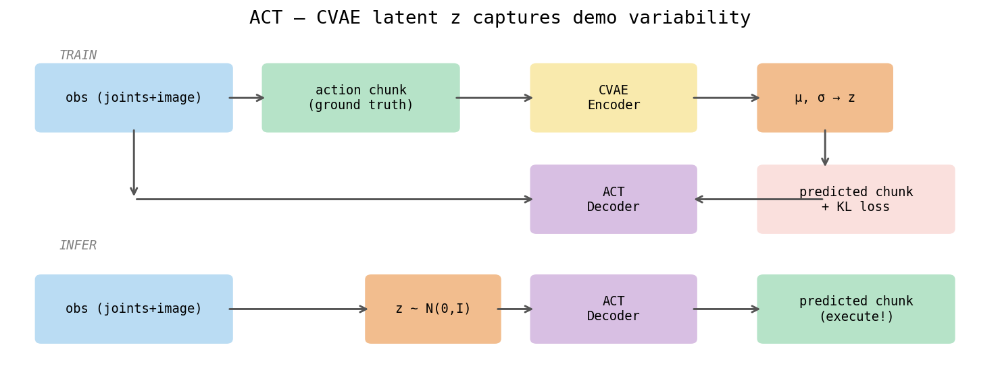
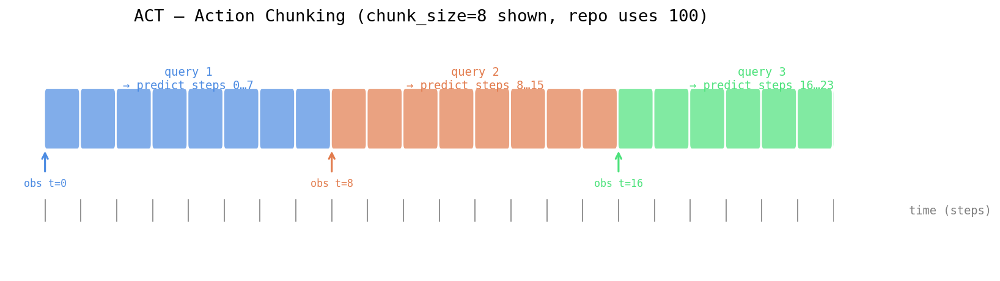
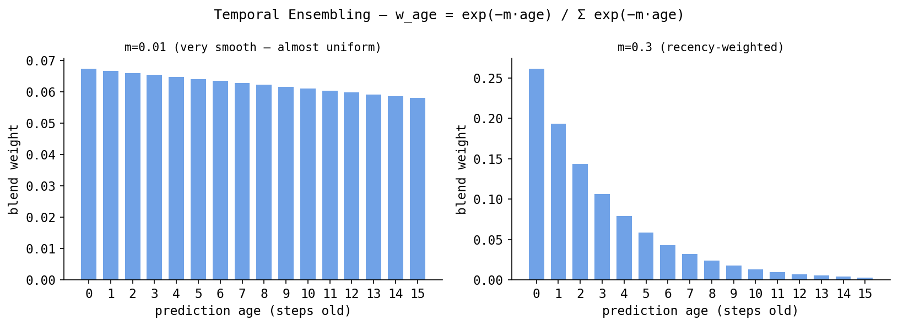

# ACT — Action Chunking with Transformers (a complete, from-the-ground-up explainer)

This document explains **ACT** — *Action Chunking with Transformers* — completely, assuming
only that you know basic Python and a tiny bit of machine learning. Every technical term is
defined the first time it appears. Every equation lists its symbols, gives tensor shapes, and
explains in plain English what it does and why. There is a fully worked numerical example.

ACT is the imitation-learning policy used in this repository to drive a **Fairino FR5** robot
arm. The repo wraps **lerobot 0.5.1's `ACTPolicy`** (the open-source re-implementation of the
original ACT paper, *"Learning Fine-Grained Bimanual Manipulation with Low-Cost Hardware"*,
Zhao et al. 2023). The concrete numbers used below come from this repo's real config files:

- `policies/act/config.yaml` — the "paper-scale" config
- `policies/act/config.local.yaml` — the small laptop config actually used to train the 2-episode demo checkpoint
- `policies/act/model.py` — the wrapper around lerobot's `ACTPolicy`

---

## Table of contents

1. The robot and the data (what ACT actually consumes and produces)
2. Prerequisite concepts (neural nets, layers, attention, transformers, CNNs, VAEs)
3. The one-paragraph version of ACT
4. The five core ideas of ACT
5. The full architecture, piece by piece, with shapes
6. The math: the CVAE loss, derived and explained
7. A fully worked micro-example (one observation → one action chunk)
8. Inference: open-loop chunks vs temporal ensembling
9. The exact numbers in this repo
10. ACT vs the diffusion / flow family
11. When to use ACT (and when not to)
12. Glossary of every term

---

## 1. The robot and the data

Before any ML, you need to know exactly what goes *in* and what comes *out*, because every
tensor shape in this document traces back to these definitions.

**The robot.** A Fairino FR5 is a **6-DOF arm**. *DOF* means *degrees of freedom* — the number
of independent joints that can move. So the arm has 6 rotating joints, plus a gripper (the
"hand" that opens and closes).

**The observation** (what the policy sees at one instant in time):
- **State** = the 6 *actual* joint angles in **degrees** plus the *current gripper opening* [0,1].
  This is a vector of **7 numbers**, e.g. `[12.3, -45.0, 90.1, 0.0, 30.0, -10.0, 0.8]`.
  We call its size `state_dim = 7`. Including the current gripper state matches what the ACT
  paper does (bimanual ALOHA: 14-D = 6 joints + 1 gripper per arm × 2), and means the policy
  has explicit closed-loop feedback about whether the gripper is open or closed — not just what
  it can infer from the image.
- **Image** = one RGB frame from a wrist-mounted **Intel RealSense D405** camera. *Wrist-mounted*
  means the camera is bolted near the gripper and moves with it. The native frame is
  640×480 pixels, but before the network sees it the frame is **resized to 224×224**. *RGB*
  means 3 color channels (Red, Green, Blue). So one image is a tensor of shape `(3, 224, 224)`:
  3 channels × 224 rows × 224 columns of pixels.

**The action** (what the policy outputs for one time step):
- 7 numbers, `action_dim = 7`:
  - the first 6 are **target joint angles in degrees** (where we *want* the joints to go next),
  - the 7th is the **gripper command, normalized to the range 0–1** (`0` = fully closed,
    `1` = fully open, or vice-versa). *Normalized* just means rescaled to a fixed convenient
    range so the numbers are comparable in magnitude to the others.

**Control rate.** The robot runs at **30 Hz** — *Hertz* means "times per second", so the
control loop fires 30 times every second. Each fire = one time step ≈ 33.3 milliseconds.

Note the subtle but important distinction: **state is the *current measured* joint angles;
action is the *desired next* joint angles + gripper.** ACT's whole job is: given the current
state + image, output a *sequence* of future actions.

---

## 2. Prerequisite concepts

This section builds up every ML idea ACT depends on. If you already know transformers and
VAEs, skip to Section 3.

### 2.1 What a neural network and a "layer" are

A **neural network** is just a function `y = f(x)` made of many small, simple, *learnable*
steps. Each step is a **layer**. The most basic layer is a **linear layer** (also called a
*fully-connected* or *dense* layer):

```
y = W x + b
```

- `x` — the input vector, shape `(d_in,)`. `d_in` is "input dimension", the number of inputs.
- `W` — a **weight matrix**, shape `(d_out, d_in)`. These are the numbers the network *learns*.
- `b` — a **bias vector**, shape `(d_out,)`. Also learned.
- `y` — the output vector, shape `(d_out,)`.

In plain English: a linear layer takes a list of numbers and produces a new list of numbers,
where each output number is a weighted sum of all the inputs plus an offset. "Learning" means
adjusting `W` and `b` so the outputs become useful.

To make the network able to represent curved, complicated functions (not just straight lines),
you put a **nonlinearity** (also called an **activation function**) between linear layers — e.g.
**ReLU**, *Rectified Linear Unit*, defined as `ReLU(x) = max(0, x)` (it zeroes out negatives).
A stack of `linear → ReLU → linear → ReLU → …` is the classic neural net.

**Training** = (1) run inputs through the net to get predictions (the *forward pass*),
(2) measure how wrong the predictions are with a **loss function** (a single number; lower =
better), (3) use **backpropagation** (an automatic application of calculus' chain rule) to
compute how to nudge every `W` and `b` to reduce the loss, (4) take a small step in that
direction via an **optimizer** (this repo uses **Adam**, a popular optimizer). Repeat millions
of times.

### 2.2 What an "embedding" is

An **embedding** is a learned vector that represents some piece of data in a fixed-size numeric
space. "Embedding" something means mapping it into a vector. For example, we might take the
6-number joint state and pass it through a linear layer to get a 512-number vector — that
512-number vector is the *embedding of the state*. We embed things so that everything inside the
network lives in the same-sized space (here, `d_model = 512`, the model's internal "width") and
can be combined with everything else.

### 2.3 What "attention" is (the heart of a transformer)

**Attention** is a mechanism that lets the network, for each item in a set, decide *which other
items to look at and how much*. It is the single most important idea in a transformer.

The standard form is **scaled dot-product attention**. You start with three sets of vectors
derived (by linear layers) from the inputs:

- **Query (Q)** — "what am I looking for?" — one query vector per item.
- **Key (K)** — "what do I contain / advertise?" — one key vector per item.
- **Value (V)** — "what information do I actually carry?" — one value vector per item.

The formula:

```
Attention(Q, K, V) = softmax( (Q Kᵀ) / √d_k ) V
```

Symbol by symbol:
- `Q` — query matrix, shape `(n, d_k)`. `n` = number of items (e.g. number of tokens), `d_k` =
  dimension of each query/key vector.
- `K` — key matrix, shape `(n, d_k)`.
- `Kᵀ` — the **transpose** of `K` (rows and columns swapped), shape `(d_k, n)`.
- `Q Kᵀ` — a matrix of **dot products**, shape `(n, n)`. Entry `(i, j)` is how well query `i`
  matches key `j`: a big number means "item i should pay attention to item j".
- `√d_k` — the square root of `d_k`. Dividing by it keeps the numbers from getting huge when
  `d_k` is large (this stabilizes training); this is the "scaled" part.
- `softmax(...)` — a function applied to each row that turns a row of arbitrary numbers into
  positive numbers that sum to 1, i.e. a **probability distribution** (a set of weights).
  Formally `softmax(z)_i = exp(z_i) / Σ_j exp(z_j)`. So each row becomes "how much of my
  attention goes to each other item".
- `V` — value matrix, shape `(n, d_v)`.
- The final result, shape `(n, d_v)`: for each item, a **weighted average of all the value
  vectors**, where the weights are the attention probabilities.

Plain English: every item asks "who is relevant to me?" (via Q·K), turns that into a set of
weights (softmax), and then pulls together a blend of everyone's information (the weighted sum
of V). This is how a transformer mixes information across an entire sequence in one shot.

**Self-attention** = Q, K, V all come from the *same* sequence (items attend to each other).
**Cross-attention** = Q comes from one sequence, K and V from *another* (one sequence reads from
another). ACT's decoder uses cross-attention to read from the encoded observation.

**Multi-head attention.** Instead of doing attention once, you do it `h` times in parallel with
different learned Q/K/V projections ("heads"), then concatenate the results. Each head can learn
to focus on a different kind of relationship. `nhead = 8` in this repo means 8 heads.

### 2.4 What a "transformer" is

A **transformer** is a neural network built primarily out of attention layers. It comes in two
kinds of blocks:

- A **transformer encoder layer**: `self-attention → add & normalize → feed-forward (two linear
  layers with ReLU) → add & normalize`. Stacking several of these = a **transformer encoder**.
  Its job is to take a set of input vectors and produce a set of *context-aware* output vectors
  (each output has "absorbed" relevant information from all the others).
- A **transformer decoder layer**: like the encoder but with an extra **cross-attention**
  sub-layer that lets it read from the encoder's output. Stacking these = a **transformer
  decoder**. It produces outputs while attending both to itself and to the encoded inputs.

Two more pieces:

- **Add & normalize** = a **residual connection** (`output = sublayer(x) + x`, which helps
  gradients flow during training) followed by **layer normalization** (rescaling each vector to
  have a stable mean and variance, which stabilizes training).
- **Positional encoding.** Attention by itself is *order-blind* — it treats its inputs as an
  unordered set, because the weighted sum doesn't care about position. But order matters
  (token 1 vs token 50). So we **add** a **positional encoding** — a vector that encodes "I am at
  position k" — to each input embedding. ACT uses fixed *sinusoidal* positional encodings
  (vectors built from sines and cosines of different frequencies) so the network can tell
  positions apart and generalize to relative offsets.

### 2.5 What a CNN / ResNet / convolution is (for the image)

An **image** can't sensibly be flattened into one giant vector and fed to linear layers — you'd
lose all spatial structure and have far too many weights. Instead we use a **convolutional
neural network (CNN)**.

A **convolution** slides a small learnable filter (e.g. 3×3) across the image, computing a
weighted sum of each local patch. This detects *local patterns* (edges, corners, textures)
regardless of where they appear, and uses far fewer weights than a linear layer. Stacking many
convolution layers builds up from edges → textures → object parts → objects.

A **ResNet** (*Residual Network*) is a famous, very effective CNN design. The "residual" part
refers to the residual/skip connections (`output = layer(x) + x`) that let you train very deep
networks without the gradients vanishing. **ResNet18** is the 18-layer version — relatively
small and fast — and it is the **vision backbone** ("backbone" = the feature-extracting front
end) used by ACT here.

**Pretrained / ImageNet.** Training a vision backbone from scratch needs millions of images.
Instead we start from **ResNet18 weights pretrained on ImageNet** (a dataset of ~1.2M labeled
photos). This is **transfer learning**: the network already knows generic visual features, so it
adapts to our wrist-camera images much faster. In this repo the weights are
`ResNet18_Weights.IMAGENET1K_V1`. Because the backbone was trained on ImageNet, our images must
be **ImageNet-normalized** (each color channel shifted/scaled by ImageNet's mean/std) before
being fed in — the repo does this in `dataset.py`.

The backbone turns one `(3, 224, 224)` image into a grid of **feature vectors** — a small
spatial map (e.g. 7×7) where each of the 49 cells is a `d_model`-dimensional vector summarizing
what's in that region. These 49 vectors become 49 "tokens" that the transformer can attend over.

### 2.6 Probability concepts you need for the VAE

- **Random variable** — a quantity whose value is uncertain, described by a probability
  distribution.
- **Gaussian / normal distribution** — the classic "bell curve", written `N(μ, σ²)`. `μ` (mu) is
  the **mean** (center) and `σ²` (sigma squared) is the **variance** (spread); `σ` is the
  **standard deviation**. A **standard normal** is `N(0, 1)`: centered at 0 with spread 1. For a
  vector, `N(0, I)` means each component is an independent standard normal (`I` is the **identity
  matrix**, signaling "no correlation between dimensions").
- **Prior** — a distribution we *assume before seeing data*. In a VAE the prior over the latent
  is `N(0, I)`.
- **Posterior** — a distribution *after* conditioning on data, e.g. "given this action sequence,
  what latent codes are plausible?"
- **KL divergence** — `D_KL(p ‖ q)` measures how different two distributions `p` and `q` are. It
  is `0` when they're identical and grows as they diverge. (It is *not* symmetric:
  `D_KL(p‖q) ≠ D_KL(q‖p)`.) We use it to push a learned distribution toward the prior `N(0, I)`.
- **Latent variable** — a hidden, unobserved variable the model *invents* to explain the data. In
  ACT the latent `z` will represent "which style of demonstration is this".

### 2.7 What an autoencoder and a VAE are

An **autoencoder** is a network that learns to compress data and reconstruct it:

```
input  →  [encoder]  →  latent z  →  [decoder]  →  reconstruction (≈ input)
```

The **encoder** squeezes the input into a small **latent** vector `z` (a "code"); the **decoder**
expands `z` back into the original. Training minimizes reconstruction error. The bottleneck `z`
forces the network to keep only the essential information.

A **VAE** (*Variational Autoencoder*) is a probabilistic autoencoder. Instead of producing a
single `z`, the encoder produces a *distribution* over `z` — specifically a Gaussian with a mean
`μ` and a variance, and we *sample* `z` from it. Two extra ingredients make this work:

1. **A prior** on `z`, namely `N(0, I)`, and a **KL term** in the loss that keeps the encoder's
   output distribution close to that prior. This makes the latent space smooth and well-behaved
   (nearby `z`'s decode to similar outputs, and `z = 0` is always a meaningful "average" code).
2. **The reparameterization trick.** You can't backpropagate through a random "sample" directly.
   So instead of sampling `z ∼ N(μ, σ²)` opaquely, you write:

   ```
   z = μ + σ ⊙ ε ,    ε ∼ N(0, I)
   ```

   - `μ`, `σ` — the mean and standard deviation produced by the encoder (learnable, differentiable).
   - `ε` (epsilon) — fresh random noise drawn from a *standard* normal. The randomness now lives
     in `ε`, which is *outside* the network, so gradients can flow through `μ` and `σ`.
   - `⊙` — element-wise multiplication.

   Plain English: the randomness is "moved to the side" so the rest of the network is an ordinary
   differentiable function you can train normally.

A **CVAE** (*Conditional VAE*) is a VAE where the decoder is also given some extra **conditioning**
information (here: the current observation). So the decoder reconstructs the target *given the
latent `z` **and** the observation*. This is exactly what ACT is.

### 2.8 A few last terms

- **L1 loss** = mean absolute error, `mean(|prediction − target|)`. **L2 loss** = mean squared
  error, `mean((prediction − target)²)`.
- **Open-loop vs closed-loop control.** *Closed-loop* = look at the latest observation before
  *every* action (constant feedback). *Open-loop* = decide a whole plan, then execute it blindly
  for a while before looking again. ACT predicts a chunk and executes it open-loop.
- **Autoregressive vs one-shot.** *Autoregressive* = generate a sequence one element at a time,
  feeding each output back as input for the next (slow; errors compound). *One-shot* = produce
  the whole sequence in a single forward pass. ACT is one-shot.
- **ELBO** (*Evidence Lower BOund*) = the quantity a VAE actually maximizes; equivalently we
  *minimize* `reconstruction loss + KL term`, which is what ACT's loss is.

---

## 3. The one-paragraph version of ACT

ACT is a transformer that looks at the current observation (one camera image + the 6 joint
angles) and **directly predicts a chunk of the next 100 actions in a single forward pass** (one
"shot", not one step at a time). It is trained as a **CVAE**: during training a small extra
encoder peeks at the *real* future action sequence and squeezes it into a 32-dimensional latent
`z` capturing "which style of demonstration this is"; the main transformer decoder then
reconstructs the action chunk from the observation **plus** `z`. The loss is **L1 reconstruction
+ a KL term** that keeps `z` near a standard normal. At test time we don't have future actions,
so we set **`z = 0`** (the prior mean) and decode. The result is the simplest, fastest learned
manipulation policy in this repo.



---

## 4. The five core ideas of ACT

### Idea 1 — Action chunking (predict many steps at once)

The naive approach predicts **one** action per observation, then re-observes, repeats. Two
problems:

- **Compounding error / covariate shift.** Tiny prediction errors push the robot into states
  slightly different from any it saw in training; on those unfamiliar states it errs a bit more,
  which pushes it further off, and the error snowballs.
- **Jittery, non-committal motion.** Single-step policies tend to dither, especially through
  "pauses" in human demos where the right action is ambiguous.

ACT instead predicts a **chunk** of `chunk_size = 100` consecutive actions. At 30 Hz that's
`100 / 30 ≈ 3.3 seconds` of committed future motion. Predicting a chunk:
- reduces how often errors can compound (you commit to a coherent multi-step plan),
- produces smooth, decisive motion,
- effectively shortens the task's decision horizon (fewer independent decisions to get right).

### Idea 2 — One-shot prediction (not autoregressive)

ACT outputs all 100 actions **in parallel** in one decoder pass, rather than generating them one
at a time. This is fast (single forward pass, friendly to CPU inference) and avoids
autoregressive error accumulation *within* a chunk.

### Idea 3 — The CVAE latent `z` (handling demonstration variability)

Human teleoperation is **multimodal** and inconsistent: the same task is performed slightly
differently every time (different speeds, different paths to the same goal). If you just train a
deterministic net to predict the "average" action, you get **mode averaging** — the network
splits the difference between valid behaviors and produces a mushy, often invalid blend (imagine
averaging "go left around the obstacle" and "go right around the obstacle" → "go straight into
it").

The CVAE latent solves this. During training the latent `z` absorbs the *style* of each specific
demonstration, so the decoder no longer has to average — given `z`, the action chunk becomes
much more predictable. Think of `z` as a knob the model can set to pick *which* style of
demonstration to imitate. At test time, setting `z = 0` selects the "central" style.

### Idea 4 — Vision via a pretrained ResNet18, fused by a transformer

The wrist image is processed by ResNet18 into a grid of feature tokens; the joint state is
embedded into another token; the transformer encoder fuses all of these so the decoder sees a
unified, context-rich representation of "the current situation".

### Idea 5 — L1 reconstruction loss (not L2)

ACT matches predicted actions to demonstrated actions with **L1** (absolute error). L1 is chosen
over L2 (squared error) because L2 heavily penalizes large errors, which makes the model
*conservative* and pushes it toward averaging the modes (the very mode-averaging we're trying to
avoid). L1 penalizes errors linearly, tolerates the occasional large deviation, and empirically
yields **sharper, more precise** actions — important for fine manipulation.

---

## 5. The full architecture, piece by piece

Notation: `B` = **batch size** (how many examples processed at once; `batch_size = 8` here),
`d_model` = the transformer's internal width (`512` in `config.yaml`, `256` in
`config.local.yaml`), `chunk_size = 100`, `latent_dim = 32`, `state_dim = 7`, `action_dim = 7`.

### 5.1 Training-time data flow (the CVAE encoder is active)

```
                         TRAINING
                         ════════

   ground-truth action chunk            current observation
   actions (B, 100, 7)                  ┌─────────────────────────────┐
        │                               │ image (B, 3, 224, 224)      │
        │                               │ state (B, 7)                │
        ▼                               └─────────────────────────────┘
 ┌──────────────────┐                              │
 │  CVAE  ENCODER    │                   ResNet18  │  state
 │  (transformer,    │                   backbone  │  linear-embed
 │   4 layers)       │                      │      │
 │  reads the actual │              image tokens   │ state token
 │  actions + state  │              (B, 49, d_model)  (B, 1, d_model)
 └──────────────────┘                      │      │
        │  outputs μ, log σ²               └───┬──┘
        │  each (B, 32)                        ▼
        ▼                              ┌──────────────────┐
   z = μ + σ ⊙ ε   ε∼N(0,I)           │  TRANSFORMER      │
        │   (B, 32)                    │  ENCODER (obs)    │
        │                              │  4 layers         │
        │  embed z to a token          │  fuses image +    │
        │  (B, 1, d_model)             │  state tokens     │
        └──────────────┬───────────────└──────────────────┘
                       ▼                        │  memory
              ┌────────────────────────────────┴───────┐
              │      TRANSFORMER  DECODER (1–7 layers)   │
              │  100 learned position queries cross-     │
              │  attend to {z token, obs memory}         │
              └──────────────────────────────────────────┘
                       │
                       ▼
            predicted action chunk  (B, 100, 7)
                       │
                       ▼
   loss = L1(predicted, ground-truth)  +  kl_weight · KL( N(μ,σ²) ‖ N(0,I) )
```

Component by component:

**(a) The CVAE encoder — and what the CLS token is doing.**

A small transformer encoder (`num_encoder_layers = 4`). Its input sequence is:

```
[CLS,  action_0,  action_1,  ...  action_99,  state_token]
```

- `action_0 … action_99` — the 100 ground-truth future actions, each projected from 7 → `d_model`
  via a linear layer.
- `state_token` — the current joint state (7-D), also projected to `d_model` (see (c) below).
- `[CLS]` — a single **learned embedding** with no initial meaning, prepended to the sequence.

All 102 tokens do **self-attention** with each other. Because every token attends to every other,
by the time the encoder finishes, `CLS_out` has absorbed information from all 100 action tokens
and the state token through attention. You then **throw away** the other 101 output vectors and
only keep `CLS_out`:

```
CLS_out  (B, d_model)  →  two Linear heads  →  μ (B, 32),  log σ² (B, 32)
```

Why `[CLS]` and not just average-pool the outputs? Because `[CLS]` is a **learned aggregation**
— the model learns what to route into it during training, rather than uniformly averaging.

This encoder exists **only during training**. It "cheats" by looking at the real future actions
to summarize *which style of demo this is* into the latent `z`. At inference you don't have
future actions, so the entire CVAE encoder is skipped.

**(b) The latent sample z — and why z = 0 at inference.**

```
z  =  μ  +  σ ⊙ ε,      ε ∼ N(0, I)        ← reparameterization trick
z  shape:  (B, 32)
```

The KL loss term forces the encoder's distribution `N(μ, σ²)` to stay close to `N(0, I)` — the
standard normal. So during training, z encodes "which demo style this is" but is always anchored
near zero.

**The multimodality problem z solves.** Suppose half the demos reach from the left and half from
the right. A plain transformer averaging both trajectories predicts straight down the middle →
crashes. The CVAE fixes this: for left-reach demos the encoder produces z ≈ +0.3; for right-reach
demos z ≈ -0.3. The decoder learns "z > 0 → reach left, z < 0 → reach right." Each demo gets
explained by its own z, not a single blurred average.

At inference you have no future actions to run the encoder. You set `z = 0` — the mean of the
prior `N(0, I)`. Because KL training forced all z values to cluster near zero, this gives the
"committed average style" — the decoder produces its most confident default prediction.

Then `z (B, 32)` → `Linear(32, d_model)` → one z token `(B, 1, d_model)`, which joins the
observation encoder's input sequence alongside the image and state tokens.

**(c) The observation encoder — how image and state become tokens.**

**State → 1 token.** The state is `(B, 7)` — 7 numbers (6 joint angles + gripper). A single
linear layer projects it:

```
state_token  =  W · state  +  b

W  shape: (d_model, 7)     ← learned weight matrix
b  shape: (d_model,)       ← learned bias

result: state_token  (B, 1, d_model)
```

That's it — one matrix multiply. Each of the `d_model` output numbers is a weighted sum of all 7
input numbers. The weights are learned end-to-end; the network figures out which combinations of
joints and gripper state matter. The output is in the same `d_model`-dimensional space as every
other token, which is required for attention to work.

**Image → 49 tokens.** Here's the full chain:

```
image  (B, 3, 224, 224)
    ↓  ResNet18 conv layers  (no final global average-pool)
feature map  (B, 512, 7, 7)
```

ResNet18 downsamples 32× (224 / 32 = 7), so the spatial output is a **7×7 grid** of
512-dimensional feature vectors. Each cell in the grid corresponds to a ~32×32 pixel region of
the original image — spatial structure is preserved (top-left cell "saw" the top-left of the
image, etc.).

```
feature map  (B, 512, 7, 7)
    ↓  reshape spatial dims: 7×7 = 49 positions become a sequence
(B, 49, 512)
    ↓  Linear(512, d_model) — same projection applied to every position
(B, 49, d_model)    ← 49 image tokens
    ↓  + sinusoidal 2D positional encodings  (so the transformer knows which of
       the 49 grid positions each token came from)
ready for self-attention
```

So you get **49 tokens** simply because 7 × 7 = 49. The "49" is not a free choice — it's fixed
by ResNet18's architecture (32× downsampling of a 224-px input).

All tokens are now the same shape `(B, *, d_model)` and are concatenated into one sequence:

```
obs encoder input:
[  img_patch_0,  img_patch_1,  ...  img_patch_48,   ← 49 image tokens
   state_token,                                      ← 1 state token
   z_token       ]                                   ← 1 z token
                                                        51 tokens total
```

These 51 tokens do **self-attention** among themselves (`num_encoder_layers = 4` layers). By the
end, each token has "seen" all the others — image patches know the joint state and z, the state
token knows what's in the image. The output of this encoder is the **memory**:

```
memory  (B, 51, d_model)
```

The memory is exactly the **K and V matrices** in the decoder's cross-attention. The decoder's
action queries are the Q. So cross-attention is each of the 100 action queries asking: "given
everything the encoder fused (image + joints + z), what should I — step k of the future — be?"

**(d) The transformer decoder.** It holds `chunk_size = 100` **learned query embeddings** — one
per future time step (these are the "I am action-slot k" queries). Each query **cross-attends**
to the memory (K, V = memory; Q = action query), then a final linear layer maps each of the 100
decoder outputs to a 7-dimensional action. Result: the predicted chunk `(B, 100, 7)`, **all 100
produced in parallel** (one-shot). Depth is `num_decoder_layers` — **7** in `config.yaml`, **1**
in `config.local.yaml`. (lerobot's library default is 1; this repo's paper-scale config raises it
to 7. Both are valid — more layers = more capacity but slower.)

### 5.2 Inference-time data flow (the CVAE encoder is OFF, `z = 0`)

```
                        INFERENCE
                        ═════════

   current observation                       z = 0  (the prior mean, B×32 of zeros)
   image (B, 3, 224, 224)                       │  embed to token
   state (B, 7)                                 │
        │                                       │
   ResNet18 + state-embed                       │
        │                                       │
   transformer encoder (obs)  ── memory ──┐     │
                                          ▼     ▼
                            transformer decoder (100 queries)
                                          │
                                          ▼
                            predicted action chunk (B, 100, 7)
                                          │
                                          ▼
                       execute on robot (open-loop, or temporally ensembled)
```

At test time there are no future actions to feed the CVAE encoder (that's literally what we're
trying to predict), **so we skip it entirely and set `z = 0`**. Because the KL term trained the
encoder's distribution to hug `N(0, I)`, whose mean is `0`, the value `z = 0` is the "central /
average style" — a sensible default. The decoder then runs exactly as in training, conditioned on
the real observation, and emits a 100-step action chunk.

---

## 6. The math: the CVAE loss

ACT minimizes:

```
L  =  L_recon  +  β · D_KL( q(z | a, o) ‖ N(0, I) )
```

Symbol by symbol:
- `L` — the total scalar loss (one number per batch; lower is better).
- `L_recon` — the **reconstruction loss**, here **L1**:

  ```
  L_recon = (1 / (T · D)) · Σ_t Σ_d | â[t,d] − a[t,d] |
  ```
  - `â[t,d]` (a-hat) — the **predicted** action, time step `t`, dimension `d`.
  - `a[t,d]` — the **ground-truth** (demonstrated) action.
  - `T` — number of time steps in the chunk = `chunk_size = 100`.
  - `D` — `action_dim = 7`.
  - `| · |` — absolute value; `Σ` — sum.
  - Plain English: average absolute difference between every predicted action number and the
    corresponding demonstrated number, over all 100 steps and all 7 dims. (Padded steps — when a
    real episode ends before 100 future steps exist — are masked out via `action_is_pad` so they
    don't contribute.)

- `q(z | a, o)` — the encoder's **posterior**: the distribution over the latent `z` given the
  action chunk `a` and observation `o`. It is the Gaussian `N(μ, σ²)` the CVAE encoder produced.
- `N(0, I)` — the **prior**: a standard normal of dimension `latent_dim = 32`.
- `D_KL( · ‖ · )` — **KL divergence**, "how far the posterior is from the prior". For two
  Gaussians it has a clean closed form:

  ```
  D_KL( N(μ, σ²) ‖ N(0, I) )  =  ½ Σ_j ( μ_j² + σ_j² − log σ_j² − 1 )
  ```
  - `j` ranges over the `latent_dim = 32` latent dimensions.
  - `μ_j`, `σ_j²` — the mean and variance of latent dimension `j`.
  - Plain English: this is `0` exactly when `μ_j = 0` and `σ_j² = 1` for every dimension (i.e.
    the posterior *is* the standard normal); it grows as the mean drifts from 0 or the variance
    drifts from 1. Minimizing it **pulls the encoder's output toward `N(0, I)`**.

- `β` (beta) — the **KL weight**, `kl_weight = 10.0` in this repo. It trades off the two terms.

**Why each term, in plain English:**
- The **L1 term** makes the predicted chunk match what the human actually did. Without it, the
  policy doesn't imitate anything.
- The **KL term** regularizes the latent: it keeps `q(z|a,o)` close to `N(0, I)` so that (1) the
  latent space is smooth and (2) `z = 0` is a valid, central code at test time. Without it, the
  encoder could scatter codes arbitrarily and `z = 0` would be meaningless.
- **`β = 10` (relatively large)** says "keep the latent strongly regularized". A latent that's
  *too* expressive would let the decoder lean on it as a shortcut and ignore the observation
  (so it'd fail when `z = 0` at test time). A high `β` keeps `z` as a light "style hint" rather
  than a full description of the actions, forcing the decoder to actually use the camera + state.

This whole objective is exactly the negative **ELBO** (Evidence Lower BOund) of the CVAE: minimizing
`L_recon + β·KL` is the standard way to train a (β-weighted) VAE.

---

## 7. A fully worked micro-example

Let's trace **one** training example through ACT with concrete shapes. We'll use the
**`config.local.yaml`** numbers (`d_model = 256`, `num_decoder_layers = 1`) and a batch of
`B = 8`. The ResNet18 spatial grid for a 224×224 input is 7×7 = 49 tokens.

**Inputs for one batch:**
- image: `(8, 3, 224, 224)` — 8 wrist frames, ImageNet-normalized.
- state: `(8, 7)` — 8 observations of 6 joint angles (deg) + current gripper [0,1], normalized to mean-0/std-1 using dataset
  stats (the wrapper's `_norm_state`).
- ground-truth action chunk: `(8, 100, 7)` — the 100 future actions per example, normalized via
  `_norm_action`. Also a pad mask `(8, 100)`.

**Step A — CVAE encoder (training only).**
- Embed the 100 actions → `(8, 100, 256)`; embed state → `(8, 1, 256)`; prepend a `[CLS]` token.
- Run 4 transformer encoder layers; take the `[CLS]` output → two heads →
  `μ : (8, 32)` and `log σ² : (8, 32)`.

**Step B — sample the latent.**
- `σ = exp(0.5 · log σ²)` → `(8, 32)`; draw `ε ∼ N(0, I)` → `(8, 32)`;
  `z = μ + σ ⊙ ε` → `(8, 32)`. Embed → one token `(8, 1, 256)`.

**Step C — observation encoder.**
- ResNet18(image) → 49 tokens `(8, 49, 256)`, plus positional encodings.
- state-embed → `(8, 1, 256)`.
- Concatenate → `(8, 50, 256)`; 4 transformer encoder layers → **memory** `(8, 50, 256)`.

**Step D — decoder (one-shot).**
- 100 learned query embeddings → `(8, 100, 256)`.
- 1 decoder layer: queries self-attend, then cross-attend to `{z token, memory}` (effectively
  `(8, 51, 256)` of context) → `(8, 100, 256)`.
- Final linear `256 → 7` → predicted chunk `â : (8, 100, 7)`.

**Step E — loss.**
- `L_recon = mean(|â − a|)` over the non-padded entries — one scalar.
- `KL = ½ Σ_j (μ_j² + σ_j² − log σ_j² − 1)` averaged over the batch — one scalar.
- `L = L_recon + 10.0 · KL`. Backpropagate; Adam updates all weights.

**At inference**, skip Steps A–B, set `z = 0` (`(8, 32)` zeros, or `(1, 32)` for a single robot),
run Steps C–D, then **un-normalize** the predicted actions back to real units (degrees + gripper
0–1) with `_unnorm_action`, and send them to the FR5. The first 6 numbers of each row are target
joint angles in degrees; the 7th is the gripper command.

---

## 8. Inference: open-loop chunks vs temporal ensembling

### 8.0 The 30 Hz control loop — what actually happens tick by tick

**Hz = times per second.** 30 Hz means the loop fires **once every 33 ms**:

```
1 second = 1000 ms
1000 ms / 30 = 33.3 ms per tick
```

Same logic for reference: a 60 Hz monitor refreshes every 16.7 ms; the FR5's internal servo loop
runs at 1000 Hz = every 1 ms.

Each tick of the policy loop does exactly four things:

```
tick at t=0  (0 ms):
    1. read joint encoders from FR5        →  state  (7,)
    2. grab latest wrist camera frame      →  image  (3, 224, 224)
    3. model.predict(state, image)         →  action (7,)
    4. send action to FR5                  →  robot moves

tick at t=1  (33 ms):   repeat
tick at t=2  (66 ms):   repeat
...
```

Between your 33 ms commands the FR5's own 1000 Hz servo loop holds and interpolates to the last
target you sent — so the arm moves smoothly even though you only update it 30 times a second.
**The 30 Hz rate is set by the camera** (the D405 produces 30 frames per second), so there is no
point running the policy faster than that — you wouldn't get new image information anyway.

ACT produces 100 actions per query, but you must decide *how many to actually execute before
re-querying*. The repo supports two modes, controlled by `temporal_ensemble_coeff`.



### Mode 1 — Plain open-loop chunking (`temporal_ensemble_coeff: null`)

Query the policy once, blindly execute all 100 actions in sequence (no new observation for
100 × 33 ms ≈ **3.3 seconds**), then query again:

```
t=0:    query → chunk A  =  [a0, a1, a2, ... a99]
t=0:    send a0
t=1:    send a1   ← no new query, just popping from the chunk
t=2:    send a2
...
t=99:   send a99
t=100:  query → chunk B  =  [a0, a1, ... a99]   ← new observation here
t=100:  send a0
...
```

Cheapest (one model call per 100 steps) but at the **chunk boundary** (t=100) the new chunk
starts from a fresh observation that may disagree with where the old chunk left off → small
**jerk** in the motion.

### Mode 2 — Temporal ensembling (`temporal_ensemble_coeff: 0.01`, the default here)

Re-query the model **every single step** (every 33 ms). Now chunks overlap — at step t=3 you
have four predictions for "what action to send right now":

```
t=0:  query → chunk A predicts actions for steps  0, 1, 2, ... 99
t=1:  query → chunk B predicts actions for steps  1, 2, 3, ... 100
t=2:  query → chunk C predicts actions for steps  2, 3, 4, ... 101
t=3:  query → chunk D predicts actions for steps  3, 4, 5, ... 102

at t=3, predictions available for "right now":
    chunk D's prediction for step 3  ← age 0  (just computed)
    chunk C's prediction for step 3  ← age 1  (computed 1 tick ago)
    chunk B's prediction for step 3  ← age 2  (computed 2 ticks ago)
    chunk A's prediction for step 3  ← age 3  (computed 3 ticks ago)
```

Instead of picking one, **blend them** with exponentially decaying weights:

```
w(age) = exp(−m × age)          m = temporal_ensemble_coeff = 0.01

age 0  →  exp(0)     = 1.000
age 1  →  exp(−0.01) = 0.990
age 2  →  exp(−0.02) = 0.980
age 3  →  exp(−0.03) = 0.970

normalise so weights sum to 1:
w = [0.253, 0.251, 0.249, 0.247]   ← nearly uniform (m=0.01 is tiny)

action_sent = 0.253·(D's pred) + 0.251·(C's pred) + 0.249·(B's pred) + 0.247·(A's pred)
```

**Why blending removes the jerk.** Each individual chunk has small prediction errors. By
averaging many overlapping predictions for the same timestep, errors cancel out. You never
suddenly switch from one chunk's plan to another's — you are always mixing many of them.
And because you re-query every step, the newest chunk always has the **latest observation** —
if something moved, the age-0 weight grows relative to older stale chunks.

**The m parameter:**

```
weight(age) = exp(−m × age)
```

| m | effect |
|---|---|
| 0.01 (this repo) | nearly flat weights — old predictions trusted almost as much as new. very smooth, slow to react |
| 0.3 | weight drops fast with age — recent predictions dominate. more reactive, slightly less smooth |
| → 0 | pure uniform average of all past predictions |
| → ∞ | only the newest chunk used — equivalent to no ensembling |

**The cost:** the model runs at the full 30 Hz (every tick) instead of once per 100 ticks. You
pay the full forward pass 100× more often than open-loop chunking.

```
weight(age) = exp( −coeff · age )
```
- `age` — how many steps ago the prediction was made (`0` = predicted just now).
- `coeff` — `temporal_ensemble_coeff`. **Smaller `coeff` ⇒ older predictions keep more weight**
  (smoother, more inertia); larger ⇒ trust the freshest prediction more (more reactive).



**Side by side:**

| | Open-loop chunk | Temporal ensembling |
|---|---|---|
| Model queries per 100 steps | **1** | **100** |
| Observation freshness | stale for up to 3.3 s | fresh every 33 ms |
| Chunk boundary jerk | yes | no |
| Compute cost | cheap | 100× more expensive |
| `n_action_steps` in code | 100 | 1 |

---

## 9. The exact numbers in this repo

From `policies/act/config.yaml` (paper-scale) and `config.local.yaml` (laptop) and
`policies/act/model.py`:

| Setting | `config.yaml` | `config.local.yaml` | Meaning |
|---|---|---|---|
| `state_dim` | 7 | 7 | 6 FR5 joint angles (deg) + current gripper [0,1] |
| `action_dim` | 7 | 7 | 6 target joints (deg) + gripper (0–1) |
| `chunk_size` | 100 | 100 | actions predicted per query (≈3.3 s @ 30 Hz) |
| `d_model` | 512 | 256 | transformer width |
| `latent_dim` | 32 | 32 | CVAE latent `z` size |
| `nhead` | 8 | 8 | attention heads |
| `num_encoder_layers` | 4 | 4 | obs-encoder **and** CVAE-encoder depth |
| `num_decoder_layers` | 7 | 1 | transformer decoder depth (lerobot default is 1) |
| `dim_feedforward` | 3200 | 1024 | width of the feed-forward sublayers |
| `dropout` | 0.1 | 0.1 | regularization (randomly zeroing activations) |
| `kl_weight` (β) | 10.0 | 10.0 | KL term weight |
| `temporal_ensemble_coeff` | 0.01 | null | inference blending (Mode 2 vs Mode 1) |
| `batch_size` | 8 | 8 | examples per training step |
| `lr` | 1e-5 | 1e-5 | learning rate |
| `weight_decay` | 1e-4 | 1e-4 | L2 penalty on weights (regularization) |
| `max_epochs` | 100 | 5 | passes over the dataset |
| `grad_clip` | 10.0 | 10.0 | gradient clipping (training stability) |
| vision backbone | resnet18 | resnet18 | pretrained on ImageNet |
| image size | 224×224 | 224×224 | resized from 640×480 |
| `use_vae` | true | true | the CVAE is enabled |

Fixed facts baked into `model.py`: `n_obs_steps = 1` (one observation per query — state is
`(B, 7)`, image is `(B, 3, 224, 224)`, no extra time axis), `use_vae = True`, and normalization is
handled by the wrapper (state/action mean-std from dataset stats; images ImageNet-normalized in
`dataset.py`), with lerobot told to treat every feature as `IDENTITY`.

> Honesty note: `config.local.yaml` is a deliberately small "pipeline demonstration" run trained
> on **only 2 episodes (~5401 frames)** — it proves the code path works end-to-end, not that the
> resulting policy is good. Two demonstrations is far too few for a competent ACT policy.

---

## 10. ACT vs the diffusion / flow family

The other policies in this repo (Diffusion Policy, DiT-Flow, π0 / π0.5 / π0-FAST) produce actions
by **iterative generation** instead of one-shot prediction.

| | **ACT** | **Diffusion / DiT / π0 (flow)** |
|---|---|---|
| How actions are produced | direct, **one forward pass** | **iterative**: many denoising steps (diffusion) or ODE integration steps (flow matching) |
| Handles multimodality via | the **CVAE latent `z`** | the stochastic denoising / flow process itself |
| Inference cost | **lowest** (single pass) | higher (multiple network evals per chunk) |
| Sharpness loss | L1 | typically a noise-prediction / velocity (L2-style) objective |
| Language conditioning | **no** | DiT / π0 family: **yes** (vision-language models) |
| Relative complexity | **simplest** | more moving parts, more compute |

**What "diffusion" and "flow" mean, briefly.** A **diffusion** model learns to start from pure
random noise and *denoise* it step by step into a valid action chunk, conditioned on the
observation. A **flow-matching** model learns a smooth "velocity field" and integrates an ODE
(*ordinary differential equation*) from noise to a clean action chunk. Both represent
multimodality naturally (different random seeds → different valid modes) but cost several network
evaluations per chunk. ACT trades that expressive, multi-step generation for a single cheap
forward pass plus a lightweight latent.

---

## 11. When to use ACT (and when not to)

**Use ACT when:**
- You want the **simplest, fastest-to-deploy** learned policy and a strong baseline before
  reaching for heavier models.
- Inference must be **cheap** (single forward pass; viable on CPU).
- The task is fairly single-mode, or you can collect reasonably consistent demonstrations.
- You don't need natural-language task conditioning.

**Reach for diffusion / flow / π0 instead when:**
- The task is **strongly multimodal** (many genuinely different valid behaviors) and ACT's single
  latent + L1 still averages them.
- You need **language conditioning** ("pick up the *red* block") — that requires the
  vision-language models in the DiT / π0 family.
- You can afford the extra inference compute for better generative quality.

In short: **ACT is the lightweight workhorse.** Start here; escalate only if its limitations bite.

---

## 12. Glossary

> **ACT data flow (Mermaid — renders on GitHub)**
>
> ```mermaid
> flowchart TD
>     OBS["obs: image (3,224,224)\n+ joints (6,)"]
>     ACT_CHUNK["action chunk\n(chunk_size, 7)\nground truth (train only)"]
>     RESNET["ResNet18\n→ spatial-softmax keypoints\n→ feature (B, feat_dim)"]
>     STATE_PROJ["Linear\njoints → (B, d_model)"]
>     CVAE_ENC["CVAE Encoder\n(Transformer Encoder)\npeeks at action chunk\n→ μ, σ → z (B,32)"]
>     CONCAT["concat: image feat + joints + z\n→ input tokens (B, S, d_model)"]
>     TRANS_DEC["Transformer Decoder\n(7 layers, 512-wide)\naction queries × S"]
>     OUTPUT["predicted chunk\n(B, chunk_size, 7)"]
>     LOSS["L1 recon + KL loss"]
>
>     OBS --> RESNET & STATE_PROJ
>     ACT_CHUNK --> CVAE_ENC
>     OBS --> CVAE_ENC
>     RESNET & STATE_PROJ & CVAE_ENC --> CONCAT
>     CONCAT --> TRANS_DEC --> OUTPUT --> LOSS
> ```

- **Action chunking** — predicting many future actions at once instead of one at a time.
- **Activation function / nonlinearity** — a function (e.g. ReLU) between linear layers that lets
  a network model curved relationships.
- **Attention** — mechanism letting each item decide which other items to read and how much.
- **Autoregressive** — generating a sequence one element at a time, feeding each back in.
- **Backbone** — the feature-extracting front end (here ResNet18 for images).
- **Backpropagation** — algorithm computing how to nudge each weight to reduce the loss.
- **Batch / batch size (B)** — number of examples processed together.
- **Closed-loop / open-loop** — observe before every action / commit to a plan and execute blindly.
- **CNN / convolution** — network that slides small learnable filters over an image.
- **Cross-attention** — attention where queries and keys/values come from different sequences.
- **CVAE** — Conditional VAE; a VAE whose decoder is also given conditioning (the observation).
- **DOF** — degrees of freedom (independent joints); the FR5 has 6.
- **d_model** — the transformer's internal vector width (512 / 256 here).
- **ELBO** — Evidence Lower BOund; the VAE training objective (= minimizing recon + KL).
- **Embedding** — a learned fixed-size vector representing some input.
- **Encoder / decoder** — transformer block that contextualizes inputs / that generates outputs.
- **Gaussian / normal `N(μ, σ²)`** — bell-curve distribution with mean `μ`, variance `σ²`.
- **Gripper** — the robot hand; commanded by the 7th action dim, normalized 0–1.
- **KL divergence** — measure of how different two distributions are; 0 when identical.
- **L1 / L2 loss** — mean absolute error / mean squared error.
- **Latent variable (z)** — invented hidden variable; here, demonstration "style", dim 32.
- **Layer (linear)** — `y = Wx + b`; the basic learnable building block.
- **Layer normalization** — rescaling a vector for stable training.
- **Memory** — the observation encoder's output that the decoder cross-attends to.
- **Multimodal / mode averaging** — many valid behaviors / the failure of blending them into mush.
- **Multi-head attention** — running attention several times in parallel with different projections.
- **Normalization (mean/std)** — rescaling features to comparable magnitudes.
- **One-shot** — producing a whole sequence in a single forward pass.
- **Positional encoding** — vector added to embeddings so the network knows item order/position.
- **Prior / posterior** — distribution assumed before / inferred after seeing data.
- **Proprioception** — sense of one's own joint positions (the 6-dim state).
- **Query / Key / Value (Q/K/V)** — "what I seek" / "what I advertise" / "what I carry" in attention.
- **Reparameterization trick** — `z = μ + σ⊙ε` so randomness sits outside the differentiable net.
- **ResNet / residual connection** — CNN with skip connections; ResNet18 = the 18-layer version.
- **Self-attention** — attention where Q, K, V all come from the same sequence.
- **Softmax** — turns a vector of numbers into positive weights summing to 1.
- **State** — the 6 measured joint angles in degrees (the observation's proprioceptive part).
- **Temporal ensembling** — re-querying every step and blending overlapping chunk predictions.
- **Transformer** — neural net built from attention layers (encoder and/or decoder blocks).
- **Transfer learning / pretrained / ImageNet** — reusing weights learned on a large dataset.
- **VAE** — Variational Autoencoder; encoder outputs a distribution, decoder reconstructs from a sample.
- **Vision backbone** — see *backbone*.
- **Weight / bias** — the learnable numbers (`W`, `b`) inside layers.
```
