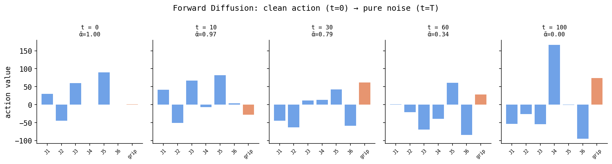
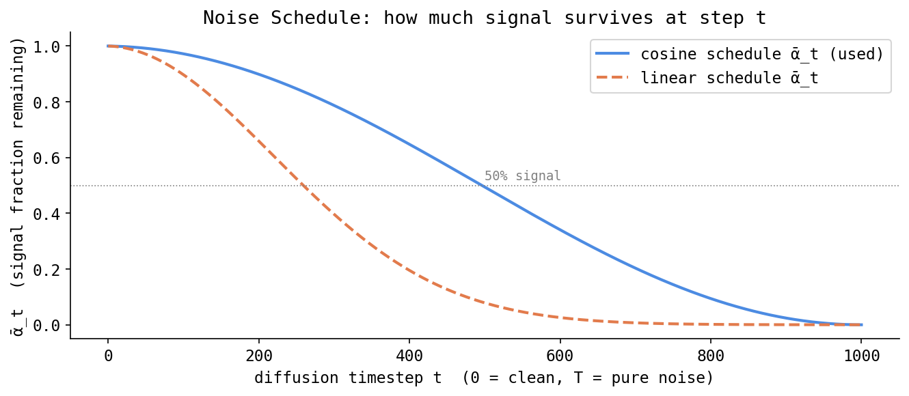
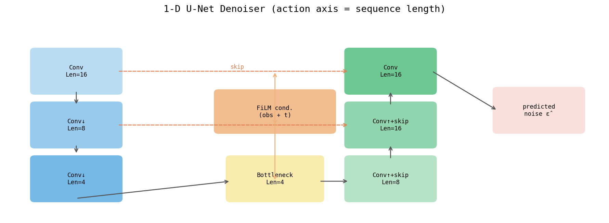

# Diffusion Policy (DDPM / DDIM) — An Extreme Micro-Detail Explainer

> **Who this is for.** You know basic Python and a tiny bit of machine learning (you've heard "neural network" and "training"). This document explains *every* concept from the ground up. The first time a technical term appears, it is defined inline. There is a lot here on purpose — read it top to bottom and you will understand not just *what* Diffusion Policy does but *why* every piece is the way it is.
>
> **The concrete system this targets.** A **Fairino FR5** robot arm. "FR5" is the model; it is a **6-DOF** arm, where **DOF** = "degrees of freedom" = the number of independent joints that can move. So the arm has 6 motorized joints. We add a gripper (a 2-finger hand) on the end. A single wrist-mounted **Intel RealSense D405** camera (a small depth+RGB camera) looks at the workspace. We control it at **30 Hz** (30 decisions per second; "Hz" = hertz = times per second).
>
> In this repo, Diffusion Policy is a thin wrapper around **lerobot 0.5.1**'s `DiffusionPolicy` class. The wrapper lives in `policies/diffusion/model.py`; configs in `policies/diffusion/config.yaml` (full scale) and `policies/diffusion/config.local.yaml` (laptop scale).

---

## Table of contents

1. [The one-sentence version](#1-the-one-sentence-version)
2. [Prerequisite concepts (read this first)](#2-prerequisite-concepts-read-this-first)
3. [The problem Diffusion Policy solves: multimodality and the averaging trap](#3-the-problem-diffusion-policy-solves-multimodality-and-the-averaging-trap)
4. [The core idea: learn to denoise](#4-the-core-idea-learn-to-denoise)
5. [The forward process (adding noise), unpacked symbol by symbol](#5-the-forward-process-adding-noise-unpacked-symbol-by-symbol)
6. [The variance / beta schedule](#6-the-variance--beta-schedule)
7. [The training objective: MSE on epsilon](#7-the-training-objective-mse-on-epsilon)
8. [A fully worked micro-example with real numbers](#8-a-fully-worked-micro-example-with-real-numbers)
9. [The reverse process: DDPM sampling](#9-the-reverse-process-ddpm-sampling)
10. [DDIM: fewer steps, deterministic](#10-ddim-fewer-steps-deterministic)
11. [The architecture, piece by piece](#11-the-architecture-piece-by-piece)
12. [Conditioning: how the observation gets in (FiLM)](#12-conditioning-how-the-observation-gets-in-film)
13. [Shapes end to end (the exact tensors in this repo)](#13-shapes-end-to-end-the-exact-tensors-in-this-repo)
14. [The action queue: receding horizon control](#14-the-action-queue-receding-horizon-control)
15. [Normalization (what the wrapper does)](#15-normalization-what-the-wrapper-does)
16. [Why every design choice is the way it is](#16-why-every-design-choice-is-the-way-it-is)
17. [Comparison vs ACT and vs DiT/Flow](#17-comparison-vs-act-and-vs-ditflow)
18. [When to use Diffusion Policy](#18-when-to-use-diffusion-policy)
19. [The exact repo config](#19-the-exact-repo-config)
20. [Glossary](#20-glossary)

---

## 1. The one-sentence version

Instead of a network that looks at the camera and *directly outputs* "here is the action to take," Diffusion Policy trains a network to **remove noise** from a corrupted action sequence. At run time you hand it pure random static and ask it to denoise that static, step by step, into a clean, sensible sequence of robot actions. This is the *same* mathematical machinery that powers image generators (Stable Diffusion, DALL·E) — except the thing being generated is a short clip of future robot motion instead of a picture.

Hold onto one mental image: **generation = repeated denoising of random noise.**

---

## 2. Prerequisite concepts (read this first)

This section builds the vocabulary. If you already know an item, skim it. None of it is optional for the later math.

### 2.1 What is a probability distribution?

A **probability distribution** is a rule that assigns a likelihood to every possible value of something. If I roll a fair die, the distribution over outcomes is "each of {1,2,3,4,5,6} has probability 1/6." For continuous things (like "a joint angle in degrees") we don't assign probability to single exact values but to *ranges*, using a **density**: a curve where the area under a region equals the probability of landing in that region. Higher curve = more likely.

The key distribution for us is the **Gaussian** (also called the **normal distribution** or "bell curve"). It is fully described by two numbers:
- **mean** μ ("mu") — where the bump is centered (the most likely value),
- **variance** σ² ("sigma squared") — how wide the bump is. Its square root σ is the **standard deviation** (typical distance from the mean).

We write `X ~ N(μ, σ²)` to mean "X is a random number drawn from a Gaussian with mean μ and variance σ²." The symbol `~` reads "is distributed as."

### 2.2 What is sampling?

**Sampling** = drawing one concrete value from a distribution, the way rolling a die gives you one number. `eps = N(0, 1)` in code (e.g. `torch.randn`) produces one specific number near 0, usually between −3 and +3. Do it again and you get a different number. Sampling is how a *probability rule* turns into an *actual value you can compute with*.

### 2.3 What is Gaussian noise?

**Noise** is unwanted randomness added to a signal. **Gaussian noise** specifically means the random amounts added are drawn from a Gaussian distribution. "Static" on an old TV is roughly Gaussian noise on each pixel.

The special standard one is `N(0, I)`:
- mean **0** = centered at zero (just as likely to push a value up as down),
- **I** = the **identity matrix**, which here just means "each dimension gets its *own independent* unit-variance noise, and the dimensions don't influence each other." If our action has 7 numbers, `N(0, I)` gives us 7 independent standard-normal numbers.

Why Gaussian everywhere? Because Gaussians have a magical property: **add two Gaussians and you get another Gaussian**, and **scale a Gaussian and it stays Gaussian**. This lets us collapse "add a little noise 100 times in a row" into a single closed-form equation (Section 5). Without that, none of this would be computationally practical.

### 2.4 What is a tensor, and what do B, T, action_dim mean?

A **tensor** is just a multi-dimensional array of numbers (a generalization of a vector and a matrix). In deep learning we constantly track a tensor's **shape** — the size along each dimension. Three dimensions show up over and over here:
- **B** = **batch size**. Networks process many examples at once for efficiency; B is how many. (Our config: 64 full-scale, 16 on a laptop.)
- **T** = **time / horizon**. The number of future timesteps in an action sequence. (Here T = `horizon` = `chunk_size` = **16**.)
- **action_dim** = how many numbers describe one action. (Here **7**: 6 joint-angle targets in degrees + 1 gripper command in [0, 1].)

So a batch of action chunks is a tensor of shape `(B, T, action_dim)` = `(64, 16, 7)`.

> ⚠️ **Two different "t"s.** This is the single most confusing thing in diffusion. There is a *time-in-the-action-sequence* index (which of the 16 future steps), and there is a *diffusion timestep* (how noisy a thing is, from 0 to 100). They are unrelated. To keep them apart, this doc uses **T_h** ("horizon", = 16) for the action-sequence length and **k** for the diffusion (noise-level) timestep. Many papers sloppily call both "t" — beware when reading elsewhere.

### 2.5 What is a neural network, in one paragraph?

A **neural network** is a big function with millions of tunable numbers (**parameters**, also called **weights**). You feed it an input, it computes an output. **Training** = adjusting the parameters so the output matches what you want, by measuring an error (a **loss**) and nudging every parameter a little in the direction that reduces the loss. That nudging uses **gradient descent** (compute the slope of the loss with respect to each parameter, step downhill). We write a network as `f_θ` where **θ** ("theta") is the bundle of all its parameters; the subscript reminds us "this output depends on the current weights."

### 2.6 What is MSE loss?

**MSE** = **Mean Squared Error**. To measure how wrong a prediction is, take the difference between prediction and target, square it (so over- and under-shoots both count as positive error and big mistakes are punished extra), and average over all the numbers. For vectors:

```
MSE(pred, target) = mean over all elements of (pred − target)²
```

The notation `‖ x ‖²` (read "norm squared") means "sum of the squares of the entries of x." So `‖ pred − target ‖²` is the (unaveraged) squared error. Minimizing MSE pulls the prediction toward the target.

### 2.7 What is convolution? What is 1-D convolution over time?

A **convolution** slides a small window of weights (a **kernel** or **filter**) across a signal, computing a weighted sum at each position. It is the workhorse of vision and sequence models because (a) it reuses the same small set of weights everywhere (few parameters, **translation-equivariant** — a pattern is detected the same way wherever it appears), and (b) each output looks only at a *local neighborhood*.

- **2-D convolution** slides the window over an image (height × width). Used on the camera image.
- **1-D convolution over time** slides the window along a *single time axis*. Diffusion Policy treats the 16-step action chunk like a short audio clip — a 1-D signal indexed by time — and runs 1-D convolutions along that time axis. With `kernel_size = 5` (our config), each output position blends the action at that step with its 2 neighbors on each side. This lets the network smooth and shape the *trajectory* (e.g. "joints should move continuously, not jump").

```
1-D conv, kernel_size = 5, over the time axis of the action chunk:

time step:   0   1   2   3   4   5   ...  15
              \  |  |  |  /
               [w0 w1 w2 w3 w4]  ← same 5 weights slide along
                output[2] = w0·a0 + w1·a1 + w2·a2 + w3·a3 + w4·a4
```

### 2.8 What is a U-Net?

A **U-Net** is a neural network shaped like the letter **U**. It has:
- a **downsampling path** (encoder): repeatedly shrink the signal's length while increasing the number of feature **channels** (channels = parallel feature detectors). Shrinking length lets later layers "see" a wider span of time at once.
- a **bottleneck** at the bottom (most compressed, most abstract representation).
- an **upsampling path** (decoder): grow the length back to the original, step by step.
- **skip connections**: at each resolution, the encoder's features are copied across and concatenated into the matching decoder stage. This lets the network keep fine, local detail (from the encoder) while also using the big-picture context (from the bottleneck).

```
            ENCODER (down)                 DECODER (up)
 input ──► [conv] ──┐                          ┌──► [conv] ──► output
 length 16          │  skip ───────────────►   │   length 16
            [down]──┐└──────────────►──────────┘┌──[up]
 length 8           │  skip ──────────►         │  length 8
            [down]──┐└─────────►───────────────┘┌──[up]
 length 4           │  skip ──►                  │  length 4
            [down]  └──►   [ bottleneck ]   ──►──┘
 length 2                  (most abstract)
```

The width of each level — how many channels — is set by `down_dims`. Our config uses `[256, 512, 1024]` (laptop) or `[512, 1024, 2048]` (full scale). Bigger = more capacity = more parameters.

### 2.9 What is ResNet18? What is a backbone?

A **backbone** is the front-end network that turns raw pixels into a compact list of meaningful features. **ResNet18** is a specific, classic 18-layer convolutional image network. "Res" = **residual connections**: each block computes `output = input + f(input)` instead of `output = f(input)`. Adding the input back ("the residual") makes very deep networks trainable, because gradients have a clean path to flow backward through the `+`.

### 2.10 What is spatial softmax?

After ResNet18 processes the 224×224 image, it produces a stack of small 2-D feature maps (e.g. a grid of activations, one grid per detected feature type). We need to turn each 2-D grid into a few numbers to feed downstream. **Spatial softmax** does this by computing, for each feature map, the **expected (x, y) location** where that feature fires most strongly — essentially "where in the image is this thing?" The **softmax** part normalizes the activations into a probability map over locations (all positive, summing to 1); the **expected location** is the average (x, y) weighted by that map. The result is a short list of coordinates ("the red block is around here, the gripper tip is around there") — exactly the kind of spatial info a manipulation policy needs.

### 2.11 What is GroupNorm? How is it different from BatchNorm?

**Normalization** inside a network re-centers and re-scales activations so training is stable. Two flavors matter here:
- **BatchNorm** (Batch Normalization): normalizes each feature using statistics (mean, variance) computed *across the whole batch* of examples. Problem: its behavior depends on the batch — if the batch is tiny (or size 1, as in real-time robot inference), the statistics are garbage.
- **GroupNorm** (Group Normalization): splits a layer's channels into a few **groups** (our config: `n_groups = 8`) and normalizes within each group, *per single example*. It does **not** look across the batch, so it behaves identically whether the batch is 64 or 1. That makes it the right choice for a policy that trains with big batches but runs inference one step at a time.

This single difference has a consequence that confuses everyone — see §16 on why GroupNorm forces `pretrained_backbone_weights = None`.

### 2.12 What is a score function? (optional intuition)

The **score** of a distribution at a point is the gradient (direction of steepest increase) of the log-probability density: `∇ log p(x)`. Plain English: it's an arrow pointing toward where data is more likely — "which way should I nudge this noisy thing to make it look more real?" Training a denoiser turns out to be mathematically equivalent to learning this score field. You do **not** need this to use Diffusion Policy; it's just the deep reason "predict the noise" and "point toward real data" are the same task. ("Score matching" = training a network to match that arrow field.)

### 2.13 Marginal vs conditional distribution

- A **conditional** distribution `p(action | observation)` = "the distribution over actions *given that* we observed this particular scene." This is what a policy needs: given what I see, what should I do?
- A **marginal** distribution `p(action)` = the distribution over actions averaged over all observations.

Diffusion Policy models the **conditional** distribution of action chunks given the current observation. The observation enters as the **conditioning** (§12).

### 2.14 What is multimodality?

A distribution is **multimodal** if it has multiple separate peaks ("modes"). Example: at a fork in a path, "go left" and "go right" are both fine, so the distribution of good actions has two peaks with a valley (nothing) in between. A **unimodal** model can only represent one peak. This distinction is the entire reason Diffusion Policy exists — see the next section.

---

## 3. The problem Diffusion Policy solves: multimodality and the averaging trap

Imagine teaching the arm to grab a cup that's directly in front of it. A human demonstrator sometimes reaches around the **left** side and sometimes the **right** side. Both are correct. In the training data, for the *same* observation you have *two* different valid action chunks.

Now suppose your network directly predicts the action and is trained with MSE (Section 2.6). MSE is minimized by predicting the **average** of the targets. The average of "go left" and "go right" is **"go straight into the cup"** — which knocks it over. This is the **averaging trap** (a.k.a. **mode averaging**): a unimodal regressor handed multimodal data confidently predicts the worst-of-both-worlds middle.

```
   left grasp •                      • right grasp
                \                    /
                 \                  /
                  ●  ← MSE average lands HERE
                     (collides with the cup — neither valid behavior)
```

To do well you need a model that can represent a **multimodal** distribution and *commit* to one mode per attempt. Diffusion Policy does exactly this: starting from a different random noise sample each time, the denoiser can flow toward the left-grasp mode *or* the right-grasp mode, and it lands cleanly on one of them. It never averages, because each run is a guided random walk that picks a basin and descends into it.

This is *the* headline advantage over ACT (§17).

---

## 4. The core idea: learn to denoise

There are two processes. Memorize this picture; everything else is detail.

```
FORWARD PROCESS  (a.k.a. "diffusion", "noising")  — used only during TRAINING
─────────────────────────────────────────────────────────────────────────────
 clean action chunk a₀  ──add a bit of Gaussian noise──►  a₁
                        ──add a bit more──►  a₂  ──►  ...  ──►  a_K  ≈ pure noise

   a₀ : real expert actions (recognizable trajectory)
   a_K: indistinguishable from N(0, I) static
   K  : num_train_timesteps = 100 in our config

REVERSE PROCESS  (a.k.a. "denoising", "generation")  — used during TRAINING & INFERENCE
─────────────────────────────────────────────────────────────────────────────
 pure noise a_K  ──denoise one step──►  a_{K-1}  ──►  ...  ──►  a₀  (clean actions)

   The network is trained to do ONE denoising step.
   At inference, you chain those steps to walk noise → clean.
```

**The forward process is not learned — it's a fixed recipe** (just "add Gaussian noise on a schedule"). The **reverse process is what the network learns**. The trick that makes training cheap: we don't run the forward process step by step. Because Gaussians compose (Section 2.3), we can jump *directly* to any noise level `k` in one shot with a closed-form equation. That's next.

---

## 5. The forward process (adding noise), unpacked symbol by symbol

The single most important equation in this whole document — the **forward noising equation**:

```
a_k = √(ᾱ_k) · a₀  +  √(1 − ᾱ_k) · ε ,        ε ~ N(0, I)
```

Let's name every symbol, then explain it in English, then say *why* it has this exact form.

| Symbol | Read as | Shape | What it is |
|---|---|---|---|
| `a₀` | "a-zero" | `(B, T_h, action_dim)` = `(B, 16, 7)` | the **clean** expert action chunk from a demonstration |
| `k` | "kay" | scalar integer in `{0, …, 99}` | the **diffusion timestep** = which noise level. `k=0` ≈ clean, `k=99` ≈ pure noise. Sampled at **random** each training step. |
| `a_k` | "a-kay" | same as `a₀` | the **noised** version of `a₀` at level `k` |
| `ε` | "epsilon" | same as `a₀` | the actual Gaussian noise we drew, `N(0, I)`. *This is the network's target.* |
| `ᾱ_k` | "alpha-bar-kay" | scalar in `[0, 1]` | the **signal-retention factor** at level `k` (defined below) |
| `√(ᾱ_k)` | "root alpha-bar" | scalar | how much of the **clean signal** survives |
| `√(1 − ᾱ_k)` | "root one-minus alpha-bar" | scalar | how much **noise** we mix in |

**In plain English:** `a_k` is a weighted blend of the clean actions and pure noise. The two weights are tied together so that `(√(ᾱ_k))² + (√(1−ᾱ_k))² = ᾱ_k + (1 − ᾱ_k) = 1`. That "squares sum to 1" is exactly the condition that keeps the **total variance constant** as we add noise (this is why the scheme is called *variance-preserving*). The signal doesn't blow up or shrink to nothing; it smoothly hands the spotlight from data to noise.

**Where does `ᾱ_k` come from?** Define a tiny per-step noise amount `β_k` ("beta-kay", the **variance schedule** — see §6). Then:
- `α_k = 1 − β_k` (how much signal survives *that one step*),
- `ᾱ_k = α_1 · α_2 · … · α_k` (the **cumulative product** — multiply all the per-step survivals up to step `k`; the bar over α means "cumulative").

Because each `α_k < 1`, multiplying more of them makes `ᾱ_k` shrink from ≈1 (at `k=0`) toward ≈0 (at `k=99`). So:
- small `k`: `ᾱ_k ≈ 1` → `√ᾱ_k ≈ 1`, `√(1−ᾱ_k) ≈ 0` → `a_k ≈ a₀` (barely any noise),
- large `k`: `ᾱ_k ≈ 0` → `√ᾱ_k ≈ 0`, `√(1−ᾱ_k) ≈ 1` → `a_k ≈ ε` (almost all noise).

**Why the square roots?** Variance scales with the *square* of a multiplier: if you scale a random variable by `c`, its variance scales by `c²`. We want the *variances* to add up to a constant (variance-preserving), so we scale the *signal* by `√ᾱ_k` and the *noise* by `√(1−ᾱ_k)`; then their variances are `ᾱ_k · Var(a₀)` and `(1−ᾱ_k) · 1`, which (for normalized data with unit variance) sum to 1. Without the square roots the total energy would drift and the network would see inconsistent scales.

**Why can we jump straight to step `k`?** Because adding Gaussian noise repeatedly is itself Gaussian, the 100 little additions collapse into this *one* formula. That means in training we never simulate the chain — we pick a random `k`, compute `ᾱ_k` (precomputed once), draw one `ε`, and get `a_k` instantly.

```
ASCII picture of the forward process at three noise levels
──────────────────────────────────────────────────────────
 k = 5    a_k ≈ 0.97·a₀ + 0.24·ε      ▁▂▃▄▅  (clean trajectory, faint grain)
 k = 50   a_k ≈ 0.50·a₀ + 0.87·ε      ▂▆▃▇▅  (shape barely visible under noise)
 k = 99   a_k ≈ 0.03·a₀ + 1.00·ε      ▇▅▇▆▇  (pure static)
```



---

## 6. The variance / beta schedule

The **schedule** is the list of per-step noise amounts `β_1, …, β_K`. It controls *how fast* clean data dissolves into noise as `k` grows. Our config sets:

```
num_train_timesteps: 100
beta_schedule: "squaredcos_cap_v2"
```

- **`num_train_timesteps = 100`** = K, the number of noise levels. (The original image-diffusion papers used 1000; 100 is plenty for short action chunks and trains/runs faster.)
- **`squaredcos_cap_v2`** = the **cosine schedule** (a "squared cosine," capped to avoid numerical extremes). It makes `ᾱ_k` follow a smooth cosine curve rather than a straight line.

Why a cosine instead of a straight (linear) ramp? With a linear schedule, the data gets destroyed too fast at the end — the last several steps are *all* basically pure noise, so they teach the network nothing (there's no signal left to recover). The cosine schedule spends more steps in the *useful middle regime* where the signal and noise are both present and the denoising task is informative. Intuitively:

```
ᾱ_k  (fraction of signal kept)
1.0 ●●●●●●                                 linear: ╲ steep drop, wastes late steps
    │      ●●●●                            cosine: ╲___ gentle S-curve, useful middle
0.5 │          ●●●●●
    │                ●●●●●●
0.0 │                       ●●●●●●●●●●●●●●●
    └─────────────────────────────────────► k
    0                                     99
```

(The shape above is schematic; the point is the cosine eases in at the start and eases out near the end.)



---

## 7. The training objective: MSE on epsilon

We could ask the network to predict different things. The two classic choices:
- **epsilon-prediction** (`prediction_type: "epsilon"`, our config): the network predicts **the noise `ε`** that was added.
- **sample-prediction** (`prediction_type: "sample"`): the network predicts **the clean action `a₀`** directly.

These are mathematically interchangeable — given `a_k`, `k`, and a prediction of *one*, you can algebraically recover the *other* via the forward equation. We use epsilon-prediction because, empirically, predicting the noise gives the network a target with consistent unit scale across all noise levels, which trains more stably.

Call the network `ε_θ` ("epsilon-theta") — it takes the noisy actions, the timestep, and the conditioning, and outputs its guess of the noise. The loss is plain **MSE** between the guessed noise and the true noise:

```
L(θ) = E_{a₀, ε, k}  ‖ ε_θ(a_k, k, c) − ε ‖²
```

Symbol by symbol:

| Symbol | Meaning |
|---|---|
| `L(θ)` | the loss, as a function of the network parameters θ |
| `E_{a₀, ε, k}` | **expectation** = "average over" random draws of a clean chunk `a₀` (from the dataset), noise `ε ~ N(0, I)`, and timestep `k` (uniform over 0…99) |
| `ε_θ(a_k, k, c)` | the network's predicted noise. Inputs: noisy actions `a_k` `(B,16,7)`, timestep `k` `(B,)`, conditioning `c` `(B, cond_dim)` |
| `ε` | the true noise that was actually added, same shape `(B,16,7)` |
| `‖ · ‖²` | sum of squared entries (Section 2.6) |
| `c` | the **conditioning vector** built from the observation (§12) |

**The full training step, in words:**
1. Grab a batch of clean expert chunks `a₀` and their observations. Shape `(64, 16, 7)`.
2. For each, sample a random timestep `k ∈ {0,…,99}` and fresh noise `ε ~ N(0, I)`.
3. Compute `a_k = √ᾱ_k · a₀ + √(1−ᾱ_k) · ε` (the forward equation — *one* line, no simulation).
4. Build the conditioning `c` by encoding the observation (image through ResNet18 → spatial softmax; state through a linear layer).
5. Run the U-Net: `ε̂ = ε_θ(a_k, k, c)`.
6. Loss = `mean((ε̂ − ε)²)`. Backpropagate, update θ.

That's it. There's **no KL term, no adversarial game, no reconstruction-vs-latent tradeoff** — just one MSE. (Contrast ACT's CVAE loss in §17.) In the repo, `DiffusionPol.forward(...)` returns `(loss, loss.item(), 0.0)` — the trailing `0.0` is a placeholder for "KL loss" to keep the same call signature as ACT, but Diffusion Policy has none.

**Why predicting noise still produces good actions:** if the network can reliably say "this much of what you handed me is noise," then it implicitly knows "the rest is signal." Repeatedly subtracting off the predicted noise walks any random start toward the data manifold (the set of realistic action chunks). The denoiser never has to commit to a single answer up front — it just keeps removing noise — which is exactly why it can land on *different* valid modes from different starts (Section 3).

---

## 8. A fully worked micro-example with real numbers

Let's pick a tiny case and compute everything. We'll use a small diffusion timestep so the numbers are easy to feel.

**Setup.** Take one action *number* (one entry of the 7-dim action — say joint 1's normalized target). Suppose after mean-std normalization (§15) the clean value is

```
a₀ = 0.80          (a normalized joint target; unitless)
```

**Pick a small timestep** `k = 5`. We need `ᾱ_5`. With the cosine schedule and K=100, `ᾱ_5` is close to 1 (very little destroyed yet). For a concrete, representative value, take

```
ᾱ_5 ≈ 0.94
```

(The exact number comes from the cosine formula; 0.94 is realistic for k=5 of 100.) Then

```
√ᾱ_5      = √0.94      ≈ 0.970     ← signal weight
√(1−ᾱ_5)  = √0.06      ≈ 0.245     ← noise weight
```

**Draw the noise.** Say we sample `ε = +1.20` (a single number from N(0,1); perfectly ordinary, just over one standard deviation).

**Form the noisy input** with the forward equation:

```
a_5 = √ᾱ_5 · a₀  +  √(1−ᾱ_5) · ε
    = 0.970 · 0.80  +  0.245 · 1.20
    = 0.776          +  0.294
    = 1.070
```

**What the network sees and is asked to do.** Its inputs are:
- `a_5 = 1.070` (the noisy action value; in the full tensor this is one of `(B,16,7)` numbers),
- the timestep `k = 5` (encoded into a vector so the net knows "this is barely noised"),
- the conditioning `c` (the encoded camera image + joint state).

Its job (epsilon-prediction) is to output its guess `ε̂` of the noise. The training target is the true `ε = +1.20`. If the network outputs, say, `ε̂ = 1.05`, the per-element loss contribution is

```
(ε̂ − ε)² = (1.05 − 1.20)² = (−0.15)² = 0.0225
```

That number gets averaged with all the other `B·16·7` elements and backpropagated.

**Now the same input at a large timestep** to feel the contrast. Take `k = 90`, where the cosine schedule has nearly killed the signal — say `ᾱ_90 ≈ 0.02`:

```
√ᾱ_90 = √0.02 ≈ 0.141      √(1−ᾱ_90) = √0.98 ≈ 0.990
a_90 = 0.141·0.80 + 0.990·1.20 = 0.113 + 1.188 = 1.301
```

Here `a_90 = 1.301` is almost entirely the noise term (`1.188` of `1.301`). The clean value `0.80` contributes only `0.113`. The network at `k=90` is being asked to recover a faint whisper of signal from near-total static — a *hard* denoising step. At `k=5` it was an *easy* step. Training over random `k` teaches the net to handle the whole spectrum, and inference chains from hard (noisy) to easy (clean).

**Recovering the clean estimate (preview of the reverse step).** Given a noise prediction `ε̂`, you can estimate the clean action by inverting the forward equation:

```
â₀ = ( a_k − √(1−ᾱ_k) · ε̂ ) / √ᾱ_k
```

For the `k=5` case with `ε̂ = 1.05`:

```
â₀ = (1.070 − 0.245·1.05) / 0.970
   = (1.070 − 0.257) / 0.970
   = 0.813 / 0.970
   = 0.838
```

We predicted `â₀ = 0.838` vs the true `a₀ = 0.80` — close, because `k=5` is barely noised and the net's noise guess was decent. This `â₀` is the building block of the reverse update next.

---

## 9. The reverse process: DDPM sampling

**DDPM** = **Denoising Diffusion Probabilistic Model** — the original (2020) formulation. Its reverse process walks from pure noise to clean data **one diffusion step at a time**, and each step is *stochastic* (adds a fresh dab of randomness).

Sampling loop (conceptual):

```
a_K ~ N(0, I)                                   # start from pure noise, shape (B,16,7)
for k = K, K−1, …, 1:
    ε̂  = ε_θ(a_k, k, c)                         # predict the noise in a_k
    â₀ = (a_k − √(1−ᾱ_k)·ε̂) / √ᾱ_k             # implied clean estimate
    a_{k−1} = (a function of a_k, â₀, ε̂)  +  σ_k · z,   z ~ N(0, I)   # step down + re-noise a touch
return a₀                                        # the clean action chunk
```

The crucial bit: **each DDPM step re-injects a little fresh Gaussian noise** (`σ_k · z`). That randomness is what lets the *theory* match a proper probability distribution, but it means you must take *many small steps* (the original papers used hundreds to a thousand) for the walk to be accurate. Hundreds of network calls per action chunk is far too slow for a 30 Hz robot. Enter DDIM.

---

## 10. DDIM: fewer steps, deterministic

**DDIM** = **Denoising Diffusion Implicit Models** (2021). Key insight: you can define a reverse process that produces the *same* final distribution as DDPM but **without re-injecting random noise at each step** (set that `σ_k z` term to zero). Removing the per-step randomness makes the trajectory from noise to data **smooth and deterministic**, which means you can take **big jumps** — skip from `k=100` straight to `k=90`, then `80`, …, in just a handful of steps — and still land in a good place. Our config:

```
num_inference_steps: 10        # 10 DDIM steps instead of 100 DDPM steps
noise_scheduler_type: "DDPM"   # add noise with DDPM math; denoise with DDIM at inference
```

(The `noise_scheduler_type: "DDPM"` names how *training noise* is defined; lerobot uses a DDIM scheduler to actually *sample* in `num_inference_steps`. Train with the DDPM noising recipe, denoise with the fast DDIM solver.)

**The DDIM update rule, step by step.** Going from noise level `k` to the next (lower) chosen level `k_prev`:

```
Step 1 — predict the noise:
    ε̂ = ε_θ(a_k, k, c)

Step 2 — estimate the clean action from a_k and ε̂ (invert the forward eq.):
    â₀ = ( a_k − √(1 − ᾱ_k) · ε̂ ) / √(ᾱ_k)

Step 3 — recompute the noise direction consistent with â₀:
    (the "direction pointing toward a_k") = √(1 − ᾱ_{k_prev}) · ε̂

Step 4 — re-noise â₀ to the LOWER noise level k_prev (deterministic, no random z):
    a_{k_prev} = √(ᾱ_{k_prev}) · â₀  +  √(1 − ᾱ_{k_prev}) · ε̂
```

Read Step 4 carefully — it is *literally the forward equation again*, but with the **predicted** clean `â₀` and the **predicted** noise `ε̂`, evaluated at the *next, smaller* noise level. So each DDIM step is: "guess the clean trajectory, then re-corrupt it to slightly-less-noisy than before." Chaining 10 such steps walks `k: 100 → 90 → … → 0`, ending at `a₀`, the clean action chunk.

```
DDIM inference, 10 steps  (each box = one network call ε_θ)
────────────────────────────────────────────────────────────
noise        ┌──┐   ┌──┐   ┌──┐         ┌──┐   ┌──┐
a_100  ─────►│θ │──►│θ │──►│θ │── ... ──►│θ │──►│θ │─────► a_0  (clean actions)
 N(0,I)      └──┘   └──┘   └──┘         └──┘   └──┘
  k:  100     →90    →80    →70    ...   →10    →0
              guess clean, re-noise to next level, repeat
```

**Why 10 instead of 100?** Because DDIM is deterministic and smooth, ~10 jumps reproduce the quality that DDPM needs ~100 small steps for. 10 network calls per chunk is fast enough to keep the 30 Hz control loop fed on a GPU; 100 would not be. (DDIM also makes inference *reproducible*: same noise seed → same trajectory, handy for debugging.)

---

## 11. The architecture, piece by piece

Two halves: an **observation encoder** (turns "what I see" into a conditioning vector `c`) and the **denoiser** (the 1-D conditional U-Net that predicts noise on the action chunk).



```
OBSERVATION                                        NOISY ACTION CHUNK
  │                                                  a_k : (B, 16, 7)
  ├─ wrist image (B, 3, 224, 224)                        │
  │     │                                                │
  │   ResNet18 (GroupNorm, NOT pretrained)               │
  │     │  → feature maps                                │
  │   Spatial Softmax → keypoint coords                  │
  │     │                                                │
  ├─ joint state (B, 6)                                  │
  │     │                                                │
  │   Linear projection                                  │
  │     │                                                │
  └──── concat ──► conditioning vector  c : (B, cond_dim)│
                          │                              │
                          │   timestep k ──► sinusoidal embed ──► MLP ──┐
                          │   (B,)              (B, 128)                │
                          ▼                                             ▼
        ┌───────────────────────────────────────────────────────────────────┐
        │            1-D CONDITIONAL U-NET   (the denoiser ε_θ)              │
        │                                                                    │
        │   down: dims [256,512,1024] (or [512,1024,2048] full)             │
        │   1-D convs along the TIME axis (kernel_size=5, GroupNorm n=8)     │
        │   FiLM layers inject (c ⊕ timestep embed) at every resolution      │
        │   skip connections from encoder → decoder                          │
        └───────────────────────────────────────────────────────────────────┘
                          │
                          ▼
              predicted noise  ε̂ = ε_θ(a_k, k, c) : (B, 16, 7)
```

- **Image path.** The 640×480 wrist image is resized to **224×224** (ResNet18's expected input), then run through ResNet18 → **spatial softmax** → a short list of keypoint coordinates.
- **State path.** The 6 joint angles go through a **linear layer** (a learned matrix multiply + bias) to a feature vector.
- **Timestep path.** The diffusion step `k` is turned into a vector via a **sinusoidal embedding** (the same trick transformers use for position: encode an integer as a set of sine/cosine waves at different frequencies, giving the net a smooth, distinguishable representation of "how noisy is this"), then passed through a small **MLP** (Multi-Layer Perceptron = a stack of linear layers with nonlinearities). `diffusion_step_embed_dim = 128`.
- **The U-Net** processes the action chunk `(B,16,7)` as a 16-long, 7-channel 1-D signal, downsampling along time, then upsampling back, with skip connections, outputting predicted noise of the *same shape* `(B,16,7)`.

---

## 12. Conditioning: how the observation gets in (FiLM)

The denoiser must denoise *differently depending on the scene* — the same noisy chunk should resolve toward a left-grasp in one scene and a place-down in another. The mechanism that injects the observation is **FiLM**.

**FiLM** = **Feature-wise Linear Modulation.** Given the conditioning vector `c` (observation features ⊕ timestep embedding; "⊕" = concatenate), two tiny linear layers produce a per-channel **scale** `γ` ("gamma") and **shift** `β` ("beta"). Inside the U-Net, a feature map `h` is modulated as:

```
FiLM(h) = γ(c) · h  +  β(c)
```

- `h` : an internal feature map of the U-Net, shape `(B, channels, time)`,
- `γ(c)`, `β(c)` : per-channel numbers computed from `c`, shape `(B, channels, 1)` (broadcast across time),
- `·` is elementwise multiply.

In words: the observation **rescales and offsets every feature channel** at every U-Net resolution. It's a lightweight but powerful way to say "given this scene at this noise level, emphasize these features and suppress those." Our config sets `use_film_scale_modulation: true`, meaning FiLM produces *both* a scale `γ` and a shift `β` (if false, only a shift). This is how `c` steers the denoising toward the right mode of behavior.

---

## 13. Shapes end to end (the exact tensors in this repo)

Tracing one **training** forward pass with full-scale batch size 64:

| Stage | Tensor | Shape | Notes |
|---|---|---|---|
| Clean actions in | `a₀` | `(64, 16, 7)` | horizon 16, action_dim 7 |
| Sampled timestep | `k` | `(64,)` | one per example, in 0…99 |
| Sampled noise | `ε` | `(64, 16, 7)` | `N(0, I)` |
| Noised actions | `a_k` | `(64, 16, 7)` | forward equation |
| Wrist image in | img | `(64, 3, 224, 224)` | ImageNet-normalized by dataset.py |
| Joint state in | state | `(64, 1, 6)` | `n_obs_steps = 1` → middle dim 1 |
| Conditioning | `c` | `(64, cond_dim)` | image keypoints ⊕ state features |
| U-Net output | `ε̂` | `(64, 16, 7)` | predicted noise |
| Loss | scalar | `()` | `mean((ε̂ − ε)²)` |

At **inference** (`predict`), `n_obs_steps = 1` and the lerobot **action queue** handles the extra time dimension; state arrives `(B, 6)`, image `(B, 3, 224, 224)`, and after 10 DDIM steps the policy returns one action `(B, 7)` per call (in original joint units after un-normalization).

---

## 14. The action queue: receding horizon control

The U-Net predicts a chunk of **`horizon = 16`** future actions (16 steps × (1/30 s) ≈ **0.53 seconds** of motion). But we only **execute the first `n_action_steps = 8`** of them, then throw the rest away and re-predict from the fresh observation. This pattern — predict a horizon, execute a prefix, re-plan — is called **receding horizon control** (borrowed from model-predictive control). The mechanism that holds the 8 ready-to-go actions and doles them out one per control tick is the **action queue**.

```
predict 16:  [a0 a1 a2 a3 a4 a5 a6 a7 | a8 a9 a10 a11 a12 a13 a14 a15]
execute:      ▲  ▲  ▲  ▲  ▲  ▲  ▲  ▲    └──────── discarded ────────┘
              └─ these 8 only, then RE-PREDICT from a new observation
```

**Why predict 16 but execute only 8?** Two competing pressures:
- Predicting a longer horizon gives the U-Net **context** to make a coherent, smooth trajectory (the 1-D convolutions need neighbors; the *ends* of the chunk are lower-quality because they have fewer neighbors and are further from the observation).
- Executing fewer steps keeps the robot **reactive** — it re-looks at the world every 8 ticks (~0.27 s) and corrects for anything that changed.

So we **discard the back half** because those late predictions are the least reliable (furthest in the future, least constrained by the current observation, near the chunk's edge), and re-querying replaces them with fresh, observation-grounded ones. Executing the full 16 open-loop would let errors and stale assumptions accumulate; executing only 1 would waste the 10-step denoising cost on every single tick. 8-of-16 is the balance the original Diffusion Policy paper landed on, and it's what this repo uses.

In the repo: call `model.reset()` once at the start of an episode (clears the queue), then call `model.predict(...)` every control tick. When the queue is empty, `predict` runs the 10-step DDIM denoise to refill it; otherwise it just pops the next action.

---

## 15. Normalization (what the wrapper does)

Networks train best when their inputs and targets are roughly **unit-scale** (mean 0, standard deviation 1). Raw joint angles in degrees span wildly different ranges than a gripper value in [0,1], so we **normalize**.

- **State and action: mean-std normalization.** Subtract the dataset mean and divide by the dataset standard deviation: `x_norm = (x − mean) / std`. After this, every channel is centered and unit-scaled. The wrapper holds the precomputed `state_mean/std` and `action_mean/std` as buffers. The diffusion math (Sections 5–10) all happens in this **normalized** space — which is also why the forward equation's variance-preserving design works cleanly (the data already has ≈unit variance). At the end, `predict` calls `_unnorm_action` to convert back to real joint degrees + gripper.
- **Images: ImageNet normalization, done upstream.** `dataset.py` already normalizes images with ImageNet statistics before they reach the model, so the wrapper passes them through untouched.
- A subtlety in the code: the lerobot policy is configured with `NormalizationMode.IDENTITY` for state/action/visual — meaning **the wrapper does all normalization itself** and tells lerobot "don't normalize again." This avoids double-normalizing.

---

## 16. Why every design choice is the way it is

A consolidated "why," since this is the part people most want.

**Why denoise instead of directly predicting actions?** Direct regression with MSE collapses multimodal data to its average (the averaging trap, §3) — catastrophic when there are multiple valid behaviors. Denoising sidesteps this: each generation starts from a different random sample and the iterative denoiser *commits* to one mode. You get a model that represents `p(actions | observation)` as a full (possibly multi-peaked) distribution rather than a single averaged point.

**Why does it handle multimodality?** Because sampling is built in. Different initial noise `a_K` flows, through the deterministic-or-stochastic denoising path, into different basins of the action distribution. Left-grasp and right-grasp are both reachable; you land on one per run, never the invalid average.

**Why DDIM (10 steps) instead of DDPM (100 steps)?** DDPM re-injects randomness every step and therefore needs many tiny steps to be accurate — too slow for 30 Hz. DDIM removes the per-step randomness, making the noise→data path smooth and deterministic, so ~10 large jumps reach the same quality. 10 network calls per chunk fits the real-time budget; 100 would not.

**Why discard half the predicted chunk (execute 8 of 16)?** The far end of the chunk is the least reliable (furthest from the observation, fewest convolutional neighbors, closest to the chunk boundary), and re-planning every 8 ticks keeps the robot reactive to a changing world. Predicting 16 buys trajectory *coherence*; executing 8 buys *responsiveness*. (§14)

**Why GroupNorm — and why does that force `pretrained_backbone_weights = None`?** Inference runs one example at a time, where BatchNorm's batch statistics are meaningless/unstable; GroupNorm is batch-independent, so it behaves identically in training and single-step inference. **But:** the standard pretrained ResNet18 (ImageNet weights) was trained *with BatchNorm layers* — its saved weights include BatchNorm-specific parameters and statistics. When Diffusion Policy swaps every BatchNorm for GroupNorm, the layer structure no longer matches the checkpoint, so the pretrained weights **cannot be loaded** — they're for a different normalization scheme. Hence `pretrained_backbone_weights: null` in the config, and the comment in `model.py`: *"GroupNorm is incompatible with pretrained BatchNorm weights."* The ResNet18 is therefore trained **from scratch** on your robot data. (This is a genuine tradeoff: you lose ImageNet's visual prior but gain batch-size-robust inference.)

**Why epsilon-prediction over sample-prediction?** Predicting the noise gives a target with consistent unit scale across all noise levels (noise is always ~N(0,I)), which empirically trains more stably than predicting `a₀` (whose "difficulty" varies enormously with `k`). The two are algebraically equivalent, so it's purely a training-dynamics choice.

**Why a cosine (`squaredcos_cap_v2`) beta schedule?** A linear schedule destroys the signal too quickly near the end, wasting the last steps on pure-noise inputs that teach nothing. The cosine schedule spends more steps in the informative middle regime where both signal and noise are present. (§6)

**Why a 1-D U-Net (and not a transformer)?** Action chunks are short (16 steps) and *temporally smooth* — 1-D convolutions over time are a natural, parameter-efficient fit and bake in a smoothness prior. (Transformers become worth it for longer/structured sequences — that's the DiT variant, §17.)

---

## 17. Comparison vs ACT and vs DiT/Flow

### Diffusion Policy vs ACT

**ACT** (Action Chunking with Transformers) directly predicts a long action chunk in a single forward pass, trained as a **CVAE** (Conditional Variational AutoEncoder — a model that learns a small latent code `z` capturing the *variability* in demonstrations, with a **KL term** in the loss keeping `z` close to a standard normal so `z=0` is a valid "average behavior" at test time).

| | **ACT** | **Diffusion Policy** |
|---|---|---|
| What the network predicts | actions, directly | the **noise** to remove from a corrupted action chunk |
| Training loss | L1 reconstruction + β·KL (CVAE) | a single **MSE on ε** (no KL) |
| Handles multimodality | weakly (CVAE latent helps a bit, but largely averages) | **yes, natively** (sampling picks a mode) |
| Chunk size (horizon) | 100 (~3.3 s) | **16 (~0.53 s)** |
| Re-query cadence | every 100 steps (long open-loop) | every **8** steps (reactive) |
| Inference cost | **one** forward pass | **10** DDIM denoising passes |
| Vision backbone | ResNet18, **ImageNet-pretrained** (BatchNorm) | ResNet18, **from scratch** (GroupNorm) |
| Param count (this repo) | ~19M | **~75M** (full-scale, down_dims [512,1024,2048]) |
| Best at | fast, simple, long smooth trajectories | multimodal tasks, multiple valid solutions |

The headline: **ACT is cheaper and simpler; Diffusion Policy is the one that doesn't collapse multimodal behavior into a broken average.** If your task has one obvious way to do it, ACT's single forward pass is hard to beat on latency. If there are several valid ways, Diffusion Policy is far safer.

### Diffusion Policy vs DiT + Flow Matching

The repo also has a DiT/flow variant (`docs/dit_flow.md`). It keeps the "denoise a corrupted chunk" idea but swaps two pieces:
- **DiT** (Diffusion Transformer) replaces the **1-D U-Net** with a **transformer** denoiser. Conditioning enters via **AdaLN** (Adaptive Layer Norm — the conditioning computes each transformer block's layer-norm scale/shift) instead of FiLM. Transformers scale better and model long-range dependencies in the chunk more flexibly.
- **Flow matching** replaces **DDPM/DDIM** noise with a **straight-line** path from noise to data; the network predicts a **velocity** along that line. Because the path is straight (not the curved DDPM trajectory), it needs even fewer inference steps.

```
DDPM/DDIM (Diffusion Policy):  noise ～～curved path～～► data   (10 DDIM steps)
Flow matching (DiT/Flow):      noise ──straight line──► data    (even fewer steps)
```

Rough mental model: **Diffusion Policy = U-Net + DDPM noise**; **DiT/Flow = Transformer + straight-line flow.** DiT/Flow is the more modern, more scalable cousin; Diffusion Policy is the well-proven workhorse with a simpler architecture and a strong track record on manipulation.

---

## 18. When to use Diffusion Policy

**Reach for it when:**
- ✓ The task has **multiple valid ways** to accomplish it (different grasp poses, approach paths, orderings). This is the killer feature.
- ✓ Your demonstrations are **inconsistent / multimodal** (several humans, or one human doing it different ways) and a direct regressor would average them into mush.
- ✓ You have a **GPU at inference** to afford ~10 denoising passes per 8 executed actions while staying within the 30 Hz budget.
- ✓ You want **smooth, coherent short-horizon trajectories** (the 1-D conv U-Net bakes in temporal smoothness).

**Look elsewhere when:**
- ✗ You need **pure-CPU real-time** inference at 30 Hz — 10 denoising passes are too slow without CUDA; ACT's single pass is friendlier.
- ✗ The task is genuinely **unimodal** and latency-critical — ACT's one forward pass wins on simplicity and speed with no quality loss.
- ✗ You need **very long horizons** in a single shot — the 16-step (~0.53 s) chunk is short by design; long tasks are handled by frequent re-planning, not a long chunk.
- ✗ You want to **leverage ImageNet pretraining** strongly — Diffusion Policy's GroupNorm backbone trains from scratch (§16), so on tiny datasets ACT's pretrained backbone may transfer better.

---

## 19. The exact repo config

From `policies/diffusion/config.yaml` (full scale). The laptop config `config.local.yaml` differs only in `down_dims: [256, 512, 1024]`, `batch_size: 16`, `max_epochs: 5`, and a smaller dataset.

```yaml
dataset:
  chunk_size: 16          # horizon = T_h; the U-Net predicts this many action steps (~0.53 s @ 30 Hz)
  use_image: true
  image_size: [224, 224]  # wrist D405 frame resized for ResNet18

model:
  state_dim: 6            # 6 joint angles (degrees)
  action_dim: 7           # 6 joint targets (deg) + 1 gripper command (0–1)
  n_action_steps: 8       # execute 8 of the 16 (receding horizon), then re-predict

  # 1-D Conditional U-Net
  down_dims: [512, 1024, 2048]   # channel widths per resolution (full scale)
  kernel_size: 5                 # 1-D conv window over time
  n_groups: 8                    # GroupNorm groups
  diffusion_step_embed_dim: 128  # size of the timestep embedding
  use_film_scale_modulation: true

  # DDPM noise schedule (training)
  num_train_timesteps: 100       # K, number of noise levels
  beta_schedule: "squaredcos_cap_v2"   # cosine schedule
  prediction_type: "epsilon"     # predict the noise (not the clean sample)

  # DDIM inference (fast)
  num_inference_steps: 10        # 10 deterministic denoising steps (vs 100)
  noise_scheduler_type: "DDPM"   # noising recipe; DDIM solver used to sample

  # Vision
  vision_backbone: "resnet18"
  pretrained_backbone_weights: null   # GroupNorm ≠ pretrained BatchNorm weights → train from scratch

training:
  batch_size: 64
  lr: 1.0e-4
  weight_decay: 1.0e-6
  max_epochs: 100
  grad_clip: 10.0
```

- **Robot:** Fairino FR5, 6-DOF, + gripper, single wrist Intel RealSense D405, 30 Hz.
- **Param count:** ~75M at full scale (`down_dims [512,1024,2048]`); smaller with the laptop `[256,512,1024]`.
- **Implementation:** thin wrapper (`policies/diffusion/model.py`, class `DiffusionPol`) around lerobot 0.5.1's `DiffusionPolicy`. `forward` returns `(loss, loss.item(), 0.0)` — the trailing `0.0` is a no-op KL placeholder (Diffusion Policy has no KL term). `predict` runs DDIM via the lerobot action queue and un-normalizes back to joint units.

---

## 20. Glossary

> **Diffusion Policy inference loop (Mermaid)**
>
> ```mermaid
> flowchart LR
>     subgraph Observation
>         IMG["image (3,224,224)\n→ ResNet18 → keypoints"]
>         JNT["joints (6,)\n→ Linear projection"]
>         COND["concat → c (cond_dim)"]
>         IMG & JNT --> COND
>     end
>     subgraph DDIM["DDIM reverse loop (10 steps)"]
>         NOISE["x_K ~ N(0,I)\nshape (16,7)"]
>         UNET["1-D U-Net\nε̂ = model(x_k, k, c)"]
>         STEP["x_{k-1} = DDIM step\n(remove ε̂ fraction)"]
>         NOISE --> UNET --> STEP --> |"k=K..1"| UNET
>     end
>     COND --> UNET
>     STEP --> |"k=0 done"| QUEUE["action queue\npush first n_action_steps=8"]
>     QUEUE --> BOT["send action to robot\nrepeat until queue empty → refill"]
> ```

| Term | One-line definition |
|---|---|
| **Action chunk** | A short sequence of consecutive future actions, here `(16, 7)`. |
| **alpha-bar `ᾱ_k`** | Cumulative product of per-step signal-retention factors; fraction of clean signal remaining at noise level `k`. |
| **AdaLN** | Adaptive Layer Norm; conditioning method used by DiT (computes layer-norm scale/shift from `c`). |
| **Backbone** | The image front-end (ResNet18) that turns pixels into features. |
| **BatchNorm** | Normalizes using statistics across the batch; unstable at batch size 1. |
| **Beta schedule `β_k`** | Fixed list of per-step noise variances controlling how fast data turns to noise. |
| **Conditioning vector `c`** | Encoded observation (+ timestep) that steers denoising; injected via FiLM. |
| **Convolution** | Slide a small weight window over a signal computing local weighted sums. |
| **CVAE** | Conditional Variational AutoEncoder; ACT's training framework (uses a latent + KL). |
| **DDIM** | Denoising Diffusion Implicit Models; deterministic, few-step sampler. |
| **DDPM** | Denoising Diffusion Probabilistic Model; original stochastic, many-step formulation. |
| **Denoising** | Removing noise from a corrupted signal; the reverse process. |
| **Diffusion timestep `k`** | Noise-level index 0…99 (NOT the action-sequence time index). |
| **DOF** | Degrees of freedom; independently movable joints (FR5 = 6). |
| **Epsilon-prediction** | Network predicts the added noise `ε` (vs the clean sample). |
| **Expectation `E[·]`** | Average over random draws. |
| **FiLM** | Feature-wise Linear Modulation; per-channel scale+shift from `c`. |
| **Forward process** | Fixed noising recipe; clean → noise. |
| **Gaussian / Normal** | Bell-curve distribution defined by mean and variance. |
| **GroupNorm** | Normalizes within channel groups, per example; batch-size-independent. |
| **Horizon `T_h`** | Number of future steps predicted per chunk (16). |
| **Kernel / filter** | The small window of weights a convolution slides. |
| **Marginal vs conditional** | `p(a)` vs `p(a | observation)`; we model the conditional. |
| **MLP** | Multi-Layer Perceptron; stack of linear layers + nonlinearities. |
| **Mode / multimodal** | Separate peaks in a distribution; multiple valid behaviors. |
| **MSE** | Mean Squared Error loss. |
| **Norm `‖·‖²`** | Sum of squares of a vector's entries. |
| **Normalization (data)** | Rescaling inputs/targets to ≈ mean 0, std 1. |
| **Parameters `θ`** | The network's tunable weights. |
| **Receding horizon** | Predict a horizon, execute a prefix, re-plan; the action-queue pattern. |
| **ResNet18** | 18-layer convolutional image network with residual connections. |
| **Reverse process** | Learned denoising; noise → clean. |
| **Sampling** | Drawing a concrete value from a distribution. |
| **Score function** | Gradient of log-density; arrow toward more-likely data. |
| **Spatial softmax** | Turns image feature maps into expected (x,y) keypoint locations. |
| **Tensor / shape** | Multi-dimensional array / its size per dimension. |
| **U-Net** | Encoder–bottleneck–decoder network with skip connections. |
| **Variance-preserving** | Noising scheme whose total variance stays constant (why the √ weights). |

---

*This document explains the Diffusion Policy implementation in `policies/diffusion/` (wrapping lerobot 0.5.1) for the Fairino FR5 pipeline. All configuration numbers are taken directly from `config.yaml` / `config.local.yaml` and `model.py`; the worked example's `ᾱ` values are representative of a cosine schedule, not exact reads from the scheduler.*
