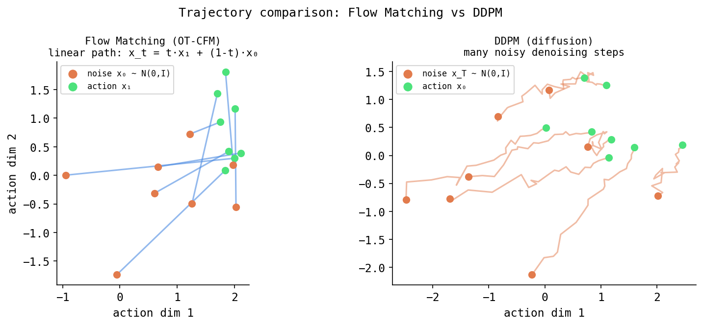
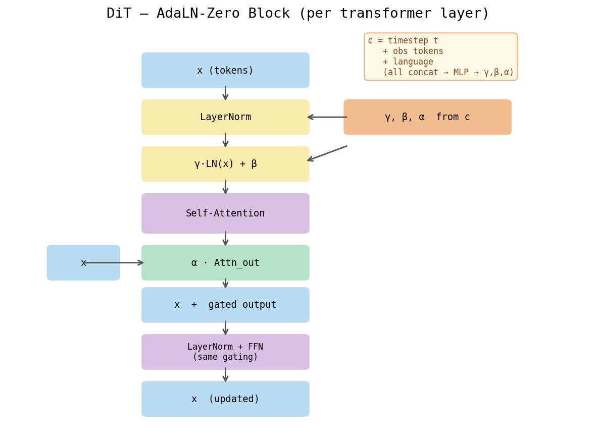

# DiT + Flow Matching — A Ground-Up Explainer

> **Who this is for.** You know basic Python and a *tiny* bit of machine learning
> (you've heard the words "neural network," "training," "loss"). You do **not**
> need to know transformers, attention, diffusion, ODEs, or CLIP. Every term is
> defined the first time it appears. This document is intentionally long: it is a
> complete teaching reference for the `dit_flow` policy in this repository.
>
> **What this policy is, in one breath.** It takes a camera image of the robot's
> workspace, the robot's current joint angles, and a text instruction, and it
> outputs the next 32 robot actions. Internally it does this by starting from
> pure random noise and "flowing" that noise into a clean sequence of actions,
> guided by a kind of neural network called a *transformer*. The two named ideas
> are **DiT** (the transformer that does the flowing) and **flow matching** (the
> math that defines what "flowing" means).

---

## Table of contents

1. [Prerequisite concepts (read this first)](#1-prerequisite-concepts-read-this-first)
2. [The big picture](#2-the-big-picture)
3. [Flow matching: the math, fully unpacked](#3-flow-matching-the-math-fully-unpacked)
4. [A worked micro-example by hand](#4-a-worked-micro-example-by-hand)
5. [The DiT architecture, block by block](#5-the-dit-architecture-block-by-block)
6. [Conditioning: vision, language, state](#6-conditioning-vision-language-state)
7. [AdaLN: how conditioning steers every block](#7-adaln-how-conditioning-steers-every-block)
8. [Inference: integrating the ODE](#8-inference-integrating-the-ode)
9. [Why each design choice (the "why" section)](#9-why-each-design-choice)
10. [This repo's exact configuration and data flow](#10-this-repos-exact-configuration-and-data-flow)
11. [Comparison: Diffusion Policy vs DiT+Flow vs pi0](#11-comparison)
12. [When to use this policy](#12-when-to-use-this-policy)
13. [Glossary](#13-glossary)

---

## 1. Prerequisite concepts (read this first)

This section builds the vocabulary. If you already know a concept, skim it; the
later sections lean on these definitions heavily.

### 1.1 A neural network, very briefly

A **neural network** is a function with adjustable numbers inside it, called
**parameters** (or **weights**). You feed in an input vector, the network
multiplies and adds and squashes, and out comes an output vector. **Training**
means: show the network many examples, measure how wrong it is with a **loss**
(a single number — bigger means more wrong), and nudge the parameters to make
the loss smaller. The nudging is done by **gradient descent**: compute the slope
("gradient") of the loss with respect to each parameter and step downhill.

### 1.2 A vector, a tensor, and "shape"

A **vector** is a 1-D list of numbers, e.g. `[0.2, -1.1, 3.0]` (length 3).
A **tensor** is the general term for an N-dimensional grid of numbers: a vector
is a 1-D tensor, a matrix is a 2-D tensor, a stack of matrices is 3-D, and so on.
The **shape** is the tuple of sizes along each dimension. We will annotate shapes
constantly using this convention:

- `B` = **batch size** (how many independent examples we process at once).
- `T` = **sequence length** / time steps (here, the number of actions in a chunk).
- `D` = a feature dimension (how many numbers describe one thing).

So a tensor of shape `(B, T, D)` is "B examples, each a sequence of T items, each
item described by D numbers." In this repo, an action chunk during training has
shape `(8, 32, 7)`: 8 examples in the batch, 32 time steps each, 7 numbers per
action (6 joint angles + 1 gripper).

### 1.3 Normalization (the statistics kind)

Neural networks train best when their inputs are roughly centered around 0 and
have a spread (standard deviation) near 1. Raw data rarely looks like that, so we
**normalize** it. Two common recipes:

- **min-max normalization** maps each number into a fixed range, here `[-1, 1]`:
  `x_norm = 2*(x - min)/(max - min) - 1`. The smallest value in the dataset
  becomes `-1`, the largest becomes `+1`. This repo uses min-max for the robot
  **state** (joint angles) and the **actions**.
- **mean-std normalization** (a.k.a. standardization): `x_norm = (x - mean)/std`.
  Used for images (subtract a per-color-channel mean, divide by a per-channel
  standard deviation).

### 1.4 Layer normalization (the neural-network-layer kind — different!)

**Layer normalization** ("LayerNorm") is a *layer inside the network*, not a
data preprocessing step. For one item in the sequence (one vector of length `D`),
it computes that vector's own mean and standard deviation across its `D` numbers,
then rescales the vector to have mean 0 and standard deviation 1:

```
LayerNorm(h)  =  gamma * (h - mean(h)) / std(h)  +  beta
                 └─ scale ─┘                       └ shift ┘
```

- `h` is the input vector, shape `(D,)`.
- `mean(h)`, `std(h)` are scalars computed over the `D` entries of `h`.
- `gamma` (scale) and `beta` (shift) are length-`D` learned parameters that let
  the network un-normalize if it wants to.

LayerNorm keeps activations well-behaved as they pass through many layers, which
makes deep networks trainable. **Remember the names `gamma` (scale) and `beta`
(shift)** — they come back in a big way when we get to AdaLN (Section 7).

### 1.5 What a transformer is

A **transformer** is a kind of neural network designed to process a *sequence*
of vectors (here: a sequence of 32 action vectors). Its defining ingredient is
**attention**. The transformer's job, loosely, is: for each position in the
sequence, produce a new, better vector by *mixing in information from the other
positions*. Stack several rounds of "mix + think," and the network can model
how every action in the chunk relates to every other action.

A transformer is built from repeated **transformer blocks**. Each block does two
things in order:

1. **Self-attention** (mix information across positions — defined next).
2. A small per-position **MLP** (multi-layer perceptron — a plain 2-layer network
   that "thinks" about each position independently: Linear -> nonlinearity ->
   Linear).

with LayerNorm and residual connections around each (a **residual connection**
adds the block's input back to its output, `x = x + block(x)`, which makes deep
stacks trainable).

### 1.6 Self-attention, step by step

**Self-attention** lets each position look at every other position and decide how
much to borrow from each. Concretely, from each position's vector `h` we compute
three new vectors via three learned linear maps:

- **query** `q` — "what am I looking for?"
- **key** `k` — "what do I offer?"
- **value** `v` — "what information do I carry?"

For position `i`, attention compares its query `q_i` against every position `j`'s
key `k_j` with a dot product (a similarity score). High score = "position j is
relevant to me." The scores are turned into weights that sum to 1 via **softmax**
(a function that exponentiates and normalizes a list so it becomes a probability
distribution). Position `i`'s output is the weighted average of all the values:

```
score(i, j) = (q_i · k_j) / sqrt(d)          # d = length of q,k; sqrt(d) keeps scores from blowing up
weight(i, j) = softmax over j of score(i, j) # weights are >= 0 and sum to 1
out_i = sum over j of  weight(i, j) * v_j    # weighted blend of values
```

In matrix form, with `Q, K, V` each shape `(T, d)`:

```
Attention(Q, K, V) = softmax( Q Kᵀ / sqrt(d) ) V        # output shape (T, d)
```

- `Q Kᵀ` has shape `(T, T)`: every position's score against every other.
- softmax is applied along each row so each row sums to 1.
- multiplying by `V` (shape `(T, d)`) blends values, giving `(T, d)`.

"**Self**-attention" means `Q`, `K`, `V` all come from the *same* sequence (the
actions attend to the actions). (**Cross-attention**, by contrast, computes `Q`
from one sequence and `K, V` from another — e.g. actions attending to text. This
DiT uses self-attention for the actions and injects conditioning a different way;
see Section 7.)

### 1.7 Multi-head attention

**Multi-head attention** runs several attention computations ("heads") in
parallel on different slices of the vector, then concatenates the results. If the
hidden size is `512` and there are `8` heads, each head works in a `512/8 = 64`-
dimensional subspace. Intuition: one head might track "which gripper actions go
together," another "the smoothness of joint 3," etc. More heads = more kinds of
relationships captured at once. In this repo: **8 heads**, head dimension **64**
(for the 512-wide model) or **32** (for the 256-wide local model).

```
head_h = Attention(Q W_h^Q, K W_h^K, V W_h^V)        # h = 1..num_heads
MultiHead = Concat(head_1, ..., head_8) W^O           # W^O mixes heads back to width D
```

### 1.8 How a transformer knows the order of a sequence (positional information)

Plain attention is **order-blind**: shuffle the input positions and the math is
unchanged (it's a weighted average; order doesn't enter). But "action #1 then
action #2" is not the same as the reverse. So we must inject **position**
information. Two common ways:

- **Absolute positional embedding**: add a learned vector to each position
  ("this is slot 0," "this is slot 1," ...). (Available in this code as
  `use_positional_encoding`, but **off** by default here.)
- **RoPE — Rotary Positional Embedding** (used here): instead of *adding* a
  position vector, RoPE *rotates* the query and key vectors by an angle that
  depends on their position before the dot product. Because a dot product of two
  rotated vectors depends only on the *difference* of their rotation angles, the
  attention score between positions `i` and `j` ends up depending on `i - j`
  (their **relative** distance) rather than absolute slots. This generalizes
  better across sequence lengths and is the modern default. RoPE acts only inside
  attention, on `q` and `k`, with a `base` frequency of `10000` here.

  ```
  q'_i = rotate(q_i, angle(i))        # rotate query at position i
  k'_j = rotate(k_j, angle(j))        # rotate key at position j
  q'_i · k'_j   depends on  (i - j)   # => relative positions, for free
  ```

### 1.9 Timestep / sinusoidal embedding

Later, the network must be told "how far along the noise-to-data flow are we?"
That progress is a single number `t` between 0 and 1. A lone scalar is a weak
input for a neural net, so we expand it into a rich vector using a **sinusoidal
embedding**: evaluate many sine and cosine waves of different frequencies at `t`
and stack them. Nearby `t` values get similar embeddings; the many frequencies
let the network read both coarse and fine progress.

```
emb(t) = [ sin(t·f_1), sin(t·f_2), ..., cos(t·f_1), cos(t·f_2), ... ]
         where the frequencies f_k are geometrically spaced
```

In this code `SinusoidalPosEmb` produces a `256`-dim vector (`timestep_embed_dim`),
which is then passed through a small MLP. Same trick as transformer position
encodings, but here it encodes the *flow time*, not sequence position.

### 1.10 What an ODE is, and integrating one numerically

An **ODE (ordinary differential equation)** describes how a quantity changes by
specifying its *rate of change* (its velocity) at every point. If `x(t)` is a
position that changes over time `t`, an ODE has the form:

```
dx/dt = v(x, t)
```

read as "the rate of change of `x` at time `t` is given by the function `v`." The
function `v(x, t)` is called a **vector field** or **velocity field**: at every
point in space and every time, it hands you an arrow telling you which way to move
and how fast. If you know where you start (`x(0)`) and you know `v` everywhere,
the future is determined — you just follow the arrows.

"**Solving**" or "**integrating**" the ODE means: starting from `x(0)`, follow
the arrows forward to find `x(1)`. Usually we can't do this with pencil-and-paper
math, so we do it **numerically** — in small steps.

**Euler integration** (the simplest method): take the arrow at where you are,
take a small step `dt` in that direction, repeat.

```
x_{t+dt} = x_t + dt · v(x_t, t)
```

- `x_t` is your current position (a tensor).
- `v(x_t, t)` is the velocity arrow at your current spot (our neural net predicts
  this).
- `dt` is the step size; smaller `dt` = more steps = more accurate but slower.

**RK4 (4th-order Runge-Kutta)** is a fancier integrator that samples the velocity
**four** times per step — at the start, twice in the middle, and at the end — and
combines them into a better-averaged step. It is more accurate per step but costs
4 network evaluations instead of 1. This repo defaults to Euler (`euler`), with
RK4 (`rk4`) available as an option.

```
Euler:  one arrow per step.        x_{t+dt} = x_t + dt·k1                 (1 net call)
RK4:    four arrows, blended.      k1,k2,k3,k4 sampled around the step,   (4 net calls)
        x_{t+dt} = x_t + dt/6·(k1 + 2k2 + 2k3 + k4)
```

### 1.11 CLIP, ViT, patch embedding, CLS token, text encoder, tokenization

**CLIP (Contrastive Language-Image Pre-training)** is a pair of pretrained
encoders — one for images, one for text — trained by OpenAI on hundreds of
millions of (image, caption) pairs. The training objective pulled matching
image/caption pairs close together in a shared vector space and pushed
non-matching pairs apart ("contrastive"). The payoff: CLIP's image and text
embeddings are *semantically meaningful* and *aligned* — "a photo of a red block"
in text lands near a picture of a red block. We reuse these encoders to turn the
robot's camera frame and its task instruction into informative vectors without
training from scratch. This repo uses **`openai/clip-vit-base-patch16`** for
**both** vision and text.

- **ViT (Vision Transformer)** is the image half of CLIP: it's a transformer that
  reads images. Since transformers eat sequences, the image must first be cut into
  a sequence of pieces:
  - **Patch embedding**: split the image into a grid of small square **patches**
    (here 16×16 pixels — that's the "`patch16`"), and turn each patch into a vector
    with a small linear layer. A 224×224 image becomes a `14×14 = 196` grid, i.e.
    a sequence of 196 patch vectors.
  - **CLS token** ("classification token"): a single extra learnable vector
    prepended to the patch sequence. After the transformer mixes everything, the
    final CLS vector serves as a **summary of the whole image**. This code reads
    exactly that — `last_hidden_state[:, 0]`, the first (CLS) position — as the
    image embedding (a 768-dim vector for ViT-B/16).
- **Text encoder & tokenization**: text can't enter a network as raw characters.
  **Tokenization** chops a string into integer IDs from a fixed vocabulary
  (roughly: subword pieces). CLIP's tokenizer pads/truncates to **77** tokens
  (`tokenizer_max_length: 77`). The **text encoder** is a transformer over those
  token IDs; its pooled output (a single summary vector, `pooler_output`) is the
  text embedding. In this repo a small learnable **Linear projection** then maps
  that text embedding to the model's width before it joins the conditioning.

> **Note on CLIP weights in this policy.** The CLIP **text** encoder is **frozen**
> (its parameters do not train — `requires_grad = False`); only its output
> projection is learnable. The CLIP **vision** encoder *is* trainable but with a
> reduced learning rate (a `0.1` multiplier in lerobot's optimizer setup) so the
> valuable pretrained features aren't wrecked by a tiny robot dataset.

You now have every prerequisite. Onward.

---

## 2. The big picture

The policy answers one question, repeatedly: **"Given what I see, what I know
about my joints, and what I've been told to do — what are my next 32 actions?"**

```
                          ┌──────────────────────────────────────────┐
   wrist camera 224x224 ─▶│  CLIP ViT-B/16 vision encoder  ─▶ 768-d   │
                          │                                           │
   task text string     ─▶│  CLIP text encoder + projection ─▶ 512-d  │ ─▶  conditioning
                          │                                           │     vector  c
   joint state (6 deg)  ─▶│  (passed through directly)      ─▶  6-d   │
                          └──────────────────────────────────────────┘
                                                                          │
   random noise ε  ──────────────────────────────────────────────┐      │
   shape (B, 32, 7)                                                ▼      ▼
                                          ┌──────────────────────────────────────┐
                                          │  DiT  (transformer, predicts the      │
                                          │  velocity field v_θ(x_t, t, c))       │
                                          └──────────────────────────────────────┘
                                                                │
                                          Euler-integrate the ODE for 10 steps
                                                                │
                                                                ▼
                                              clean action chunk, shape (B, 32, 7)
                                              → 32 actions of [6 joints + gripper]
```

There are two separable ideas, and we treat them separately:

- **Idea A — Flow matching** *(Sections 3–4, 8)*: the math that defines a path
  from pure noise to a clean action chunk, what the network is trained to predict
  (a **velocity**), and how we follow that velocity at inference (an **ODE**).
- **Idea B — DiT (Diffusion Transformer)** *(Sections 5–7)*: the actual neural
  network that predicts the velocity — a transformer, with conditioning injected
  through **AdaLN**.

The name is historical: "Diffusion Transformer" was coined for transformers used
in *diffusion* models, but the same architecture works for flow matching, which is
what we use here.



---

## 3. Flow matching: the math, fully unpacked

### 3.1 The setup

Let `a` be a **clean action chunk** from a human demonstration — shape `(B, 32, 7)`,
already min-max normalized to `[-1, 1]`. We want the network to learn to *produce*
chunks like `a` out of nothing. "Out of nothing" means: starting from **noise**.

Let `ε` ("epsilon") be **pure Gaussian noise** of the same shape, drawn from a
standard normal distribution `N(0, I)` — every entry is an independent random
number, mean 0, variance 1. (`I` is the identity covariance: the entries are
uncorrelated.) In code: `noise = torch.randn_like(data)`.

### 3.2 The probability path (the straight line from noise to data)

A **probability path** is a continuous family of distributions indexed by a time
`t ∈ [0, 1]`, smoothly morphing from "all noise" at `t=0` to "the data" at `t=1`.
Flow matching uses the simplest possible path: a **straight-line interpolation**
between a noise sample and a data sample. This repo's exact formula (from
`FlowMatchingObjective.compute_loss`):

```
x_t = t · a  +  ( 1 − (1 − σ)·t ) · ε
```

**Every symbol:**

| symbol | meaning | shape |
|---|---|---|
| `x_t` | the interpolated point at time `t` ("noisy action chunk") | `(B, 32, 7)` |
| `t`   | flow time, a number in `[0, 1]`, one per batch item | `(B,)` -> broadcast to `(B,1,1)` |
| `a`   | clean action chunk (the data) | `(B, 32, 7)` |
| `ε`   | Gaussian noise `~ N(0, I)` | `(B, 32, 7)` |
| `σ`   | `sigma_min`, a small constant; **here σ = 0** | scalar |

**Sanity-check the two ends:**

- At `t = 0`: `x_0 = 0·a + (1 − 0)·ε = ε`. **Pure noise.** ✓
- At `t = 1`: `x_1 = 1·a + (1 − (1−σ)·1)·ε = a + σ·ε`. With `σ = 0`, `x_1 = a`.
  **The clean data.** ✓

With `σ = 0` the path simplifies to the clean linear blend:

```
x_t = t·a + (1 − t)·ε          # σ = 0  (this repo's default)
```

i.e. at `t = 0.25` you are 25% of the way from noise to data, a literal straight
line in the space of action chunks. `σ > 0` would leave a sliver of noise even at
`t=1` (sometimes used for stability), but here it's exactly 0.

**This straight line is the entire point.** DDPM diffusion (the older method)
defines a *curved* path through noise levels. Flow matching defines a *straight*
one. Straight lines are trivial to follow with few steps; curves are not. We make
this geometric claim precise in Section 9.2.

### 3.3 The velocity (what the network must predict)

If `x_t` moves along a straight line from `ε` (at `t=0`) to `a` (at `t=1`), what
is its **velocity** — its rate of change `dx_t/dt`? Differentiate the path with
respect to `t`:

```
x_t = t·a + (1 − (1 − σ)·t)·ε
d/dt:  dx_t/dt = a − (1 − σ)·ε
```

So the **target velocity** (the ground-truth arrow the network should output) is:

```
v = a − (1 − σ)·ε        # with σ = 0:   v = a − ε
```

(In code: `target_velocity = data - (1 - sigma_min) * noise`.)

**Read it plainly:** the velocity is "**data minus noise**." It's a *constant*
vector for a given `(a, ε)` pair — it does not depend on `t`, because a straight
line has constant velocity. It literally points from where you start (`ε`) to
where you're going (`a`). Following this arrow for one full unit of time carries
you exactly from `ε` to `a`:

```
ε  +  1 · (a − ε)  =  a    ✓
```

| symbol | meaning | shape |
|---|---|---|
| `v` | target velocity ("data minus noise") | `(B, 32, 7)` |
| `a` | clean action chunk | `(B, 32, 7)` |
| `ε` | the *same* noise used to build `x_t` | `(B, 32, 7)` |

### 3.4 The training loss

The network — call it `v_θ`, where `θ` is its parameters — looks at the noisy
point `x_t`, the time `t`, and the conditioning `c` (image + text + state), and
outputs its *guess* of the velocity. We train it to match the true velocity `v`
using **mean squared error (MSE)** — the average squared difference, a standard
regression loss:

```
loss = ‖ v_θ(x_t, t, c) − v ‖²          (averaged over batch, time steps, and the 7 action dims)
```

| symbol | meaning | shape |
|---|---|---|
| `v_θ(x_t, t, c)` | network's predicted velocity | `(B, 32, 7)` |
| `v` | target velocity `a − (1−σ)ε` | `(B, 32, 7)` |
| `‖·‖²` | squared error, then `.mean()` over all elements | scalar |

In code: `F.mse_loss(predicted_velocity, target_velocity)`. That's it — no KL
divergence, no auxiliary terms (compare ACT/CVAE which has a KL term). The
training loop is gloriously simple:

```
for each training batch:
    a   = clean action chunk (normalized)          # (B, 32, 7)
    ε   = randn_like(a)                              # fresh noise
    t   = sample a time in [0,1] per batch item      # (B,)
    x_t = t·a + (1 − (1−σ)·t)·ε                       # the noisy point on the line
    v   = a − (1 − σ)·ε                               # the target velocity
    c   = encode(image, text, state)                 # the conditioning vector
    loss = mean( (v_θ(x_t, t, c) − v)² )             # predict velocity, compare
    loss.backward();  optimizer.step()               # nudge parameters downhill
```

### 3.5 How is `t` sampled during training?

Each batch item gets its own random `t`, so across a batch the network sees points
all along the line (some near pure noise, some near clean data). Two strategies
exist in the config:

- `uniform`: `t ~ Uniform(0,1)` — every progress level equally likely.
- `beta` (the lerobot default): draw `u` from a Beta(α=1.5, β=1.0) distribution
  and set `t = s·(1 − u)` with `s = 0.999`. This *biases* sampling toward small
  `t` (the noisy end), which tends to be the harder region to learn. Both are
  valid; `beta` is a tuning choice.

This per-item random `t` is the **"conditional"** in **conditional flow matching**:
rather than trying to match the average velocity field over the whole data
distribution at once (intractable), we match the velocity *conditioned on a
specific sampled `(a, ε)` pair and time `t`*. Averaged over all those samples, the
simple per-pair regression provably learns the correct overall velocity field.
That mathematical convenience — turning an intractable objective into a simple MSE
on per-sample straight lines — is the core trick that makes flow matching practical.

---

## 4. A worked micro-example by hand

Let's strip everything to **one action dimension** and `t = 0.5`, `σ = 0`, so we
can compute with real numbers. (In reality `a` is shape `(B,32,7)`; here we look
at a single scalar entry.)

**Given:**

- clean action value `a = 0.8` (e.g. a normalized joint angle)
- noise sample `ε = -0.4` (one draw from `N(0,1)`)
- time `t = 0.5`

**Step 1 — build the point on the line `x_t`:**

```
x_t = t·a + (1 − t)·ε
    = 0.5·(0.8) + (1 − 0.5)·(−0.4)
    = 0.40       + (0.5)·(−0.4)
    = 0.40       − 0.20
    = 0.20
```

So halfway along the line between noise (`−0.4`) and data (`0.8`), we sit at
`0.20`. (Check: the midpoint of `−0.4` and `0.8` is `(−0.4 + 0.8)/2 = 0.20`. ✓)

**Step 2 — the target velocity `v`:**

```
v = a − ε = 0.8 − (−0.4) = 1.2
```

The arrow has magnitude `1.2`, pointing in the positive direction — from `−0.4`
up toward `0.8`. (Check: distance from `−0.4` to `0.8` is `1.2`, covered in one
unit of time, so velocity `1.2`. ✓) During training the network is shown
`x_t = 0.20`, `t = 0.5`, and conditioning `c`, and is penalized by
`(v_θ − 1.2)²` for however far its prediction is from `1.2`.

**Step 3 — one Euler step at inference.** Now pretend we're sampling, not training.
We have 10 integration steps, so `dt = 1/10 = 0.1`. Suppose we're at the same
point `x_t = 0.20`, and the *trained* network predicts a velocity of, say,
`v_θ = 1.15` (close to the true `1.2`, since it learned well). One Euler step:

```
x_{t+dt} = x_t + dt · v_θ
         = 0.20 + 0.1 · 1.15
         = 0.20 + 0.115
         = 0.315
```

We nudged from `0.20` toward `0.315`, a small move along the predicted arrow. Do
this 10 times, each time re-asking the network for a fresh velocity at the new
point, and you arrive near `a = 0.8` — the clean action. If the velocity were
*exactly* constant at `1.2` (a perfect straight line), 10 steps of `0.1·1.2 = 0.12`
each starting from `−0.4` would land at `−0.4 + 10·0.12 = 0.8` exactly — which is
why a straight path needs so few steps.

---

## 5. The DiT architecture, block by block

Now the network `v_θ` itself: a **Diffusion Transformer (DiT)**. Its job is a
function `(x_t, t, c) -> predicted velocity`, all shapes `(B, 32, 7)` in/out for
the action part. Here is the data flow inside `DiffusionTransformer.forward`:

```
   x_t  (B, 32, 7)          t  (B,)              c  (conditioning, B, cond_dim)
     │                       │                          │
     │              SinusoidalPosEmb(256)               │
     │                  + MLP -> (B, 256)               │
     │                       │                          │
     │                       └────── concat ────────────┤
     │                                                  ▼
 input_proj: Linear(7 -> hidden)            cond_features = [time(256) | c]
     │  (B, 32, hidden)                          (B, 256 + cond_dim)
     ▼                                                  │
 ┌───────────────────────────────────────────┐         │
 │  TransformerBlock  x  num_layers            │◀────────┘  (cond_features feeds
 │  ─────────────────────────────             │             every block's AdaLN)
 │   AdaLN -> self-attn(RoPE) -> residual     │
 │   AdaLN -> MLP             -> residual      │
 └───────────────────────────────────────────┘
     │  (B, 32, hidden)
     ▼
 output_proj: Linear(hidden -> 7)
     │
     ▼
 predicted velocity  (B, 32, 7)
```

Walking through each piece:

1. **`input_proj` — embed each action into the transformer's width.** A `Linear`
   layer maps each 7-number action vector to a `hidden_dim`-number vector
   (`512`, or `256` in the local config). Now the chunk is `(B, 32, hidden_dim)`:
   a sequence of 32 "tokens," each `hidden_dim` wide. The transformer treats each
   of the 32 actions as one sequence position.

2. **Timestep embedding.** The scalar time `t` (one per batch item) goes through
   `SinusoidalPosEmb` (Section 1.9) to a 256-d vector, then a small MLP
   (`Linear -> GELU -> Linear -> GELU`). **GELU** ("Gaussian Error Linear Unit")
   is a smooth nonlinear activation function, a smoother cousin of ReLU.

3. **Build `cond_features`.** The 256-d time embedding is **concatenated** with
   the conditioning vector `c` (image+text+state, Section 6) to form one big
   conditioning vector `cond_features` of width `256 + conditioning_dim`. This
   single vector is what steers every transformer block via AdaLN.

4. **`num_layers` transformer blocks** (6 full / 4 local). Each block (detailed
   in Section 7) refines the 32-token sequence: self-attention mixes information
   across the 32 actions (with RoPE giving relative position), and an MLP thinks
   per-position. AdaLN injects `cond_features` into every block.

5. **`output_proj` — back to action space.** A final `Linear` maps each token
   from `hidden_dim` back to 7 numbers: the predicted velocity for each of the 32
   actions. Output shape `(B, 32, 7)`.

**Note** there is **no absolute positional embedding added** here
(`use_positional_encoding = False`); position is handled entirely by **RoPE**
inside attention (`use_rope = True`).

---

## 6. Conditioning: vision, language, state

"**Conditioning**" means the extra information that tells the network *which*
action chunk to produce — without it, the network would just hallucinate some
generic motion. The **conditioning vector** `c` is assembled in
`ObservationEncoder.encode` by concatenating three pieces (this repo uses
`n_obs_steps = 1`, one observation timestep):

```
       ┌─ robot state ────────────────────────────────── 6 numbers
       │     joint angles in degrees (already normalized to [-1,1])
       │
   c = ├─ image embedding ─────────────────────────────── 768 numbers
       │     CLIP ViT-B/16 CLS token of the wrist 224x224 frame
       │
       └─ text embedding ──────────────────────────────── 512 numbers
             CLIP text encoder pooled output -> Linear projection
                                                          ─────────────
                                          concatenated -> ~1286 numbers  (the conditioning_dim)
```

- **Robot state** (`observation.state`, 7 numbers): the 6 joint angles of the
  Fairino FR5 arm + the current gripper opening [0,1], min-max normalized. Passed
  straight into the conditioning, no encoder.
- **Image embedding** (`observation.images.wrist_cam`): the Intel RealSense D405
  wrist camera frame (native 640×480) is resized to **224×224** and renormalized
  to CLIP statistics, then fed to **CLIP ViT-B/16**. The encoder returns the
  **CLS token** — a single 768-d vector summarizing the whole image.
- **Text embedding** (`observation.language.tokens`): the task instruction string
  is tokenized (padded/truncated to 77 tokens) and run through the **frozen CLIP
  text encoder**; its pooled output is projected by a learnable `Linear` to
  `hidden_dim` (512) and joins the conditioning.

These are concatenated into one flat conditioning vector `c`. The DiT then
prepends the 256-d **timestep embedding** to `c` (Section 5, step 3) and feeds the
whole thing to every block's AdaLN.

> **Why language must always be present.** The size of the conditioning vector,
> `conditioning_dim`, is baked into the network's weight shapes (the AdaLN layers
> have `Linear(conditioning_dim+256 -> ...)`). It must be **constant** across all
> calls. So even when you have no instruction, the wrapper passes an **empty
> string `""`** through the tokenizer/text encoder. CLIP handles empty strings
> gracefully and still emits a fixed-size 512-d vector, keeping `conditioning_dim`
> constant. (See `_make_batch` in `model.py`: `if task is None: task = [""] * B`.)

---

## 7. AdaLN: how conditioning steers every block

This is the defining trick of DiT, and it deserves its own section. The question:
*how do we make the conditioning `c` (image+text+state+time) actually influence
what the transformer does?*

### 7.1 Plain LayerNorm vs FiLM vs AdaLN

Recall LayerNorm (Section 1.4): it normalizes a vector, then rescales by a
*learned, fixed* scale `gamma` and shift `beta`. Fixed means: the same `gamma`,
`beta` for every input. The conditioning has no say.

- **FiLM (Feature-wise Linear Modulation)** — used by the U-Net in Diffusion
  Policy — predicts a scale and shift from the conditioning and applies them to
  feature maps: `out = scale(c)·features + shift(c)`. The conditioning *modulates*
  the features.

- **AdaLN (Adaptive Layer Normalization)** — used here — takes FiLM's idea and
  fuses it with LayerNorm: it makes LayerNorm's `gamma` and `beta` **predicted
  from the conditioning** instead of fixed. So the conditioning literally controls
  *how each block normalizes and rescales its activations*. "Adaptive" = the
  norm's scale/shift adapt to the conditioning, per example.

  The variant here is **AdaLN-Zero**, which adds a third predicted quantity — a
  **gate** — and initializes things so each block starts as a no-op (the gate
  starts at 0, so the block initially passes its input through unchanged). This
  makes training deep DiTs stable from step one. (In code, `_initialize_weights`
  zeros the AdaLN output layer's weight and bias.)

### 7.2 What AdaLN computes, exactly

From `cond_features` (the time + conditioning vector), each block runs a tiny
network — `SiLU` activation then a `Linear` — that outputs **six** vectors, each
of width `hidden_dim`. (`SiLU`, "Sigmoid Linear Unit," is another smooth
activation.) Two sets of three, one set for the attention sub-layer (`msa` =
multi-head self-attention) and one for the MLP sub-layer:

```
[shift_msa, scale_msa, gate_msa,  shift_mlp, scale_mlp, gate_mlp]  =  Linear(SiLU(cond_features))
        ↑ shapes: each (B, hidden_dim);  the Linear outputs 6·hidden_dim, then chunked into 6
```

- **shift** (`beta` role): added after normalization — moves the activations.
- **scale** (`gamma` role): multiplies after normalization — stretches/squashes.
- **gate**: multiplies the *whole sub-layer's output* before the residual add —
  controls how much this sub-layer contributes (0 = skip it, the AdaLN-Zero start).

The block uses a helper `modulate(x, shift, scale) = x · (1 + scale) + shift`
(the `1 +` means "scale = 0 leaves things unchanged").

### 7.3 The block, line by line

Here is exactly what `TransformerBlock.forward` does (matching the code):

```
# inputs:  x = current sequence (B, 32, hidden);  cond_features (B, 256+cond_dim)

# 1. predict the six modulation vectors from the conditioning
shift_msa, scale_msa, gate_msa, shift_mlp, scale_mlp, gate_mlp = AdaLN(cond_features)

# 2. attention sub-layer (LayerNorm has NO learned affine of its own; AdaLN supplies it)
h        = LayerNorm(x)                                  # normalize, no built-in gamma/beta
h        = h · (1 + scale_msa) + shift_msa               # AdaLN modulation (conditioning steers)
attn_out = RoPE_SelfAttention(h)                          # mix across the 32 actions
x        = x + gate_msa · attn_out                        # gated residual add

# 3. MLP sub-layer
h        = LayerNorm(x)
h        = h · (1 + scale_mlp) + shift_mlp               # AdaLN modulation again
mlp_out  = MLP(h)                                         # per-position 2-layer net (Linear-GELU-Linear, 4x width)
x        = x + gate_mlp · mlp_out                         # gated residual add

return x                                                  # (B, 32, hidden)
```

Notice the `LayerNorm` modules here are created with `elementwise_affine=False`,
meaning they have **no** built-in learned `gamma`/`beta` — those roles are
entirely supplied by AdaLN's `scale`/`shift`, which are functions of the
conditioning. **That is the whole idea**: the observation (what the robot sees,
its joints, the instruction) and the flow time reach in and re-tune the
normalization of every layer, so the same transformer produces different action
chunks for different situations. The MLP "expansion factor" is 4× (hidden ->
4·hidden -> hidden), standard for transformers.



---

## 8. Inference: integrating the ODE

At deployment we have no clean action `a` — that's what we want to *produce*. We
have only the conditioning `c` (image, text, state). The recipe
(`FlowMatchingObjective.conditional_sample` + `_euler_integrate`):

```
# start from pure noise — this is x at t = 0
x = randn(B, horizon=32, action_dim=7)

# build the time grid: 10 steps from 0 to 1  ->  [0.0, 0.1, 0.2, ..., 1.0]
num_steps = 10
time_grid = linspace(0, 1, num_steps + 1)        # 11 points, 10 intervals

# Euler integration: follow the predicted velocity arrows
for i in range(num_steps):                        # i = 0..9
    t  = time_grid[i]                             # current time, e.g. 0.3
    dt = time_grid[i+1] - time_grid[i]            # step size = 0.1
    v  = v_θ(x, t, c)                             # ask the DiT for the velocity here
    x  = x + dt · v                               # Euler step (Section 1.10)

# after 10 steps, x at t = 1 is the clean action chunk
return x                                          # (B, 32, 7)
```

The single update is exactly the Euler rule unpacked earlier:

```
x_{t+dt} = x_t + dt · v_θ(x_t, t, c)
```

| symbol | meaning | shape |
|---|---|---|
| `x_t` | current point on the flow at time `t` (starts as noise) | `(B, 32, 7)` |
| `dt`  | step size = `1 / num_integration_steps` = `0.1` | scalar |
| `v_θ(x_t, t, c)` | DiT's predicted velocity at this point | `(B, 32, 7)` |
| `c`   | conditioning vector (fixed across all 10 steps) | `(B, cond_dim)` |

Each step is **one** forward pass of the DiT. So 10 steps = 10 network calls per
chunk (with Euler). RK4 would be `4 × 10 = 40` calls for the same grid, more
accurate but slower.

**Action chunking at runtime.** The DiT produces a whole chunk of 32 actions per
ODE solve. In *this repo's* wrapper, `n_action_steps` is set equal to the chunk
size (`32`), so a full chunk is generated and executed before re-querying (ACT-
style open-loop chunking). lerobot's underlying queue mechanism handles popping
actions one at a time; `reset()` clears the queue at the start of each episode.
(lerobot's library *default* is `n_action_steps = 24`, but the wrapper here
overrides it to the full `horizon`.)

---

## 9. Why each design choice

### 9.1 Why a transformer denoiser instead of a U-Net?

Diffusion Policy denoises action chunks with a **1-D U-Net** (a convolutional
network that downsamples then upsamples along the time axis, good at local
patterns). DiT swaps that for a **transformer**. Reasons:

- **Global mixing.** Self-attention lets *every* action in the 32-step chunk
  directly attend to *every* other in a single layer. A convolution only sees a
  local window and must stack many layers to connect distant steps. For long
  action horizons and long-range structure, attention models dependencies more
  directly.
- **Clean conditioning injection.** AdaLN is a tidy, well-studied way to inject
  high-dimensional conditioning (image + text + state + time) into a transformer.
  FiLM in a U-Net works but is more ad hoc.
- **Scaling.** Transformers have empirically scaled better with data and
  parameters across domains (this is the design behind large behavior models and
  pi0). If you intend to grow the model and dataset, the transformer is the more
  future-proof backbone.

Trade-off: attention is `O(T²)` in sequence length and the CLIP backbone is heavy,
so DiT+CLIP is more compute-hungry than ResNet+U-Net. With `T = 32` the quadratic
cost is negligible; the CLIP encoder dominates.

### 9.2 Why flow matching needs fewer steps than DDPM — geometrically

This is the crux. **DDPM (Denoising Diffusion Probabilistic Models)** defines a
noising process across, say, 100 levels using a variance schedule
(`beta_schedule: squaredcos_cap_v2` in the config). Reversing it traces a
**curved** trajectory through sample space, and the curvature means each reverse
step is only locally valid — take too big a step and you fly off the curve. So
DDPM typically needs many small steps (its default `num_train_timesteps = 100`).

Flow matching's path is a **straight line** with **constant velocity** (Section
3.3). Picture it:

```
  DDPM reverse path (curved):                    Flow-matching path (straight):

  noise ●                                          noise ●
         \  small steps must hug the curve                \
          \__                                              \      big steps stay on the line
             \___                                           \
                 \____                                       \
                      \___● data                              ● data

  many steps needed                                few steps suffice
```

Geometrically: to approximate a **curve** with straight Euler segments, the
segments must be short or they cut across the bend and accumulate error — hence
many steps. To approximate a **straight line**, a single straight segment is
*exact*; Euler error on a truly straight, constant-velocity path is essentially
zero. The trained velocity field isn't perfectly straight (the network
approximates, and the field bends slightly because it averages over many
data/noise pairs), but it's *far* straighter than DDPM's, so ~10 Euler steps get
clean chunks where DDPM wants many more. Fewer network calls per chunk = faster
inference, which matters at the 30 Hz control loop.

### 9.3 What AdaLN actually computes — recap

Per block, AdaLN maps the conditioning to **six** vectors: `(scale, shift, gate)`
for the attention sub-layer and `(scale, shift, gate)` for the MLP sub-layer
(Section 7.2). Scale/shift re-tune the (affine-free) LayerNorm; gate controls each
sub-layer's contribution into the residual stream. So conditioning doesn't just
get "added in" — it *reshapes how every layer normalizes and how much each
sub-block speaks*. AdaLN-Zero initializes the gates to 0 so the network starts as
identity and learns to "turn on" blocks gradually — a key stability trick.

### 9.4 Why add language via a CLIP text encoder?

- **Multi-task / instruction following.** A text instruction lets one policy do
  different things ("pick up the block" vs "move to home") from the same weights —
  the path Diffusion Policy and ACT (single-task) don't take.
- **Why CLIP specifically.** CLIP's text and image encoders were pretrained
  *together* so their embeddings live in an aligned semantic space. The phrase
  "red block" lands near pictures of red blocks. The robot policy can exploit that
  alignment to ground instructions in what the camera sees — for free, from
  pretraining, without needing a huge robot dataset to learn language from scratch.
- **Cheap and fixed-size.** The text encoder is frozen; only a small projection
  trains. The output is a constant-size vector, which keeps `conditioning_dim`
  constant (Section 6).

---

## 10. This repo's exact configuration and data flow

**Robot & sensors (real numbers, no invention):**

- **Fairino FR5** — a **6-DOF** (six degrees of freedom = six joints) arm.
- **state_dim = 7** — six joint angles (degrees) + current gripper opening [0,1].
- **action_dim = 7** — six joint targets + **1 gripper** command.
- **Camera** — Intel RealSense **D405** wrist camera, native **640×480**, resized
  to **224×224** for CLIP.
- **Control rate** — **30 Hz**.

**`dit_flow` model config (`policies/dit_flow/config.yaml`):**

| setting | value | meaning |
|---|---|---|
| `chunk_size` | `32` | actions predicted per ODE solve (= horizon = n_action_steps here) |
| `objective` | `flow_matching` | use flow matching (set `diffusion` + DDIM for the baseline) |
| `num_integration_steps` | `10` | Euler ODE steps at inference |
| `integration_method` | `euler` | solver (`euler` \| `rk4`) |
| `hidden_dim` | `512` | transformer width (**256** in `config.local.yaml`) |
| `num_layers` | `6` | transformer blocks (**4** in `config.local.yaml`) |
| `num_heads` | `8` | attention heads (head dim = 64, or 32 for the 256 model) |
| `dropout` | `0.1` | dropout regularization |
| `vision_encoder_name` | `openai/clip-vit-base-patch16` | CLIP ViT-B/16 for vision |
| `text_encoder_name` | `openai/clip-vit-base-patch16` | same CLIP checkpoint for text |
| `tokenizer_max_length` | `77` | CLIP token limit |
| `use_rope` | `true` | rotary positional embedding inside attention |
| (total) | **~97M params** | dominated by the CLIP backbones |

Training defaults: batch size 8, lr 2e-5, 100 epochs (full) / 5 (local), grad clip
10.0, cosine schedule, AdamW-style optimizer. The vision encoder trains at 0.1×
the base lr; the text encoder is frozen.

**The wrapper (`policies/dit_flow/model.py`):** this repo wraps lerobot 0.5.1's
`MultiTaskDiTPolicy` with `objective="flow_matching"`. The wrapper, **not**
lerobot, owns all normalization (lerobot sees `IDENTITY` norms):

```
                       ┌─────────────────────  DiTFlow wrapper  ──────────────────────┐
   raw state (6, deg) ─┼─▶ min-max -> [-1,1] ─────────────────────────────────┐       │
                       │                                                       │       │
   image (ImageNet-    │   undo ImageNet norm -> [0,1] -> apply CLIP norm      │       │
   normalized by the  ─┼─▶ (_renorm_image)  ──────────────────────────────────┤  build│
   dataset)            │                                                       │ batch │
                       │                                                       │       │
   task string ───────┼─▶ CLIP tokenizer (default "" if None) -> ids+mask ─────┤       │
                       │                                                       ▼       │
   raw action (7) ────┼─▶ min-max -> [-1,1]                          MultiTaskDiTPolicy│
                       └──────────────────────────────────────────────────────────────┘
                                                                          │
                                            (training) flow-matching MSE loss
                                            (inference) Euler ODE -> chunk -> un-normalize
```

Two normalization subtleties worth flagging, because they bite if you change them:

1. **Images are double-normalized on purpose.** The dataset (`dataset.py`)
   normalizes frames to **ImageNet** statistics (mean `[0.485,0.456,0.406]`, std
   `[0.229,0.224,0.225]`). But CLIP expects its *own* statistics (mean
   `[0.481,0.458,0.408]`, std `[0.269,0.261,0.276]`). So `_renorm_image` **undoes**
   ImageNet (back to `[0,1]`) then **applies** CLIP's normalization. If you skip
   this, CLIP sees wrongly-scaled pixels and the vision features degrade.
2. **Language is always passed** (default `""`) so `conditioning_dim` stays
   constant — see Section 6's callout.

At inference, `predict()` calls `select_action`, which generates a full chunk via
the 10-step Euler ODE on the first call, queues the 32 actions, and pops them one
per control tick; `reset()` clears the queue per episode. Outputs are
un-normalized back to degrees/gripper units before reaching the robot.

---

## 11. Comparison

### 11.1 Diffusion Policy vs DiT + Flow Matching

| | **Diffusion Policy** | **DiT + Flow Matching (this policy)** |
|---|---|---|
| denoiser backbone | 1-D U-Net (convolutional) | Transformer (DiT) |
| conditioning injection | FiLM | **AdaLN** (AdaLN-Zero) |
| corruption / path | DDPM, **curved** path | flow matching, **straight** path |
| network predicts | noise `ε` (or sample) | **velocity** `v = a − ε` |
| vision encoder | ResNet-18 (often) | **CLIP ViT-B/16** |
| language input | none | **CLIP text encoder** ✓ |
| positional info | conv receptive field | **RoPE** |
| inference steps | ~10–100 (DDIM/DDPM) | ~10 Euler (can go lower) |
| compute weight | lighter (ResNet+U-Net) | heavier (CLIP+transformer) |
| best fit | single-task, smaller data | multi-task, language, modern recipe |

### 11.2 vs pi0

**pi0** is a larger **vision-language-action (VLA)** model that *also* uses flow
matching for its action expert, but built on top of a pretrained
vision-language model (VLM) backbone and trained on far more, more diverse robot
data. Relationship:

- **Same flow-matching spirit** (predict a velocity, integrate an ODE with few
  steps) as this DiT policy — this policy is a compact instance of the same family.
- **pi0 is bigger and broader**: a much larger pretrained VLM, more parameters,
  trained across many robots/tasks; designed as a generalist that fine-tunes to
  new tasks. The DiT+Flow policy here is a single-arm, single-camera, smaller
  model you can actually train on this repo's data.
- **Takeaway**: DiT+Flow is the "right-sized" educational/practical step between
  single-task Diffusion Policy and a full generalist VLA like pi0.

---

## 12. When to use this policy

**Reach for DiT + Flow Matching when:**

- ✅ You want **language conditioning** — multi-task or instruction following.
- ✅ You want the **modern flow-matching recipe** with fast (~10-step) sampling.
- ✅ You have a **GPU** — CLIP + transformer is heavier than ResNet + U-Net.
- ✅ You expect to **scale up** data/model later (transformer backbone is future-proof).

**Prefer something simpler (ACT or Diffusion Policy) when:**

- ❌ **Single task, tiny dataset** — a ~97M-param model with two big CLIP backbones
  has plenty of capacity to **overfit** a handful of demonstrations.
- ❌ **CPU-only / very tight latency** deployment — the CLIP forward pass is costly.
- ❌ You don't need language at all.

**Honest caveat.** This policy shines with *language-conditioned, multi-task* data.
On a couple of demo episodes it can overfit and won't magically generalize; the
language pathway only earns its keep when your dataset actually varies the
instruction. The two demo episodes in this repo are for plumbing/validation, not
a showcase of the model's strengths.

---

## 13. Glossary

> **DiT + Flow inference loop (Mermaid)**
>
> ```mermaid
> flowchart LR
>     subgraph Encoding
>         IMG["image\n→ CLIP ViT-B/16\n→ 768-d"]
>         TXT["task text\n→ CLIP text enc\n→ 512-d"]
>         ST["state (6,)\n→ direct"]
>         COND["c = concat(img, txt, state)"]
>         IMG & TXT & ST --> COND
>     end
>     subgraph ODE["Euler ODE (10 steps t=0→1)"]
>         NOISE["x_0 ~ N(0,I)\nshape (32,7)"]
>         DIT["DiT\nv = v_θ(x_t, t, c)\nAdaLN-Zero blocks"]
>         STEP["x_{t+Δt} = x_t + Δt·v"]
>         NOISE --> DIT --> STEP --> |"next t"| DIT
>     end
>     COND --> DIT
>     STEP --> |"t=1 done"| ACT["action chunk (32,7)\n→ execute all → refill"]
> ```

- **action chunk** — a sequence of consecutive actions predicted in one shot (here
  32 actions × 7 numbers).
- **AdaLN (Adaptive Layer Normalization)** — LayerNorm whose scale/shift (and a
  gate) are *predicted from the conditioning*, so conditioning steers every block.
  **AdaLN-Zero** initializes the gate to 0 (block starts as identity).
- **attention / self-attention** — mechanism where each sequence position blends
  information from others via query·key similarity, weighting values.
- **CLIP** — pretrained, semantically-aligned image and text encoders (OpenAI).
- **CLS token** — extra learnable token in a ViT whose final vector summarizes the
  image.
- **conditioning vector `c`** — concatenated image+text+state (+time) info that
  tells the network *which* actions to produce.
- **cross-attention** — attention where queries come from one sequence and
  keys/values from another (not used for actions here; AdaLN injects conditioning).
- **DDPM** — Denoising Diffusion Probabilistic Model; the older diffusion recipe
  with a curved reverse path needing many steps.
- **DiT (Diffusion Transformer)** — a transformer used as the denoiser/velocity
  predictor, with AdaLN conditioning.
- **DOF (degrees of freedom)** — independent joints; the FR5 has 6.
- **Euler integration** — simplest ODE solver: `x ← x + dt·v`.
- **flow matching** — train a network to predict the velocity along a (straight)
  path from noise to data; **conditional** flow matching does this per sampled
  noise/data/time triple, which makes the loss a simple MSE.
- **GELU / SiLU** — smooth nonlinear activation functions.
- **layer normalization (LayerNorm)** — normalizes a vector to mean 0 / std 1, then
  rescales by learned (or, in AdaLN, predicted) scale and shift.
- **MLP** — multi-layer perceptron; here Linear→GELU→Linear, applied per position.
- **multi-head attention** — several attention computations in parallel on
  different sub-spaces, then concatenated.
- **ODE (ordinary differential equation)** — `dx/dt = v(x,t)`; defines a path by
  its velocity field.
- **patch embedding** — splitting an image into patches and linearly embedding each
  so a ViT can read it as a sequence.
- **probability path** — continuous family of distributions from noise (`t=0`) to
  data (`t=1`).
- **residual connection** — adding a block's input back to its output (`x = x + f(x)`).
- **RK4** — 4th-order Runge-Kutta; accurate ODE solver, 4 velocity evals per step.
- **RoPE (Rotary Positional Embedding)** — encodes *relative* position by rotating
  queries/keys before the attention dot product.
- **sinusoidal/timestep embedding** — expands a scalar (the flow time `t`) into a
  vector of sines/cosines at many frequencies.
- **softmax** — turns a list of scores into a probability distribution (positive,
  sums to 1).
- **tokenization** — converting text into integer token IDs from a fixed
  vocabulary.
- **transformer** — sequence model built from attention + MLP blocks.
- **velocity field / vector field** — `v(x,t)`: the arrow (direction + speed) the
  point should follow at each location and time.
- **ViT (Vision Transformer)** — a transformer that reads images via patch tokens.

---

*This document describes the `dit_flow` policy as implemented in
`policies/dit_flow/model.py` (wrapping `lerobot==0.5.1`'s `MultiTaskDiTPolicy`),
configured by `policies/dit_flow/config.yaml`. All architecture details, formulas,
and numbers were read from that code and config — none are invented.*
