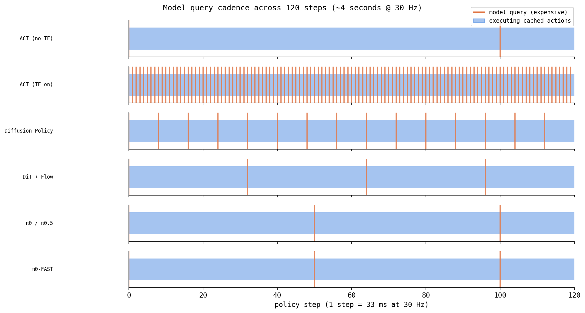

# how inference differs across the policies

All six policies train differently, but at **deployment** the differences are sharper and
more practical: how often the model is queried, how it turns a prediction into the action
sent *this* 33 ms, and whether it can keep up at 30 Hz. This doc compares all of that in one
place. Per-model derivations live in each policy's own doc; here we focus on the *runtime*.

---

## 1. the two clocks: 1000 Hz servo vs 30 Hz policy

The FR5 has **two independent loops**:

```
FR5 servo loop   — 1000 Hz — hardware. reads encoders, drives motor currents every 1 ms.
                              always on. holds the last joint target we gave it.
policy loop      —   30 Hz — ours. every 33 ms: grab camera frame → policy.predict()
                              → send a new joint target.
```

"Hz" = hertz = times per second. **30 Hz** means one policy decision every **1/30 s ≈ 33 ms**.
We run the policy at 30 Hz because the wrist camera (Intel RealSense D405) produces 30 frames
per second — there's no point predicting faster than we get new images. Between our commands,
the 1000 Hz servo keeps holding/interpolating to the last target, so the arm moves smoothly
even though we only update it 30 times a second.

**The budget:** everything in one policy step — read joints, grab frame, `predict()`, send
command — must finish inside ~33 ms or the loop falls behind real time. `predict()` is the
part that varies wildly between policies, and that's the crux of this doc.

---

## 2. the shared trick: action chunking

Every policy here predicts a **chunk** of future actions, not a single action. A chunk is a
`(chunk_size, 7)` block: `chunk_size` consecutive timesteps, each a 7-D action (6 joint angles
in degrees + 1 gripper in [0,1]). Predicting a chunk:

- avoids the jitter and compounding error of single-step prediction,
- lets the robot keep executing even if a prediction is briefly slow,
- means the model does **not** run every step — only when the chunk needs refilling.

What differs is **how many of the predicted actions you actually execute before re-querying**,
and **how you turn overlapping predictions into one command**. Three strategies exist:

| strategy | who uses it | how |
|---|---|---|
| **open-loop chunk** | ACT (TE off) | predict `chunk_size` actions, execute all of them, then re-query |
| **action queue / receding horizon** | Diffusion, DiT, pi0, pi0-FAST | predict a chunk, execute only the first `n_action_steps`, discard the rest, re-query |
| **temporal ensembling** | ACT (TE on) | re-query *every* step, blend the overlapping predictions for "now" |

---

## 3. temporal ensembling (ACT-specific, explained once)


Without it, ACT executes a whole chunk then predicts a fresh one — and at that boundary the
new chunk may not perfectly continue the old motion, causing a small **jerk**.

Temporal ensembling removes the boundary by re-querying **every single step** and blending all
the still-relevant past predictions for the current timestep `t`:

```
t=0   chunk A predicts actions for steps 0..99
t=1   chunk B predicts actions for steps 1..100
t=2   chunk C predicts actions for steps 2..101

action actually sent at t=2 =
    w0·(C's prediction for t=2)   ← newest, age 0
  + w1·(B's prediction for t=2)   ← age 1
  + w2·(A's prediction for t=2)   ← oldest, age 2
   (weights normalized to sum to 1)

w_age = exp(-m · age)          # m = temporal_ensemble_coeff
```

- **lower `m`** → flatter weights → trusts *older* predictions more → smoother, slower to react
- **higher `m`** → recent predictions dominate → more reactive, less smooth

In this repo `temporal_ensemble_coeff` lives in `policies/act/config.yaml` (set to `0.01`).
The cost: the model runs **every step** instead of once per chunk — see the latency table.
(Implement the weighting yourself in `exercises/07_temporal_ensembling.py`.)

The diffusion/flow policies don't use temporal ensembling — they get smoothness from the
short execution window of the action queue instead.

---

## 4. per-model inference, side by side

Numbers from the repo configs (`policies/<name>/config*.yaml`). "Re-query every" = how often
the heavy model actually runs.

| policy | predict via | chunk_size | executes/query | re-query every | horizon (s @30Hz) | smoothing mechanism |
|---|---|---|---|---|---|---|
| **ACT** (TE off) | 1 forward pass | 100 | 100 | 100 steps (~3.3 s) | 3.3 s | open-loop chunk |
| **ACT** (TE on, m=0.01) | 1 forward pass | 100 | 1 | **every step** (33 ms) | 3.3 s | temporal ensembling |
| **Diffusion Policy** | 10 DDIM denoise steps | 16 | 8 | 8 steps (~267 ms) | 0.53 s | short queue window |
| **DiT + Flow** | 10 Euler ODE steps | 32 | 32 | 32 steps (~1.07 s) | 1.07 s | queue window |
| **π0** | 10 Euler ODE steps | 50 | 50 | 50 steps (~1.67 s) | 1.67 s | queue window |
| **π0-FAST** | autoregressive token decode (KV-cached) | 50 | 50 | 50 steps (~1.67 s) | 1.67 s | queue window |

Key reading of the "re-query every" column: ACT-no-TE and the queue policies run the heavy
network *rarely* (once per chunk) and coast on cached actions in between; ACT-with-TE runs it
*every* step. That single fact drives the latency profile.




---

## 5. what one `predict()` call actually costs

This is where 30 Hz feasibility is decided. The expensive part is the model forward(s):

- **ACT (no TE):** one ResNet+transformer pass *only when the queue empties* (every 100 steps);
  the other 99 steps just pop a precomputed action → ~1 ms. Easily real-time, even on CPU.
- **ACT (TE on):** one full pass *every step* (~16 ms in our test on MPS). Fits 33 ms, but you
  pay it 100× more often than no-TE.
- **Diffusion Policy:** the queue-refill step runs the U-Net **10 times** (DDIM steps) in one
  `predict()` — measured ~250 ms on CPU. That blows the 33 ms budget on CPU. It's amortized
  (only every 8 steps), but the *spike* still stalls that step. **Needs CUDA** (~5–10 ms there).
- **DiT + Flow / π0:** the refill runs the denoiser/expert **10 times** (Euler ODE steps). π0
  also reuses a **KV cache** for the 2B PaliGemma prefix so only the small action expert reruns
  per ODE step. Still GPU-only for real-time.
- **π0-FAST:** **no ODE loop** — it decodes action tokens autoregressively with a KV cache, so
  there's a single generation pass rather than 10 full denoising passes. This is the whole point
  of FAST: faster inference than the flow-matching π0 on the same backbone. Still GPU-class.

> rule of thumb: ACT runs on CPU; everything with a denoising/ODE loop or a 2B backbone needs a
> GPU to stay under the 33 ms budget. Verify on the deploy machine with
> `python tools/test_inference.py --device cuda`.

---

## 6. the queue mechanics (diffusion / DiT / π0 / π0-FAST)

All four keep an internal **action queue**. The pattern (see `select_action` in each lerobot
policy, mirrored by our wrappers):

```
on reset():                      clear the queue
each policy step:
    if queue is empty:
        chunk = predict_action_chunk(obs)      # the EXPENSIVE call (ODE / autoregressive)
        push chunk[:n_action_steps] into queue # keep only the first n_action_steps
    action = queue.popleft()                   # cheap: just hand out the next one
    send action to robot
```

So `n_action_steps` controls the trade-off:
- **larger** → re-query less often → cheaper average compute, but acts on staler observations
- **smaller** → re-query more often → more reactive, but the heavy call fires more frequently

Diffusion uses `n_action_steps=8` of a 16-step chunk (discards the back half — those far-future
predictions are least reliable). DiT and π0 in this repo execute the **whole** chunk
(`n_action_steps = chunk_size`) before re-querying.

---

## 7. why the horizons differ

The action horizon (how far into the future one chunk reaches) is a design choice per policy:

- **ACT — 100 steps / 3.3 s:** long horizon, justified by the CVAE producing a coherent
  long plan in one shot.
- **Diffusion — 16 steps / 0.53 s:** short; diffusion is queried often and leans on fresh
  observations rather than long open-loop plans.
- **DiT — 32 / 1.07 s, π0/π0-FAST — 50 / 1.67 s:** middle ground.

Shorter horizon = more reactive to changes in the scene; longer horizon = smoother, less
compute, but more open-loop (blind to changes until the next re-query).

---

## 8. one-line summary per policy

- **ACT** — predict 3.3 s of actions in a single fast pass; optionally re-query every step and
  blend (temporal ensembling) for smoothness. CPU-friendly.
- **Diffusion Policy** — every 8 steps, denoise a fresh 0.53 s chunk over 10 DDIM steps; GPU.
- **DiT + Flow** — every ~1 s, integrate a 10-step ODE for a 32-action chunk; GPU.
- **π0** — same ODE idea with a 2B VLM brain + KV-cached prefix; GPU, biggest.
- **π0-FAST** — same brain, but decode action *tokens* autoregressively (no ODE) → fastest of
  the VLAs at inference; GPU.

See also: each policy's own doc (`act.md`, `diffusion_policy.md`, `dit_flow.md`, `pi0.md`,
`pi0_fast.md`) for the training-time math, and `tools/test_inference.py` for a hardware-free
multi-step rollout that exercises these exact paths.
