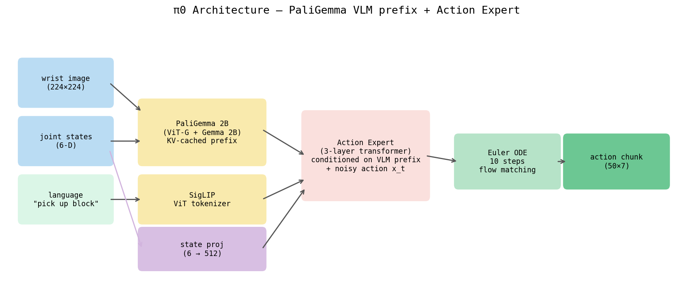

# π0 (pi0) — A Flow-Matching Vision-Language-Action Model, Explained From Scratch

This document explains π0 ("pi-zero"), the model our pipeline can use to drive the
Fairino FR5 robot arm. It is written for someone who knows a little Python and a tiny
bit of machine learning. **Every technical term is defined the first time it appears.**
If you already read `dit_flow.md`, the flow-matching math here is the *same* math — we
recap it but point you back to that file for the full derivation. Read this slowly; it
is long on purpose.

---

## Table of contents

1. [The one-paragraph version](#1-the-one-paragraph-version)
2. [Prerequisite concepts (read this first)](#2-prerequisite-concepts-read-this-first)
   - 2.1 What a neural network is
   - 2.2 What a language model is (next-token prediction)
   - 2.3 Tokens and tokenization
   - 2.4 Embeddings
   - 2.5 Attention and attention masks (causal / bidirectional / block)
   - 2.6 What a Vision Transformer (ViT) is
   - 2.7 What a VLM is (PaliGemma, SigLIP, Gemma)
   - 2.8 Foundation models: pretraining vs fine-tuning
   - 2.9 Recap of flow matching (full derivation in `dit_flow.md`)
3. [From VLM to VLA: the core idea](#3-from-vlm-to-vla-the-core-idea)
4. [The two-expert architecture](#4-the-two-expert-architecture)
5. [The token sequence: prefix and suffix](#5-the-token-sequence-prefix-and-suffix)
6. [The attention mask in detail (block masking)](#6-the-attention-mask-in-detail-block-masking)
7. [The math: flow matching as the action head](#7-the-math-flow-matching-as-the-action-head)
8. [Beta-distribution timestep sampling](#8-beta-distribution-timestep-sampling)
9. [Padding to 32: cross-embodiment, explained](#9-padding-to-32-cross-embodiment-explained)
10. [A full worked micro-example (FR5 numbers)](#10-a-full-worked-micro-example-fr5-numbers)
11. [Inference: the ODE loop and the KV cache](#11-inference-the-ode-loop-and-the-kv-cache)
12. [Why each design choice (the "why" section)](#12-why-each-design-choice)
13. [π0 vs DiT+flow vs π0.5 vs π0-FAST](#13-π0-vs-ditflow-vs-π05-vs-π0-fast)
14. [The real config in this repo (FR5 numbers)](#14-the-real-config-in-this-repo-fr5-numbers)
15. [When to use π0](#15-when-to-use-π0)

---

## 1. The one-paragraph version

Take the "denoise a corrupted chunk of future robot actions into clean actions" idea from
`dit_flow.md`. Keep the **flow-matching** math (a straight-line path from noise to clean
actions — recapped below). But instead of using a *small* image+text encoder (CLIP, ~150M
parameters) to understand the camera image and the task instruction, replace it with a
**full ~2-billion-parameter Vision-Language Model (VLM)** called **PaliGemma** — the kind
of model that can look at a photo and answer questions about it in words. Then attach a
small second network, the **action expert** (~300M parameters), that produces robot
actions. The two networks share their attention computation, so the action expert can
"read" everything PaliGemma understood about the scene and the instruction. Because
PaliGemma was already pretrained on enormous amounts of internet images and text, and π0
itself was pretrained on large robot datasets, this is a **foundation model for robots**:
you fine-tune it on your handful of demonstrations rather than training it from zero.

If any noun in that paragraph was unfamiliar, section 2 defines all of them.

---

## 2. Prerequisite concepts (read this first)

### 2.1 What a neural network is

A **neural network** is a function with millions or billions of adjustable numbers called
**parameters** (also called **weights**). You feed in some input (numbers), the network
multiplies and adds and applies simple nonlinear functions, and produces an output (more
numbers). **Training** means automatically nudging the parameters so the output is closer
to what you want, using gradient descent (a procedure that measures the error and adjusts
each parameter a tiny bit in the direction that reduces it). "A 2B model" means a network
with about 2 billion parameters.

### 2.2 What a language model is (next-token prediction)

A **language model (LM)** is a neural network trained to do one deceptively simple thing:
**given some text so far, predict the next piece of text.** That "piece" is called a
**token** (defined next). If you show it "the cat sat on the", it outputs a probability for
every possible next token, and "mat" gets a high probability. By predicting one token,
appending it, and predicting again, it generates whole sentences. This is called
**autoregressive** generation — *auto* (self) + *regressive* (feeding its own output back
in). The key takeaway: a language model is just a very good next-token guesser.

### 2.3 Tokens and tokenization

Computers do not see words; they see numbers. **Tokenization** is the process of chopping
text into small units called **tokens** and mapping each to an integer ID. A token is
usually a word-piece, not a whole word: "running" might become two tokens `["run", "ning"]`.
The component that does this is the **tokenizer**. So the string `"pick up the red block"`
becomes a short list of integers like `[1045, 88, 3, 2201, 4410]`. The number of tokens a
model will accept is capped; in our config that cap is `tokenizer_max_length = 48`, meaning
the task instruction is turned into at most 48 text tokens (shorter text is padded out,
longer text is truncated).

### 2.4 Embeddings

An integer token ID like `4410` carries no meaning by itself. An **embedding** is a lookup
table that turns each token ID into a vector — a fixed-length list of real numbers, e.g.
2048 numbers — that *does* encode meaning. Tokens with similar meanings get similar
vectors. So after embedding, the sentence is no longer a list of integers but a matrix of
shape `(num_tokens, embed_dim)`, for example `(5, 2048)`: 5 tokens, each a 2048-number
vector. **Every stream entering π0 — image patches, text, robot state, robot actions — is
ultimately turned into such vectors so they can all live in the same sequence.** This is the
whole trick that lets one transformer process pictures, words, and joint angles together.

### 2.5 Attention and attention masks (causal / bidirectional / block)

**Attention** is the core operation of a **transformer** (the dominant neural-network
design since 2017). Intuitively: each token looks at every other token and decides how much
to "pay attention" to it, then mixes in information from the ones it cares about. Mechanically,
each token produces three vectors — a **query** (what am I looking for?), a **key** (what do
I offer?), and a **value** (the information I carry). Token *i* attends to token *j* by an
amount proportional to how well query *i* matches key *j*; it then pulls in a weighted sum
of the values. With *N* tokens this produces an `N × N` grid of attention weights.

An **attention mask** is a rule that *forbids* some of those `N × N` connections by forcing
their weight to zero. Three patterns matter here:

- **Bidirectional (full) attention**: every token may attend to every other token, past
  and future. Good for *understanding* a fixed input (like reading an image or a sentence
  all at once). Encoders use this.
- **Causal attention**: token *i* may attend only to tokens at positions `≤ i` (itself and
  everything before it), never to future tokens. This is what language models use during
  generation — when predicting token 5 you must not peek at tokens 6, 7, ... because they
  don't exist yet. The mask is a lower-triangular grid.
- **Block (or block-wise) attention**: the sequence is split into named blocks, and you
  write a custom rule for which blocks may attend to which. π0 uses this. For example
  "the action block may read the image/text/state blocks, but the image/text/state blocks
  may NOT read the action block." We draw this exact grid in section 6.

The reason masks matter for π0: the actions are the thing we are trying to *produce*. The
image, text, and state are the *conditioning* (the given facts). If the conditioning tokens
were allowed to attend to the action tokens, information about the (still-being-generated,
noisy) actions would leak into the conditioning and corrupt it. So the mask blocks that
direction.

### 2.6 What a Vision Transformer (ViT) is

A transformer eats a *sequence of tokens*. An image is a 2-D grid of pixels, not a sequence.
A **Vision Transformer (ViT)** bridges this by cutting the image into a grid of small square
**patches** (e.g. 14×14 pixels each), flattening each patch into a vector, and treating the
list of patches as a sequence of tokens — exactly like words in a sentence. After that, it
is just a transformer with bidirectional attention. The output is one vector per patch;
these are the **image tokens**. A 224×224 image with 14×14 patches gives `(224/14)² = 16² =
256` image tokens.

### 2.7 What a VLM is (PaliGemma, SigLIP, Gemma)

A **Vision-Language Model (VLM)** is a single model that takes *both* an image and text and
produces text. Ask it "what is in this picture?" and it answers in words. It works by
turning the image into image tokens (via a ViT) and the text into text tokens (via a
tokenizer + embeddings), concatenating them into one sequence, and running a language model
over the whole thing.

**PaliGemma** is the specific open VLM that π0 builds on. It is made of two named pieces:

- **SigLIP**: the **vision encoder** — a ViT (section 2.6) that turns the camera image into
  image tokens. ("SigLIP" = a CLIP-style image-text model trained with a *sigmoid* loss;
  for our purposes it is "the part that converts pixels into a sequence of image tokens.")
  Important practical detail: SigLIP expects pixel values scaled to the range `[-1, 1]`.
  Our pipeline hands images in as `[0, 1]` floats and the model maps them internally to
  `[-1, 1]`.
- **Gemma**: the **language model** — a transformer LM (section 2.2) from Google. In
  PaliGemma it processes the combined image+text token sequence. The variant π0 uses for the
  vision-language part is **`gemma_2b`** (about 2 billion parameters).

So "PaliGemma = SigLIP (eyes) + Gemma (the language brain)." It already knows how to look
at images and reason about them in language, because Google pretrained it on huge
image-text datasets.

### 2.8 Foundation models: pretraining vs fine-tuning

**Pretraining** is training a model once, expensively, on a giant general dataset so it
learns broad skills (e.g. PaliGemma learning to see and read from billions of internet
image-text pairs; π0 learning manipulation from large multi-robot datasets). The result is a
**foundation model**: a big, general, reusable starting point.

**Fine-tuning** is taking that pretrained model and continuing to train it briefly on *your*
small, specific dataset (your FR5 demonstrations) so it specializes to your task while
keeping all the general knowledge. The bet behind π0: fine-tuning a model that already
understands vision, language, and robot manipulation beats training a fresh model from
scratch on your few demos.

### 2.9 Recap of flow matching (full derivation in `dit_flow.md`)

`dit_flow.md` derives flow matching in full; here is the minimum you need, using the **same
conventions** as that file so nothing contradicts.

We want to generate a clean chunk of future actions, call it `a_clean`. Flow matching learns
a **straight-line path** from random noise to `a_clean`:

```
DDPM (older):   noise ～～curvy path～～→ data   (needs many steps)
Flow matching:  noise ──straight line──→ data   (needs few steps)
```

- **The path** (a point on the straight line at fraction `t`):

  ```
  x_t = t · a_clean + (1 − (1−σ)·t) · ε ,   t ∈ [0,1] ,  ε ~ N(0, I)
  ```

  With `σ` (sigma_min) ≈ 0 this simplifies, exactly as in `dit_flow.md`, to:

  ```
  x_t = t · a_clean + (1 − t) · ε
  ```

  - `t = 0` → `x_0 = ε` (pure Gaussian noise).
  - `t = 1` → `x_1 = a_clean` (the real actions).
  - `ε` is random noise drawn from a standard normal distribution `N(0, I)`, same shape as
    `a_clean`.

- **The velocity target** (the constant direction/speed along that straight line):

  ```
  v = a_clean − (1−σ)·ε  ≈  a_clean − ε     ("data minus noise")
  ```

- **The training loss** (teach the network `v_θ` to predict that velocity):

  ```
  loss = ‖ v_θ(x_t, t, c) − v ‖²
  ```

  where `c` is the conditioning (here: image + text + robot state) and `v_θ` is our network.

- **Inference** is Euler integration of the ordinary differential equation (ODE) from `t=0`
  to `t=1`: start at noise, repeatedly step `x ← x + dt · v_θ(...)`. Because the path is
  straight you need few steps — our config uses `num_inference_steps = 10`.

**The one thing that is different in π0 vs `dit_flow.md` is *what computes* `v_θ`.** In
`dit_flow.md`, `v_θ` is a small DiT (Diffusion Transformer) conditioned by a CLIP encoder.
In π0, `v_θ` is the ~2B PaliGemma plus the ~300M action expert. The math is identical; the
brain is enormous.

---

## 3. From VLM to VLA: the core idea

**VLA = Vision-Language-Action model.** The lineage:

```
VLM (vision-language model)        →  sees image, reads text, outputs TEXT
                                      e.g. "the red block is on the left"

VLA (vision-language-ACTION model) →  sees image, reads text, outputs ROBOT ACTIONS
                                      e.g. a 50-step joint trajectory to grab the block
```

π0 starts from the pretrained VLM (PaliGemma) and teaches it to emit *actions* instead of
*words*. The single most important idea: **all the visual and linguistic understanding
PaliGemma already has — recognizing objects, parsing "pick up the red block, not the blue
one" — is reused for robot control.** The model doesn't have to learn what a "block" looks
like or what "left" means from your 50 robot demos; it already knows, and only has to learn
the mapping from understanding to motion.

But there is a representational gap. A VLM produces text tokens, one at a time, from a
*discrete* vocabulary (there are ~256k possible tokens, you pick one). Robot actions are
*continuous* numbers (a joint angle can be 41.7°, or 41.71°, or anything). You could discretize
actions into tokens (that is what π0-FAST does — see section 13), but π0's main recipe
instead generates the continuous action chunk with **flow matching**, attached via a second
network. That second network is the action expert.



---

## 4. The two-expert architecture

π0 contains **two transformer "experts" that share one attention computation.**

> **Important clarification — this is NOT a classic Mixture-of-Experts (MoE).** In a classic
> MoE, a router picks *one of many* expert sub-networks per token to save compute. Here,
> "expert" just means "a set of transformer weights," and there are exactly **two**, assigned
> by *what kind of token* you are, not by a router:
> - **Vision-language expert** = PaliGemma's Gemma (`gemma_2b`), handles image + text tokens.
> - **Action expert** = a smaller Gemma (`gemma_300m`), handles state + action tokens.
>
> Both experts run **every** forward pass (no routing), and crucially they **attend to each
> other** inside a single joint attention. Think "two specialists reading the same shared
> whiteboard," not "a switchboard that routes to one of many specialists."

```
            ┌──────────────────────────────────────────────────────────┐
            │  PALIGEMMA — the vision-language expert  (gemma_2b, ~2B)   │
            │                                                            │
            │   camera image ──► SigLIP (ViT) ──► image tokens           │
            │   task string  ──► tokenizer+embed ► text tokens           │
            │                                                            │
            │   together these are the  PREFIX  (the conditioning)       │
            └─────────────────────────────┬──────────────────────────────┘
                                          │
                            ╔═════════════╧═════════════╗
                            ║   ONE SHARED, JOINT        ║
                            ║   (block-masked) ATTENTION ║   ◄── the key trick
                            ║   over the whole sequence  ║
                            ╚═════════════╤═════════════╝
                                          │
            ┌─────────────────────────────┴──────────────────────────────┐
            │  ACTION EXPERT  (gemma_300m, ~300M)                         │
            │                                                            │
            │   robot state s ─────────────► state token                 │
            │   noisy action chunk x_t  ───► action tokens               │
            │   flow timestep t  ──────────► (modulates the expert)       │
            │                                                            │
            │   together these are the  SUFFIX                           │
            │                                                            │
            │   OUTPUT: velocity v_θ for each action token (flow matching)│
            └────────────────────────────────────────────────────────────┘
```

How information flows in one forward pass:

1. The image becomes image tokens (SigLIP), the instruction becomes text tokens (tokenizer +
   embeddings). These are the **prefix**.
2. The robot's current state and the *noisy* action chunk `x_t` become the **suffix** tokens,
   embedded into the same vector space.
3. Prefix and suffix are concatenated into **one long sequence** and run through one
   **block-masked attention** (section 6). The two experts have separate weights but their
   tokens sit in the same attention grid, so the action tokens can *read* the image/text/state
   tokens.
4. The action expert reads off the result and outputs a **velocity** `v_θ` for each action
   token, which flow matching uses to denoise the chunk.

Why two separate experts instead of one network? See section 12; short version: it lets the
huge, expensive VLM weights stay frozen-ish and reusable while a small, cheap expert
specializes in the continuous-action job, and it keeps inference fast because only the small
expert runs in the repeated ODE loop.

---

## 5. The token sequence: prefix and suffix

Everything — pixels, words, joint angles, candidate actions — is converted to vectors
(section 2.4) and laid end-to-end into a single sequence:

```
   ┌──────────────── PREFIX (conditioning) ────────────────┐ ┌──── SUFFIX (to generate) ───┐
   │                                                        │ │                              │
   │   image tokens          │   text tokens                │ │  state token │ action tokens │
   │   (from SigLIP)         │   (from tokenizer)           │ │  (robot s)   │ (noisy x_t)   │
   │                         │                              │ │              │               │
   │  [img][img]...[img]     │  [tok][tok]...[tok]          │ │   [state]    │ [a][a]...[a]  │
   └─────────────────────────┴──────────────────────────────┘ └──────────────┴──────────────┘
        ~256 image tokens          up to 48 text tokens             1 state       50 action
        (224×224, 14×14 patch)     (tokenizer_max_length)           token         tokens
```

Conceptual counts for our FR5 setup (image-token count is the standard PaliGemma 224²/14²
figure; treat it as illustrative):

- **Image tokens**: ~256 (one 224×224 wrist image, patchified by SigLIP).
- **Text tokens**: up to **48** (`tokenizer_max_length = 48`), e.g. for "pick up the block".
- **State token**: the 6-DOF FR5 joint state, padded to width 32, projected to **1** token.
- **Action tokens**: **50** (`chunk_size = 50`) — one token per future timestep in the chunk;
  each carries that timestep's 7-dim action, padded to width 32.

So the full sequence the joint attention sees is conceptually:

```
[ ~256 image | ≤48 text | 1 state | 50 action ]   ≈  355 tokens
└──────────── prefix ──────────────┘└─── suffix ───┘
```

(The exact image-token count can vary with the PaliGemma image configuration; the structure
is what matters.)

---

## 6. The attention mask in detail (block masking)

Recall from section 2.5 that an attention mask says which tokens may look at which. π0 uses a
**block mask** with this rule:

- **Prefix (image + text)**: attends **bidirectionally among itself** — image and text tokens
  freely read each other (it is a fixed input being understood). It does **not** attend to the
  suffix.
- **State token**: attends to the prefix and to itself.
- **Action tokens**: attend to the prefix, to the state, **and to each other** (so the 50
  steps of the chunk are mutually consistent — joint 1 at step 10 "knows" what joint 1 is
  doing at step 11). Action tokens are usually allowed full (bidirectional) attention *within*
  the action block, because we predict the whole chunk at once, not autoregressively.
- **Nobody in the prefix or state attends "forward" into the action tokens** — this is the
  protective rule from section 2.5 that stops the noisy actions from leaking into the
  conditioning.

As a grid (`✓` = allowed to attend, `·` = blocked). Rows = "who is looking," columns = "who is
being looked at":

```
                    looked-at →   IMAGE   TEXT   STATE   ACTION
   who looks ↓
   IMAGE                            ✓       ✓      ·        ·
   TEXT                             ✓       ✓      ·        ·
   STATE                            ✓       ✓      ✓        ·
   ACTION                           ✓       ✓      ✓        ✓
```

Read the bottom row: action tokens may look at *everything* (they need all the context).
Read the top rows: image and text tokens are walled off from the action column (the `·`s) —
the conditioning never sees the thing being generated. This is exactly why a *single* shared
attention is safe to use for both experts: the mask enforces the one-way flow of information
from "facts" to "actions."

A practical payoff of this layout: the prefix (image + text) does not depend on the action
tokens or on the flow timestep `t`. So during the repeated inference loop (section 11) the
prefix only needs to be computed **once** and cached — this is the **KV cache** (key-value
cache): you store the prefix tokens' keys and values from the first pass and reuse them on
every ODE step, so only the cheap action expert reruns. That is a large speedup.

---

## 7. The math: flow matching as the action head

This is the same flow matching as `dit_flow.md` (section 2.9 recapped it). We now annotate it
with **shapes** for the FR5 case so it is concrete. Let:

- `B` = batch size (number of examples processed together).
- `H` = `chunk_size` = 50 (the action horizon, i.e. number of future steps).
- `D` = `max_action_dim` = 32 (the padded action width; real content is 7 of those 32).

So a clean action chunk is a tensor `a_clean` of shape `(B, H, D) = (B, 50, 32)`.

**The path** — interpolate between noise and clean actions, elementwise:

```
x_t = t · a_clean + (1 − t) · ε
```

- `ε ~ N(0, I)` has shape `(B, 50, 32)` — independent standard-normal noise per element.
- `t` is the flow time, a scalar in `[0,1]` per example, broadcast across `H` and `D`.
- `x_t` has shape `(B, 50, 32)` — the "partially noised" chunk fed to the model as the action
  tokens.

**The velocity target** — the straight-line direction:

```
v = a_clean − ε          # shape (B, 50, 32)
```

**The network** — the action expert, reading the shared attention output, predicts a velocity
for every action token:

```
v_θ(x_t, t, c)           # shape (B, 50, 32),  c = {image, text, state}
```

**The loss** — mean squared error between predicted and true velocity, computed **only over
the real (unpadded) action dimensions**; the 25 padding columns contribute nothing:

```
loss = mean over real dims of  ‖ v_θ(x_t, t, c) − v ‖²
```

In words: corrupt the real future actions toward noise by an amount `t`, ask the model
"which way is the clean version?", and penalize it for pointing the wrong way. Do this for
millions of (state, image, instruction, action-chunk) tuples and the model learns to turn
noise into correct robot trajectories given the scene and instruction.

---

## 8. Beta-distribution timestep sampling

During training you must pick a flow time `t ∈ [0,1]` for each example. The naive choice is
**uniform** sampling (every `t` equally likely). π0 instead samples `t` from a **Beta
distribution** — a probability distribution on the interval `[0,1]` whose shape you control
with two parameters, letting you make some values of `t` more likely than others.

π0 shapes it to **concentrate `t` near the data end of the path** (closer to `t = 1`, where
`x_t` is mostly clean actions). Intuition: the hardest, most decision-relevant part of
denoising is the final approach to the real trajectory; sampling more training examples there
sharpens the model where it matters. This is a tweak to the *training distribution of `t`*
only — the path, the velocity target, and the loss are unchanged from section 7.

(`dit_flow.md` does not need this detail; mentioning it here keeps the two documents
consistent — flow matching is identical, π0 merely samples `t` non-uniformly during training.)

---

## 9. Padding to 32: cross-embodiment, explained

**Embodiment** = the physical body of a robot: how many joints, what kind of gripper, one arm
or two. Different robots have different state and action sizes. A 6-DOF arm like the FR5 has
6 joint angles; a 7-DOF arm has 7; a two-armed (bimanual) robot might need 14+ plus two
grippers.

π0 wants **one fixed architecture** usable across all of them (so the same pretrained weights
transfer to any robot — that is **cross-embodiment**). It fixes the input/output width to
`max_state_dim = 32` and `max_action_dim = 32`. Any real robot's vectors are **padded with
zeros** up to width 32, and the loss / outputs simply **ignore** the padding columns.

```
FR5 state  (6 dims, degrees):
   [ j1  j2  j3  j4  j5  j6 ]
   ──pad with 26 zeros──►  [ j1 j2 j3 j4 j5 j6 0 0 0 ... 0 ]    (32 wide)

FR5 action (7 dims = 6 joints + gripper):
   [ j1 j2 j3 j4 j5 j6 grip ]
   ──pad with 25 zeros──►  [ j1 j2 j3 j4 j5 j6 grip 0 0 ... 0 ] (32 wide)
```

A 32-wide architecture comfortably covers the FR5 (needs 6 / 7) and most common arms, and the
*same* tensor shapes mean a checkpoint pretrained on many robots can be fine-tuned on the FR5
without changing a single layer size. Section 12 expands on why this is worth the wasted
columns.

---

## 10. A full worked micro-example (FR5 numbers)

Let us trace one real observation through π0 with the repo's actual numbers. Wrist camera is
an Intel **RealSense D405** producing **640×480**; control runs at **30 Hz**; chunk is **50**
steps so it covers `50 / 30 ≈ 1.67 seconds` of motion.

**Inputs at one moment:**

- Camera frame: 640×480 RGB. The pipeline resizes/crops it to **224×224** for SigLIP, with
  pixel values in `[0,1]`; the model rescales internally to `[-1,1]`.
- Instruction string: `"pick up the block"`.
- Robot state: 6 joint angles in degrees, e.g. `s = [12.0, -30.0, 45.0, 0.0, 60.0, -15.0]`.
  Note: the pipeline passes state as shape `(B, 6)` (just batch × state_dim). The model adds
  the sequence dimension internally — you do **not** hand it a `(B, 1, 6)`.

**Step-by-step:**

1. **Image → image tokens.** 224×224 image → SigLIP ViT → ~256 image tokens (each a vector).
   *(prefix part 1)*

2. **Text → text tokens.** `"pick up the block"` → tokenizer → a handful of integer IDs,
   padded to length `tokenizer_max_length = 48` → embedded to 48 vectors. *(prefix part 2)*

3. **State → state token.** `s` has 6 numbers → pad to width `max_state_dim = 32`:
   `[12, -30, 45, 0, 60, -15, 0, 0, ..., 0]` → project to **1** state token vector.
   *(suffix part 1)*

4. **Action chunk → action tokens.** A clean chunk for training is `a_clean` shape
   `(50, 7)` (50 future steps, each `[6 joints + gripper]`). Pad the width 7 → 32, giving
   `(50, 32)`. Draw noise `ε ~ N(0,I)` of shape `(50, 32)`, pick `t` (Beta-sampled, section
   8), form `x_t = t·a_clean + (1−t)·ε`. These 50 rows become **50** action tokens.
   *(suffix part 2)*

5. **Concatenate into one sequence** (conceptual counts):

   ```
   [ ~256 image | 48 text | 1 state | 50 action ]   ≈ 355 tokens
   └────────────── prefix ───────────┘└── suffix ──┘
   ```

6. **Joint block-masked attention** (section 6): action tokens read image+text+state; the
   prefix never reads the actions.

7. **Action expert outputs velocity** `v_θ` of shape `(50, 32)` — one velocity vector per
   action token.

8. **Training:** compute `loss = ‖ v_θ − (a_clean − ε) ‖²` over the real 7 columns only
   (ignore the 25 padding columns), backpropagate, update weights.
   **Inference:** run the ODE loop (next section) to turn pure noise into a clean `(50, 7)`
   trajectory, unpad to 7 columns, and send it to the FR5.

---

## 11. Inference: the ODE loop and the KV cache

At deployment there is no `a_clean`. We start from pure noise and integrate the
flow-matching ODE from `t=0` to `t=1`, exactly as in `dit_flow.md`, using
`num_inference_steps = 10` Euler steps.

```
                   ┌─────────────────────────────────────────────┐
                   │  ONE-TIME PREFIX PASS                         │
   image, text ───►│  SigLIP + Gemma(2B) over [image | text]       │
                   │  → store prefix Keys/Values in the KV CACHE    │  (computed ONCE)
                   └───────────────────────┬─────────────────────┘
                                           │  reused every step ↓
   x = ε ~ N(0,I)   (shape (50,32))        │
   dt = 1 / 10 = 0.1                        │
   t = 0                                    │
        │                                   │
        ▼                                   │
   ┌─────────── repeat 10 times ────────────┴───────────────────────┐
   │                                                                 │
   │   embed current noisy chunk x as 50 action tokens                │
   │   run ACTION EXPERT (300M) — attends to cached prefix + state    │
   │   get velocity  v = v_θ(x, t, c)            # shape (50,32)       │
   │   Euler step:   x  ←  x + dt · v                                 │
   │   advance time: t  ←  t + dt                                     │
   │                                                                 │
   └───────────────────────────────┬─────────────────────────────────┘
                                    ▼
   x is now the clean action chunk  ≈ a_clean   (shape (50,32))
   unpad width 32 → 7,  giving 50 steps of [6 joints + gripper]
   send to FR5 at 30 Hz
```

Two efficiency points worth restating:

- **Few steps.** Because flow matching follows a straight path, **10** Euler steps suffice
  (compare diffusion's typically larger step counts). Each step is one cheap action-expert
  pass.
- **KV cache.** The expensive 2B vision-language pass over the prefix is **independent of `t`
  and of the noisy actions** (section 6 mask), so it runs **once**; its keys and values are
  cached and reused on all 10 steps. Only the small 300M action expert reruns per step. This
  is what makes a 2.3B-parameter model fast enough to control a robot in real time.

---

## 12. Why each design choice

**Why reuse a pretrained VLM (PaliGemma) instead of a small encoder?**
Visual and language understanding is hard and data-hungry. Recognizing "the red block, not
the blue one," generalizing to a block you never demonstrated, parsing a novel instruction —
PaliGemma already learned all of this from internet-scale image-text data. By starting there,
π0 *transfers* that understanding and only has to learn the much narrower mapping from
"understood scene + instruction" to "motion." A small CLIP encoder (the `dit_flow.md` recipe)
has far less of this knowledge, so it leans harder on your own demos and generalizes less.

**Why two experts instead of one big network?**
1. *Specialization.* The vision-language job (understand a fixed image+text) and the action
   job (denoise continuous trajectories) are different; giving each its own weights lets the
   small action expert focus purely on actions without disturbing the huge, carefully
   pretrained VLM weights.
2. *Inference speed.* Only the action expert runs inside the repeated 10-step ODE loop; the
   2B VLM runs once (KV-cached). If actions were generated *inside* the 2B network you would
   pay the 2B cost ten times instead of once.
3. *Modularity.* The action expert is a clean place to attach the continuous flow-matching
   head onto a model that natively only produced discrete text tokens.
   This is "two experts sharing attention," **not** classic routing MoE (section 4).

**Why pad to 32?**
A single fixed width (`max_state_dim = max_action_dim = 32`) gives **one architecture for all
robots** (cross-embodiment, section 9). The same pretrained weights and tensor shapes work
for a 6-DOF FR5, a 7-DOF arm, or a bimanual rig — you just zero-pad and ignore the extra
columns. The cost (a few wasted dimensions) is trivial next to the benefit (one transferable
foundation checkpoint).

**Why flow matching as the action head?**
Robot actions are continuous and you want them generated **fast and smoothly**. Flow matching
gives a straight noise→data path that integrates in ~10 cheap steps and tends to produce
smooth chunks — ideal for a 30 Hz controller. (The full case for flow matching over DDPM is
in `dit_flow.md`.) It also slots naturally onto a transformer expert, unlike discrete
text-token generation which would need action *discretization* (the π0-FAST route, section 13).

---

## 13. π0 vs DiT+flow vs π0.5 vs π0-FAST

First, against the `dit_flow.md` model. The math is the same; the **brain** differs:

| | DiT + Flow Matching (`dit_flow.md`) | π0 (this doc) |
|---|---|---|
| Vision/language brain | CLIP ViT-B/16 (~150M) | PaliGemma (SigLIP + `gemma_2b`, ~2B) |
| Action head | DiT transformer (AdaLN-conditioned) | `gemma_300m` action expert, shared attention |
| How conditioning enters | AdaLN modulation | joint block-masked attention (two experts) |
| Pretraining | CLIP weights only | PaliGemma + large robot datasets |
| State/action width | exact (6 / 7) | padded to 32 (cross-embodiment) |
| Objective | flow matching | flow matching (identical) |
| Total size | ~150M | ~2.3B |
| Needs | a GPU | bigger GPU + gated PaliGemma download (~5 GB) |

In one line: **π0 is "DiT+flow, but the encoder is a giant pretrained VLM instead of a small
CLIP, generalizes far better, and costs ~15× more parameters."**

Then, the π0 family (named for honesty; treat sizes/specifics as the broad picture, not exact
repo numbers):

- **π0** (this doc): flow-matching action expert producing **continuous** action chunks.
  The general-purpose default.
- **π0-FAST**: instead of flow matching, it **tokenizes actions into discrete tokens** (using
  a frequency-domain compression scheme, "FAST") and generates them **autoregressively** like
  text. This reuses the VLM's native text-generation machinery directly — no separate flow
  head. Trade-off: training can be simpler/more VLM-native, but autoregressive decoding of
  many action tokens can be **slower at inference** than π0's 10-step flow loop.
- **π0.5**: a later, **broader-generalization** iteration of the π0 recipe, trained on more
  diverse data and tasks for better open-world / out-of-distribution behavior. Same family
  spirit (VLM + action generation), pushed further on data scale and generalization.

**When to use which:** use **π0** for fast continuous control with strong generalization;
consider **π0-FAST** if you want a fully VLM-native, discrete-token pipeline and can tolerate
slower decoding; reach for **π0.5** when you specifically need the broadest generalization and
have the data/compute. For a small single-task setup with limited compute, the **`dit_flow`**
or even diffusion-policy recipes remain simpler and lighter.

---

## 14. The real config in this repo (FR5 numbers)

These are the actual values our pipeline uses. No invented numbers; where a figure is a
standard PaliGemma/illustrative value rather than a config knob, it is marked.

**Robot / sensors:**

- Robot: **Fairino FR5**, a **6-DOF** (6 degrees of freedom) arm.
- **State** = **6** values: the 6 joint angles, in **degrees**.
- **Action** = **7** values: **6 joint targets + 1 gripper** command.
- Wrist camera: Intel RealSense **D405**, native **640×480**, resized to **224×224** for
  SigLIP.
- Control rate: **30 Hz**.

**Model / π0 config:**

- `paligemma_variant = gemma_2b` — the vision-language expert, ~**2B** parameters.
- `action_expert_variant = gemma_300m` — the action expert, ~**300M** parameters.
- **Total ≈ 2.3B** parameters.
- `chunk_size = 50` — predict 50 future steps ≈ **1.67 s** at 30 Hz.
- `max_state_dim = 32`, `max_action_dim = 32` — fixed padded widths (cross-embodiment).
- `tokenizer_max_length = 48` — max text tokens for the instruction.
- `num_inference_steps = 10` — Euler steps in the flow-matching ODE loop.
- Images supplied in **`[0,1]`**, mapped internally to **`[-1,1]`** for SigLIP.
- State is passed as shape **`(B, state_dim) = (B, 6)`**; the model adds the sequence
  dimension internally.

**Operational requirements:**

- Requires **gated PaliGemma weights** (~**5 GB** download): you need a Hugging Face account
  and must accept Google's license to obtain them.
- Requires a real **CUDA** GPU — 2.3B parameters will not run on a laptop CPU.
- This pipeline wraps **lerobot 0.5.1**'s `PI0Policy` (the LeRobot library's π0
  implementation), so the heavy lifting comes from that dependency.

**Illustrative (not config knobs):**

- Image-token count ≈ **256** for a 224×224 image with 14×14 patches — the standard ViT
  arithmetic, shown to make the sequence-length example concrete; the exact number depends on
  the PaliGemma image setup.

---

## 15. When to use π0

Use π0 when:

- ✓ You want a **pretrained foundation model** that already understands manipulation, objects,
  and language, rather than training from scratch on a few demos.
- ✓ Your task is **language-conditioned and/or multi-task**, and you want **generalization** to
  new objects, phrasings, and situations.
- ✓ You have a **proper CUDA GPU** and can obtain the **gated PaliGemma weights**.
- ✓ You want **fast continuous action generation** (the 10-step flow loop) for real-time
  control like the FR5's 30 Hz.

Avoid / reconsider π0 when:

- ✗ You have a **single narrow task**, **very limited compute** (laptop/CPU), or want a
  **simple, self-contained** model — prefer the `dit_flow` or diffusion-policy recipes.
- ✗ You cannot download multi-gigabyte gated weights or lack GPU access.

In short: **π0 is the "fine-tune a giant robot foundation model" option** — maximum
generalization and language understanding, at the cost of size, a gated download, and a GPU.
