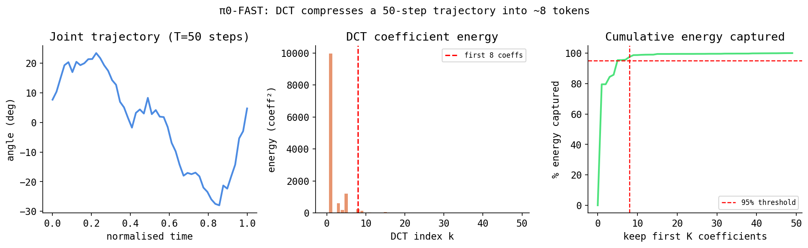

# π0-FAST — autoregressive VLA with FAST action tokenization

> **The one-line version.** π0-FAST uses the *exact same* vision-language brain as π0
> (a 2-billion-parameter model called PaliGemma). But instead of *denoising* a
> continuous action with the ODE/flow-matching machinery that π0 and π0.5 use, it
> **converts each chunk of robot actions into a short sequence of discrete tokens**
> (little integers, like the "words" a language model emits) and then **generates
> those tokens one at a time, exactly the way a chatbot writes a sentence word by
> word.** No flow matching. No ODE solver loop. No separate "action expert" network.
> It is PaliGemma's *own* language-model output head producing action tokens.
>
> This single change has one big payoff: at run time there is **no iterative
> denoising loop**, so inference can be much faster.

This document is written for someone who knows a little Python and a tiny bit of
machine learning. **Every term is defined the first time it appears.** It is long
on purpose — it is meant to teach the whole idea from the ground up. If a section
feels obvious to you, skim it.

You should read [`pi0.md`](pi0.md) first for the shared PaliGemma backbone (the
vision encoder, the 2B language model, the "pad state/action to 32 dims" trick,
the gated-weights download). This document references that one and focuses on
**what is different**: the action-as-tokens idea and the machinery — DCT, BPE,
KV cache — that makes it work.

---

## Table of contents

1. [Prerequisite concepts (from scratch)](#1-prerequisite-concepts-from-scratch)
   - 1.1 Discrete vs. continuous
   - 1.2 What "tokenization" means
   - 1.3 What a "vocabulary" is
   - 1.4 Autoregressive language modeling
   - 1.5 Logits, softmax, sampling, temperature, greedy
   - 1.6 Cross-entropy loss
   - 1.7 Attention, keys/values, and the KV cache
   - 1.8 Quantization / binning
   - 1.9 Frequency domain vs. time domain, and the DCT
   - 1.10 Byte-pair encoding (BPE)
2. [Why tokenize actions at all?](#2-why-tokenize-actions-at-all)
3. [FAST — the action tokenizer, stage by stage with shapes](#3-fast--the-action-tokenizer-stage-by-stage-with-shapes)
4. [Worked example: a 4-sample DCT](#4-worked-example-a-tiny-4-sample-dct)
5. [Worked example: a tiny BPE merge](#5-worked-example-a-tiny-bpe-merge)
6. [The autoregressive generation loop (with KV cache)](#6-the-autoregressive-generation-loop-with-kv-cache)
7. [Why this can be faster than the ODE loop](#7-why-this-can-be-faster-than-the-ode-loop)
8. [Architecture summary — no flow, no ODE, no action expert](#8-architecture-summary)
9. [The code in this repo](#9-the-code-in-this-repo)
10. [Real config numbers for the FR5](#10-real-config-numbers-for-the-fr5)
11. [Comparison: π0 vs π0.5 vs π0-FAST](#11-comparison-π0-vs-π05-vs-π0-fast)
12. [When to use it](#12-when-to-use-it)

---

## 1. Prerequisite concepts (from scratch)

Before any of the π0-FAST machinery makes sense, you need a handful of ideas. This
section builds each one with no assumed background beyond "I can read a Python
list and I've heard the word 'neural network'."

### 1.1 Discrete vs. continuous

A **continuous** quantity is a real number that can take *any* value in a range,
to arbitrary precision: `1.0`, `1.5`, `1.50001`, `-3.14159…`. A robot joint angle
like `37.42°` is continuous. There are infinitely many possible values.

A **discrete** quantity comes from a *finite* set of allowed values, usually
labeled by integers: `0, 1, 2, …, 255`. A pixel's red channel in an 8-bit image is
discrete (one of 256 levels). The letters of the alphabet are discrete.

This distinction is the crux of the whole document:

- π0 / π0.5 treat a robot action as a **continuous vector** and learn to *denoise*
  it (push a cloud of random numbers toward the right real-valued answer).
- π0-FAST converts the action into a **discrete sequence of integers (tokens)** and
  learns to *predict the next integer*, exactly like a text model.

To go from continuous to discrete you must **quantize** (Section 1.8). To turn a
discrete sequence back into the real-valued action you reverse the process.

### 1.2 What "tokenization" means

**Tokenization** is the act of chopping some input into a sequence of small,
discrete units called **tokens**, and mapping each unit to an integer ID.

For text, a token might be a whole word, a piece of a word ("token", "##ize"), or
even a single byte. Example: the sentence `"pick the red block"` might tokenize to
the integer sequence `[1996, 2417, 3796, 1209]` — four tokens, each a number the
model understands.

The key mental model: **a transformer (the neural network family used here) does
not see text, images, or actions directly. It only ever sees sequences of
integers.** Everything — pixels, words, joint angles — must first be turned into a
sequence of integer token IDs. Tokenization is that turning.

For π0-FAST the novel part is: **robot actions are also tokenized into integers**,
using a scheme called FAST (Section 3).

### 1.3 What a "vocabulary" is

The **vocabulary** is the fixed, finite set of all distinct tokens a model knows,
each with a unique integer ID. If a tokenizer has a vocabulary of size 50,000,
then every token is an integer in `0 … 49,999`. The model's output layer produces
one score per vocabulary entry (Section 1.5).

PaliGemma's text vocabulary has tens of thousands of entries. π0-FAST adds a block
of **action tokens** to that same vocabulary — the action tokens are just more
integers the model can emit, sitting alongside the word tokens. That is the whole
trick: actions become "words" in the same language.

### 1.4 Autoregressive language modeling

**Autoregressive generation** means: *predict the next token given all the
previous tokens, then append it, then repeat.* "Auto-regressive" literally means
"regressing on itself" — each new output depends on the outputs so far.

This is how every text-generating model (GPT-style, Gemma, etc.) writes:

```
given:  "the cat sat on the"
predict: "mat"          ← model outputs a probability over the whole vocabulary,
                          picks "mat"
append:  "the cat sat on the mat"
predict: "."            ← now conditioned on the longer sequence
append:  "the cat sat on the mat ."
...stop when an "end" token is produced
```

**Next-token prediction** is the single skill the model is trained on: given a
prefix of tokens, output a probability distribution over what the next token
should be. Generating a whole sentence is just doing next-token prediction over
and over, feeding each prediction back in. This loop is the "autoregressive loop."

π0-FAST applies exactly this to actions: given the prefix `[image tokens][text
instruction tokens][robot state]`, it autoregressively predicts `[action token 1,
action token 2, …]` until it has emitted the whole action chunk.

### 1.5 Logits, softmax, sampling, temperature, greedy

When the model predicts the next token, its final layer outputs one raw number per
vocabulary entry. These raw numbers are called **logits** — unnormalized scores,
any real value, higher means "more likely." For a vocabulary of size `V`, the
logits are a vector of length `V`.

Logits are not probabilities (they don't sum to 1, can be negative). To turn them
into a **probability distribution** you apply the **softmax** function:

```
softmax(z)_i = exp(z_i) / Σ_j exp(z_j)
```

In words: exponentiate every logit (making them all positive), then divide by the
total so they sum to 1. Now you have a real probability for each possible next
token. Example: logits `[2.0, 1.0, 0.1]` → softmax ≈ `[0.66, 0.24, 0.10]`.

Given that probability vector, how do you pick the actual next token?

- **Greedy**: always take the highest-probability token (`argmax`). Deterministic.
- **Sampling**: draw a token *randomly* according to the probabilities — token with
  prob 0.66 is chosen 66% of the time. Adds variety.
- **Temperature** `T`: divide the logits by `T` before softmax. `T < 1` sharpens
  the distribution (more confident, closer to greedy); `T > 1` flattens it (more
  random); `T → 0` becomes pure greedy. It is a "randomness dial."

For action generation you typically want low/no randomness (you want the *correct*
action), so decoding is effectively greedy or near-greedy.

### 1.6 Cross-entropy loss

To *train* a next-token predictor, you need a number that says "how wrong was the
predicted distribution compared to the true next token?" That number is the
**cross-entropy loss**.

The true next token is "one-hot": probability 1 on the correct token, 0 elsewhere.
The model produced a softmax distribution `p`. Cross-entropy is:

```
loss = − log( p[correct_token] )
```

In words: take the probability the model assigned to the *correct* token and take
the negative log of it. If the model was confident and correct (`p = 0.99`), the
loss is small (`−log 0.99 ≈ 0.01`). If it was confident and wrong (`p = 0.001` on
the correct token), the loss is huge (`−log 0.001 ≈ 6.9`). Averaging this over all
positions in the sequence and over the batch gives the scalar training loss.

> **This is the *entire* training objective of π0-FAST.** There is no MSE on a
> velocity field, no flow-matching target. The model is trained with plain
> next-token cross-entropy on the action tokens — the *same* loss used to train any
> language model. In this repo, `forward()` returns that scalar loss directly
> (note: unlike π0, the `forward()` here has **no `reduction` parameter** — see
> Section 9).

### 1.7 Attention, keys/values, and the KV cache

Transformers process a sequence using an operation called **attention**. The
intuition: to compute a new representation for the token at position `i`, the model
lets that token "look at" (attend to) every earlier token and pull in relevant
information.

Mechanically, each token produces three vectors:

- a **query** `q` — "what am I looking for?"
- a **key** `k` — "what do I offer / how should others find me?"
- a **value** `v` — "the actual content I'll hand over if attended to"

For token `i`, the model compares its query `q_i` against the key `k_j` of every
token `j` (via dot products), softmaxes those scores into attention weights, and
then takes a weighted sum of the values `v_j`. So the output at `i` is a blend of
the *values* of the tokens it paid most attention to.

Why does this matter for speed? During autoregressive generation you produce
tokens one at a time. Each new token must attend to **all previous tokens**. The
keys `k_j` and values `v_j` of those previous tokens **do not change** once
computed — they depend only on tokens already fixed. So recomputing them every step
would be pure waste.

The **KV cache** (key-value cache) stores the keys and values of all
already-generated tokens. At each new step you only:

1. compute the query/key/value for the *one* new token,
2. append its key and value to the cache,
3. attend the new query against the cached keys/values.

This turns "re-process the whole growing sequence every step" (cost grows
quadratically) into "process one new token against a cache" (cost grows linearly).
It is the standard trick that makes LLM text generation practical, and π0-FAST uses
it (`use_kv_cache: true` in the config) to make action-token generation fast.

```
WITHOUT KV cache, step t:   re-run attention over tokens 1..t   (redo everything)
WITH    KV cache, step t:   compute Q,K,V for token t only;
                            K,V of 1..t-1 are already stored      (reuse)
```

### 1.8 Quantization / binning

**Quantization** (a.k.a. **binning**) is how you convert a continuous number into
a discrete one. You divide the value range into a finite number of "bins" and
replace each value with the index of the bin it falls into.

Example with 4 bins over the range `[0, 1]`:

```
bins:    [0.00–0.25) → 0    [0.25–0.50) → 1    [0.50–0.75) → 2    [0.75–1.00] → 3
value 0.42  →  bin 1
value 0.91  →  bin 3
```

To go back ("de-quantize") you usually map a bin index to the center of its bin
(`bin 1 → 0.375`). Notice you **lose precision**: every value in `[0.25, 0.50)`
collapses to the same `0.375`. More bins = finer precision but more distinct
symbols. This precision loss is the fundamental **quantization tradeoff** of
π0-FAST: discretizing actions throws away some fine detail. With enough bins the
error is tiny, but it is never exactly zero — which is why very-high-precision
continuous control is the one place token methods can lose to flow matching.

### 1.9 Frequency domain vs. time domain, and the DCT

This is the heart of "FAST," so we go slowly.

#### Time domain

A robot trajectory for one joint is a list of values over time: at step 0 the angle
is `10°`, step 1 `11°`, step 2 `12.5°`, … This "value at each moment" view is the
**time domain**. It is the natural way to record a signal.

#### Frequency domain

There is an equivalent way to describe the *same* signal: as a **sum of waves of
different frequencies**. A **frequency transform** rewrites a signal as "how much of
each wave (slow waves, medium waves, fast waves) do I need to add up to reconstruct
it?" Each "how much" is a **coefficient**. The list of coefficients is the
**frequency domain** representation. No information is lost — it is the same signal
described in a different basis, and you can transform back exactly.

Analogy: a musical chord is "pressure over time" (time domain) but is *also* "this
much C + this much E + this much G" (frequency domain). Both fully describe the
chord.

#### The Discrete Cosine Transform (DCT)

The **DCT (Discrete Cosine Transform)** is one specific, very popular frequency
transform. It expresses a length-`N` signal as a **sum of cosine waves of
increasing frequency**:

```
signal[n] = Σ_k  C[k] · cos( π/N · (n + ½) · k )     for n = 0 … N−1
            └────┬───┘  └──────────┬──────────┘
            coefficient        cosine wave of frequency index k
                               (k=0 is flat/constant, k=1 is half a cosine cycle,
                                k=2 is one cycle, ... higher k = wigglier)
```

- `k = 0` is the **constant / DC component** — a flat line, the average level.
- small `k` are **low-frequency** waves — slow, smooth ups and downs.
- large `k` are **high-frequency** waves — fast wiggles, fine detail, noise.

The DCT outputs the coefficient list `C[0], C[1], …, C[N−1]`. The **inverse DCT**
(IDCT) takes those coefficients and rebuilds the original `signal[n]` exactly.

#### The JPEG analogy

This is *exactly* what JPEG image compression does. JPEG splits an image into 8×8
pixel blocks and applies a 2-D DCT to each block. Most natural image blocks are
smooth, so almost all the "energy" lands in a few low-frequency coefficients; the
many high-frequency coefficients are nearly zero. JPEG then **throws away** (or
heavily quantizes) those near-zero high-frequency coefficients. That's why a JPEG
is so much smaller than the raw image — and why over-compressed JPEGs look
"blocky" (you discarded too much high-frequency detail). FAST does the same thing
to action trajectories instead of image blocks.

#### Why smooth trajectories concentrate energy in low frequencies

"Energy concentrates in low frequencies" means: for a *smooth* signal, the
low-`k` coefficients are large and the high-`k` coefficients are ~0.

Intuition: a smooth trajectory changes gradually — it has no sudden jumps or rapid
jitter. Rapid jitter is precisely what high-frequency cosine waves represent. If
the signal has no jitter, you need (almost) none of those fast waves, so their
coefficients are ~0. A slowly rising arm trajectory is mostly "a constant + a gentle
slope," which the `k=0` and `k=1` cosines capture almost completely.

Robot action chunks are smooth and strongly **correlated across time** (step 11 is
very close to step 10 — the arm can't teleport). So after a DCT, only a *handful*
of low-frequency coefficients are non-trivial. **You can drop / coarsely quantize
the rest with almost no error.** That is the entire reason FAST does a DCT before
tokenizing: it makes the action representation short, because most of it is
"approximately zero" and compresses away.

### 1.10 Byte-pair encoding (BPE)

**Byte-pair encoding (BPE)** is a compression / tokenization algorithm. Starting
from a sequence of basic symbols, it **repeatedly finds the most frequent adjacent
pair of symbols and merges that pair into a single new symbol.** Frequent patterns
become short, so the overall sequence gets shorter. The set of learned merges
becomes part of the vocabulary.

Tiny worked example. Suppose our data is the string of symbols:

```
a a b a a b a a b
```

Count adjacent pairs: `aa` appears 3 times, `ab` 3 times, `ba` 2 times. Say `aa`
wins (ties broken by a rule). Create a new symbol `Z = aa` and replace:

```
Z b Z b Z b          (was 9 symbols, now 6)
```

Now the most frequent pair is `Zb` (3 times). Merge `Y = Zb`:

```
Y Y Y                (now 3 symbols)
```

We compressed `9 → 3` symbols by learning two merges (`Z=aa`, `Y=aaZb…` etc.). A
real text BPE does this thousands of times over a corpus, learning merges like
`t+h → th`, `th+e → the`, so that common words become single tokens while rare
strings fall back to smaller pieces. FAST applies the **same BPE idea to the
quantized DCT coefficients**: after the DCT+quantize step the coefficient stream
has lots of repeated patterns (long runs of the same small/zero values), and BPE
crushes those repeats into a short token sequence.

> In this repo the learned BPE/action vocabulary comes from the public download
> `lerobot/fast-action-tokenizer` (small), used on top of the gated PaliGemma
> text tokenizer `google/paligemma-3b-pt-224`.

---

## 2. Why tokenize actions at all?

Three concrete reasons, now that you have the vocabulary:

1. **Reuse the entire LLM machinery for free.** Once actions are just tokens in the
   same vocabulary as words, you don't need *any* new model component to produce
   them. PaliGemma already has a language-model head that predicts the next token,
   a softmax, a KV cache, sampling code, and a cross-entropy training loop. π0-FAST
   uses all of it unchanged. **No separate "action expert" network exists** (π0 and
   π0.5 bolt on a 300M-param Gemma action expert; π0-FAST has none).

2. **Unified training objective.** Training becomes plain next-token cross-entropy
   (Section 1.6) — the most battle-tested objective in modern ML — instead of a
   bespoke flow-matching regression.

3. **Speed at inference (the headline).** Generating tokens with a KV cache is a
   *single left-to-right pass*. There is **no ODE solver loop** repeatedly running
   the full network to denoise (Section 7).

The cost is the quantization tradeoff (Section 1.8): discretizing actions sacrifices
a little precision. FAST's job is to make that cost small (via the DCT) and the
token sequence short (via the DCT + BPE).

---

## 3. FAST — the action tokenizer, stage by stage with shapes

**FAST = Frequency-space Action Sequence Tokenization.** (Double meaning: it is the
*name* of the tokenizer, and it also makes inference *fast*.)

The job: turn a continuous action chunk into a short sequence of integer tokens, and
back again. Here is every stage with annotated shapes. We use the FR5 numbers from
this repo: chunk length `T = 50` timesteps, action dimension `D = 7` (6 joints +
gripper). `B` is the batch size.

### Forward (encode): continuous chunk → tokens

```
┌──────────────────────────────────────────────────────────────────────────────┐
│ FAST ENCODE PIPELINE                                                           │
└──────────────────────────────────────────────────────────────────────────────┘

  (1) continuous action chunk
      shape: (B, T, D) = (B, 50, 7)        ← 50 timesteps, 7 action dims, real numbers
                 │
                 │  treat each of the 7 dims as its own length-50 time signal
                 ▼
  (2) DCT over the TIME axis (length 50), applied per action dimension
      shape: (B, 50, 7)  →  (B, 50, 7)     ← same shape, but axis-0-within-chunk is now
                                              FREQUENCY index, not time index.
                                              For each of the 7 dims you get 50 cosine
                                              coefficients: C[0] (flat) … C[49] (fastest).
                 │
                 │  smooth trajectory ⇒ only the first few coefficients are big;
                 │  the rest are ~0 (Section 1.9)
                 ▼
  (3) QUANTIZE the coefficients into integer bins (Section 1.8)
      shape: (B, 50, 7) floats  →  (B, 50, 7) small integers
                                              ← the many ~0 high-freq coefficients all
                                                quantize to 0 (or are dropped)
                 │
                 │  flatten to one integer stream per sample (lots of repeated 0s/small ints)
                 ▼
  (4) BPE compress the integer stream (Section 1.10)
      shape: (B, ~350 ints)  →  (B, L) tokens, L is SHORT and variable
                                              ← repeated runs merged into single tokens
                 │
                 ▼
  (5) discrete action-token sequence
      a short list of integer token IDs, living in PaliGemma's vocabulary,
      padded/truncated to tokenizer_max_length = 200 for batching.
```

Key point about step (2): the DCT is taken **along the time axis** (the length-50
direction), *independently for each of the 7 action dimensions*. Each dimension is
its own smooth signal, so each gets its own set of low-frequency-dominated
coefficients.

Key point about steps (3)+(4): because smooth → most coefficients ~0 → the integer
stream is full of repeats → BPE crushes it. **Smooth chunk ⇒ very few tokens.** A
jittery, high-frequency chunk would need more tokens (it has real high-frequency
content that cannot be dropped).

### Reverse (decode): tokens → continuous chunk

At inference the model *generates* the action tokens (Section 6). To turn them back
into a usable action chunk you run the pipeline backward:

```
  generated action tokens  (B, L)
                 │  inverse BPE: expand merged tokens back to the integer stream
                 ▼
  quantized integer coefficients  (B, 50, 7)
                 │  de-quantize: map each bin index back to its bin-center value
                 ▼
  approximate DCT coefficients (floats)  (B, 50, 7)
                 │  INVERSE DCT (IDCT) over the frequency axis → back to time domain
                 ▼
  reconstructed continuous action chunk  (B, T, D) = (B, 50, 7)
```

The reconstruction is *approximate*, not exact — the quantization in step (3)
introduced small errors. For smooth robot motions this error is small because the
information that survived (the low-frequency coefficients) is exactly the
information that mattered.

> **Note on dims = 32 vs 7.** As in π0 (see `pi0.md`), the model architecture is
> built for `max_state_dim = 32` and `max_action_dim = 32` so one model can serve
> many robots. The FR5's 6 state dims and 7 action dims are padded out to 32 with
> zeros; the padded coordinates are smooth constants (all zero), so they cost
> essentially no tokens after DCT+BPE.



---

## 4. Worked example: a tiny 4-sample DCT

Let's make "energy concentrates in low frequencies" concrete with a length-`N = 4`
smooth signal — say one joint's angle over 4 timesteps, gently rising:

```
x = [1, 2, 3, 4]      (time domain: 4 samples)
```

The DCT-II (the common variant) computes coefficients `C[k]` as:

```
C[k] = Σ_{n=0}^{3}  x[n] · cos( π/4 · (n + ½) · k )      for k = 0,1,2,3
```

Compute each (rounded):

```
k = 0 (flat / DC):    cos term = 1 for all n
   C[0] = 1·1 + 2·1 + 3·1 + 4·1 = 10.00      ← LARGE (the average level × 4)

k = 1 (lowest wave):  cos(π/4·(n+½))  = [ 0.924, 0.383, −0.383, −0.924 ]
   C[1] = 1(0.924)+2(0.383)+3(−0.383)+4(−0.924) ≈ −3.16   ← captures the slope: moderately large

k = 2 (one cycle):    cos(π/2·(n+½))  = [ 0.707, −0.707, −0.707, 0.707 ]
   C[2] = 1(0.707)+2(−0.707)+3(−0.707)+4(0.707) ≈ 0.00     ← ~ZERO

k = 3 (fastest):      cos(3π/4·(n+½)) = [ 0.383, −0.924, 0.924, −0.383 ]
   C[3] = 1(0.383)+2(−0.924)+3(0.924)+4(−0.383) ≈ −0.16    ← ~ZERO
```

Result:

```
DCT(x) ≈ [ 10.00 , −3.16 , 0.00 , −0.16 ]
            └──────┬──────┘    └────┬────┘
          low frequencies      high frequencies
          carry ~all the energy   ≈ 0  →  can be dropped / quantized to 0
```

The smooth ramp `[1,2,3,4]` is described almost entirely by **two** numbers
(`C[0]`, `C[1]`). The high-frequency coefficients are ~0. If we quantize and keep
only the meaningful coefficients, we store roughly 2 numbers instead of 4 — and the
inverse DCT still reconstructs `[1,2,3,4]` very closely. Scale this up: a smooth
length-50 trajectory might be captured by ~5–10 meaningful coefficients instead of
50 raw samples. That compression is multiplied across all 7 action dims, then BPE
squeezes it further. **This is why FAST chunks become short token sequences.**

(If instead the signal were `[1, 4, 1, 4]` — alternating, high-frequency — the
energy would land in the *high*-`k` coefficients and you could *not* drop them; such
a jittery chunk would cost more tokens. Robot motions are rarely like this.)

---

## 5. Worked example: a tiny BPE merge

After DCT + quantize, the per-sample integer stream is full of repeated values
(especially long runs of `0` from the dropped high-frequency coefficients). BPE
collapses those repeats. Suppose a (toy) quantized stream is:

```
0 0 0 0 5 0 0 0 0 5          (10 symbols)
```

Most frequent adjacent pair: `0 0` (appears 4 times). Merge it into a new token
`A = "0 0"`:

```
A A 5 A A 5                  (6 symbols)
```

Now the most frequent pair is `A A` (twice). Merge `B = "A A" = "0 0 0 0"`:

```
B 5 B 5                      (4 symbols)
```

Now `B 5` appears twice. Merge `C = "B 5"`:

```
C C                          (2 symbols)
```

We went from **10 raw symbols to 2 tokens** (`C C`), where `C` is a learned token
meaning "four zeros followed by a 5." At decode time you reverse the merges
(`C → B 5 → 0 0 0 0 5`) to recover the exact integer stream, then de-quantize and
inverse-DCT. The learned merges (`A`, `B`, `C`, …) are what ship inside
`lerobot/fast-action-tokenizer`. Real action streams have far more structure than
this toy, so the real compression is substantial — turning hundreds of quantized
coefficients into a short token list.

---

## 6. The autoregressive generation loop (with KV cache)

Once actions are tokens, π0-FAST runs *exactly* like a language model generating
text. The conditioning ("prefix") is the scene and instruction; the generated
"suffix" is the action tokens.

```
┌────────────────────────────────────────────────────────────────────────────────┐
│ AUTOREGRESSIVE ACTION-TOKEN GENERATION                                           │
└────────────────────────────────────────────────────────────────────────────────┘

  PREFIX (the conditioning — computed once):
  ┌───────────────┬──────────────────────────┬───────────────┐
  │ image tokens  │ text/instruction tokens   │ state tokens  │
  │ (SigLIP enc.) │ (PaliGemma text tokenizer)│ (robot state) │
  └───────────────┴──────────────────────────┴───────────────┘
        │  one forward pass over the prefix
        │  → fills the KV cache with prefix keys/values  (Section 1.7)
        ▼
  ┌──────────────────────────── decode loop ───────────────────────────────────┐
  │  step 1:  attend new query vs CACHED prefix K/V  → logits → softmax → pick  │
  │           token a₁ ;  append a₁'s K,V to cache                              │
  │  step 2:  feed a₁ ; attend vs cache (prefix + a₁) → pick a₂ ; cache a₂      │
  │  step 3:  feed a₂ ; → pick a₃ ; cache a₃                                    │
  │   ...                                                                       │
  │  step L:  produce final action token / end token                           │
  └─────────────────────────────────────────────────────────────────────────────┘
        │  generated: [a₁, a₂, a₃, …, a_L]
        ▼
  INVERSE FAST  (Section 3 reverse):  BPE⁻¹ → de-quantize → IDCT
        ▼
  continuous action chunk  (B, 50, 7)  →  unnormalize  →  send to robot
```

Each decode step does the *minimum* work thanks to the KV cache: process one new
token, attend it against the stored prefix+history keys/values, pick the next
token. The expensive prefix (a 2B-param pass over image+text) is computed **once**
and reused for every decode step.

---

## 7. Why this can be faster than the ODE loop

Recall how π0 / π0.5 generate an action (see `pi0.md`): they start from random noise
and run an **ODE (ordinary differential equation) integration loop** — typically
**10 steps**, and *each step is a full forward pass through the entire 2B+300M
network* to evaluate the velocity field, nudging the noisy action toward the data.
That is ~10 full network evaluations per action chunk.

π0-FAST instead does:

- **one** full forward pass over the prefix (image + text + state), then
- a left-to-right decode loop where each step is cheap because of the **KV cache**
  (process one token against cached keys/values, not the whole sequence again).

So the contrast is:

```
π0 / π0.5 (flow matching):   ~10 × (full network forward pass)        ← the ODE loop
π0-FAST (autoregressive):    1 × (prefix pass) + L × (cheap cached step)
```

The per-token decode steps are far cheaper than full denoising passes, and there is
no requirement to run the heavy network many times over the whole input. That is the
structural reason the FAST paper reports autoregressive generation being faster, and
why this repo's `model.py` notes inference on the order of milliseconds versus the
ODE path. (Exact numbers depend heavily on hardware, sequence length, and
implementation — treat any single figure as illustrative, not a guarantee.)

The flip side is the precision tradeoff from Section 1.8: tokenized actions are
quantized, so for control that needs ultra-fine continuous precision the
flow-matching models can have an edge.

---

## 8. Architecture summary

```
┌───────────────────────────────────────────────────────────────────────┐
│ PaliGemma 2B  (vision-language model — SAME backbone as π0 / π0.5)      │
│                                                                         │
│   image  → SigLIP vision encoder → image tokens  ┐                      │
│   task   → PaliGemma text tokenizer → text tokens ├─→ PREFIX            │
│   state  → state tokens                           ┘                     │
│                                                                         │
│                          ▼  PaliGemma's OWN language-model head         │
│                                                                         │
│   autoregressive decoding (KV-cached) → ACTION TOKENS                   │
│                                                                         │
│            ▼  inverse FAST:  BPE⁻¹ → de-quantize → IDCT                 │
│                                                                         │
│                    continuous action chunk (50 × 7)                     │
└───────────────────────────────────────────────────────────────────────┘
```

What is **NOT** here, on purpose:

- **No flow matching.** No straight-line noise→data path, no velocity target.
- **No ODE solver loop.** No 10-step Euler integration at inference.
- **No separate "action expert."** π0/π0.5 attach a 300M Gemma action expert;
  π0-FAST uses PaliGemma's existing LM head to emit action tokens.
- **No MSE-on-velocity loss.** Training is next-token **cross-entropy** (Section 1.6).

Extra dependency beyond π0: the action tokenizer `lerobot/fast-action-tokenizer`
(small, public) layered on the gated PaliGemma weights (~5 GB, requires a HuggingFace
account + accepting Google's license) and CUDA.

---

## 9. The code in this repo

The implementation lives in `policies/pi0_fast/model.py` and is a thin wrapper
around lerobot 0.5.1's `PI0FastPolicy` (imported from
`lerobot.policies.pi0_fast.modeling_pi0_fast`). Key points that match this document:

- **`use_kv_cache=True`** is set in `_lerobot_config(...)` (Section 6/1.7).
- **`forward()` returns the scalar loss directly and has no `reduction` parameter**
  (unlike the flow-matching policies). The wrapper calls
  `self.policy.forward(batch)` which returns `(loss, _)`, and the wrapper returns
  `(loss, loss.item(), 0.0)`. That `loss` *is* the next-token cross-entropy.
- **State is passed as `(B, state_dim)`** — i.e. `(B, 6)` for the FR5 — with **no
  sequence dimension**; the policy adds the sequence dim internally (the wrapper
  comment notes this explicitly: *"State: always (B, state_dim) — pi0_fast adds seq
  dim internally."*).
- **Images** arrive ImageNet-normalized; `_to_raw(...)` undoes that back to `[0,1]`
  via `img * imagenet_std + imagenet_mean` (clamped), and the policy internally maps
  `[0,1] → [-1,1]` for SigLIP — the same convention described in `pi0.md`.
- **Text** is tokenized with `google/paligemma-3b-pt-224` (gated) to
  `tokenizer_max_length = 200` tokens; if the tokenizer can't load, the wrapper
  falls back to zero token IDs so the code path still runs.
- **Actions** are mean-std normalized in the wrapper *before* being handed to the
  policy, which then tokenizes them internally with the FAST action tokenizer; at
  predict time the wrapper un-normalizes with `a * action_std + action_mean`.
- `predict(...)` is wrapped in `@torch.no_grad()` and calls
  `self.policy.select_action(batch)` — that call runs the whole autoregressive decode
  + inverse-FAST pipeline (Section 6) under the hood.

The matching config is `policies/pi0_fast/config.yaml`.

---

## 10. Real config numbers for the FR5

From `policies/pi0_fast/config.yaml` and `policies/pi0_fast/model.py` in this repo:

| Setting | Value | Meaning |
|---|---|---|
| `chunk_size` | `50` | timesteps per action chunk (`T`) |
| `state_dim` | `6` | FR5 is 6-DOF; state is 6 joint angles in degrees |
| `action_dim` | `7` | 6 joints + 1 gripper (`D`) |
| `max_state_dim` | `32` | architecture width; FR5's 6 padded to 32 |
| `max_action_dim` | `32` | architecture width; FR5's 7 padded to 32 |
| `tokenizer_max_length` | `200` | max text/action token sequence length |
| `use_kv_cache` | `true` | KV cache for fast autoregressive decode |
| text tokenizer | `google/paligemma-3b-pt-224` | **gated** (~5 GB PaliGemma weights) |
| action tokenizer | `lerobot/fast-action-tokenizer` | public, small download |
| wraps | lerobot `0.5.1` `PI0FastPolicy` | |
| device | `cuda` | requires a GPU |
| camera | D405 wrist cam | RGB, resized to `224 × 224` |
| control rate | `30 Hz` | |
| image convention | `[0,1]` → `[-1,1]` internally | SigLIP normalization |

Training (from the config): `batch_size 4`, `lr 2.5e-5`, `weight_decay 0.01`,
`max_epochs 100`, `grad_clip 1.0`, `aug_level "crops"`, `val_frac 0.1`.

---

## 11. Comparison: π0 vs π0.5 vs π0-FAST

| | π0 | π0.5 | π0-FAST |
|---|---|---|---|
| backbone | PaliGemma 2B | PaliGemma 2B | PaliGemma 2B (same) |
| action method | flow matching | flow matching | **autoregressive FAST tokens** |
| action representation | continuous vector | continuous vector | **discrete tokens** |
| separate action expert | Gemma 300M | Gemma 300M | **none** (uses LM head) |
| training objective | MSE on velocity field | MSE on velocity field | **next-token cross-entropy** |
| inference procedure | 10-step ODE loop | 10-step ODE loop | **KV-cached token decode** |
| inference passes | ~10 full network passes | ~10 full network passes | 1 prefix pass + cheap decode |
| precision | continuous (no quantization) | continuous | quantized (small precision cost) |
| `tokenizer_max_length` | 48 | 200 | 200 |
| extra download | — | — | FAST action tokenizer |

Mental model: **π0** = the original flow-matching VLA; **π0.5** = π0 tuned for
open-world generalization (still flow matching); **π0-FAST** = π0's backbone with
the action head swapped from "denoise a continuous vector" to "generate discrete
action tokens like text."

---

## 12. When to use it

- ✓ **Inference speed matters** and you want to avoid the multi-step ODE denoising
  loop — a single KV-cached decode pass is the win.
- ✓ You like the "**actions are just another language**" framing, which lets you
  reuse all the standard LLM tooling (sampling, KV cache, cross-entropy training).
- ✓ You have a **GPU + gated PaliGemma access** (same requirement as π0).
- ✗ Tasks needing **very high-precision continuous control**, where the quantization
  step (Section 1.8) could discard detail that flow matching would keep.

> Reminder on the name: **FAST = Frequency-space Action Sequence Tokenization** — it
> describes the DCT-then-tokenize scheme, and it doubles as a nod to the faster
> inference that dropping the ODE loop provides.
